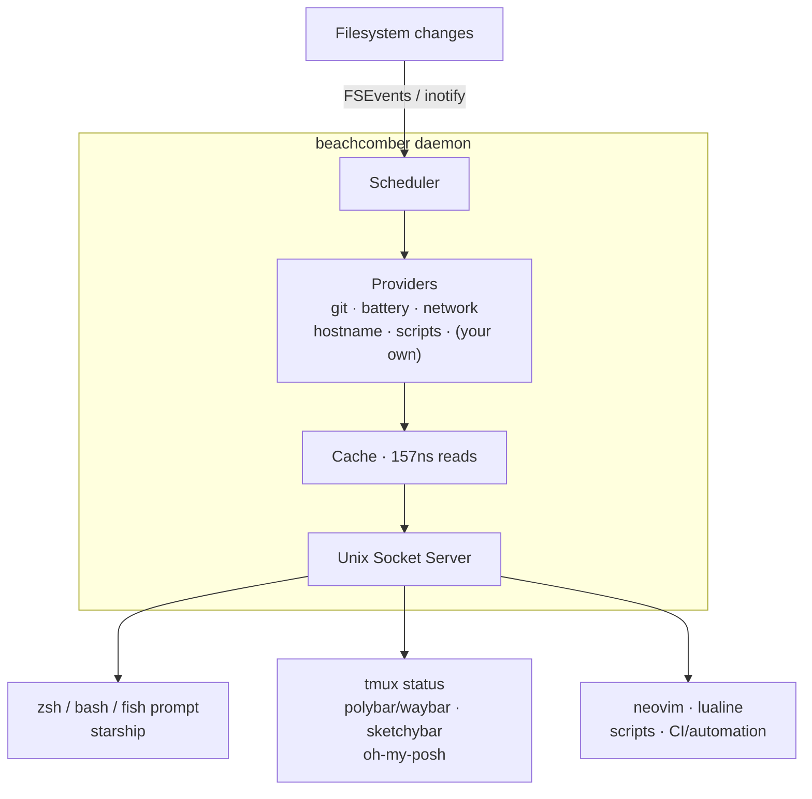

# beachcomber

> One daemon. One cache. Every consumer reads from it.

---

## The Problem

Picture your typical development machine. You have 30 terminal shells open — tmux, iTerm tabs, nested sessions. Each one is running powerlevel10k with gitstatus enabled.

**That's 30 gitstatusd daemons.** Each one spawns a thread pool of up to `min(32, 2 × NUM_CPUS)` threads. On a 16-core machine, that's 960 threads — all independently watching overlapping filesystem trees, all independently computing the same answer to "what branch am I on?"

Now look at your tmux status bar. If you're using a common config like gpakosz/.tmux, it forks a shell process for every pane to collect battery, hostname, and git data. Every 10 seconds. 50 panes × 10 data points = **500 shell forks every 10 seconds.** Your laptop is burning CPU to spawn processes that each run for 5ms and return the same answer they returned 10 seconds ago.

Meanwhile, `fseventsd` is pegging a CPU core dispatching the same filesystem change event to 30 independent FSEvents registrations — one per gitstatusd instance — all watching the same `.git` directory.

Every shell, every editor plugin, every status bar, every prompt framework is independently asking the same questions about the same files with no coordination whatsoever.

**beachcomber** is a single daemon that watches directories, computes shell state, and caches it. Every consumer — prompts, tmux, editors, scripts — reads from the same cache via a Unix socket. One watcher. One computation. Infinite readers.

---

## The Numbers

| Operation | Latency |
|---|---|
| Cache read (global key) | **157 ns** |
| Socket query (warm, persistent connection) | **15 µs** |
| Socket query (cold, new connection) | 34 µs |
| Git status (at parity with raw `git status`) | **5.6 ms** |
| Throughput (10 concurrent clients) | **45,000 req/sec** |

**Real-world impact:**

| Scenario | Without beachcomber | With beachcomber | Improvement |
|---|---|---|---|
| zsh prompt (3 queries) | ~5ms (gitstatus fork) | **45µs** (persistent session) | 111x faster |
| tmux status (100 panes, 10s refresh) | ~2.5s CPU (500 shell forks) | **7.5ms** (socket queries) | 333x fewer forks |
| fseventsd dispatch load | N watchers × N events | 1 watcher, shared | Linear reduction |

---

## Quick Look

```
$ comb g git.branch .          # g = get, text is the default format
main

$ comb g hostname.short
Project2501

$ comb g battery.percent
85

$ comb g.s git .                # .s = shell format (key=value, sourceable)
branch=main
dirty=true
staged=2
ahead=0
behind=0
stash=1

$ comb g git .                   # default: text (one value per line)
a1b2c3d
0
0
main
true
2
clean
1
1

$ comb g.j git .                 # .j = JSON format
{
  "ok": true,
  "data": {
    "branch": "main",
    "commit": "a1b2c3d",
    "dirty": true,
    "staged": 2,
    "unstaged": 1,
    "untracked": 4,
    "ahead": 0,
    "behind": 0,
    "stash": 1,
    "state": "clean"
  },
  "age_ms": 120,
  "stale": false
}

$ comb s                         # status: one row per warm cache entry
PROVIDER  PATH    FIELD    VALUE    AGE   TTL
git       /repo   branch   main     14s   ★     60s×12 ◉
git       /repo   dirty    true     14s   ★     60s×12 ◉
battery   -       percent  87       8s    ★     30s×04
hostname  -       short    artemis  3h    ---
```

All commands use single-letter shorthands (`g` get, `s` status, `w` watch, `p` put, `e` eval, `i` init, `c` check, `d` daemon). Format suffixes (`.s` shell, `.t` tsv, `.T` TSV+header, `.f` template, `.c` csv, `.C` CSV+header, `.j` json) replace the `-f` flag. Text is the default — `comb g` and `comb g git.branch .` both return plain text. Long forms always work too: `comb get git.branch . -f text` is the same as `comb g git.branch .`

---

## Table of Contents

- [Quick Start](#quick-start)
- [How It Works](#how-it-works)
- [CLI Reference](#cli-reference)
- [Configuration Reference](#configuration-reference)
- [Built-in Providers Reference](#built-in-providers-reference)
- [Consumer Integration](#consumer-integration)
- [Shell Fallback & Integration Scripts](#shell-fallback--integration-scripts)
- [Client SDKs](#client-sdks)
- [Custom Providers Guide](#custom-providers-guide)
- [Debugging](#debugging)
- [Protocol Reference](#protocol-reference)
- [Alternatives and Prior Art](#alternatives-and-prior-art)
- [FAQ](#faq)
- [Contributing](#contributing)

---

## Quick Start

### Install

```sh
# Homebrew (macOS)
brew install navistau/tap/beachcomber

# npm
npm install -g beachcomber

# pip
pip install beachcomber

# Cargo (Rust toolchain required)
cargo install beachcomber
```

The npm and pip packages download the correct pre-built binary for your platform from GitHub Releases. You can also use `npx beachcomber`, `uvx beachcomber`, or `uv tool install beachcomber`.

#### Debian/Ubuntu

Download the `.deb` from the [latest release](https://github.com/NavistAu/beachcomber/releases/latest):

```sh
curl -LO https://github.com/NavistAu/beachcomber/releases/latest/download/beachcomber_0.7.0-1_amd64.deb
sudo dpkg -i beachcomber_0.7.0-1_amd64.deb
```

```sh
# ARM64
curl -LO https://github.com/NavistAu/beachcomber/releases/latest/download/beachcomber_0.7.0-1_arm64.deb
sudo dpkg -i beachcomber_0.7.0-1_arm64.deb
```

#### Fedora/RHEL

Download the `.rpm` from the [latest release](https://github.com/NavistAu/beachcomber/releases/latest):

```sh
curl -LO https://github.com/NavistAu/beachcomber/releases/latest/download/beachcomber-0.7.0-1.x86_64.rpm
sudo rpm -i beachcomber-0.7.0-1.x86_64.rpm
```

```sh
# ARM64
curl -LO https://github.com/NavistAu/beachcomber/releases/latest/download/beachcomber-0.7.0-1.aarch64.rpm
sudo rpm -i beachcomber-0.7.0-1.aarch64.rpm
```

#### Arch Linux (AUR)

```sh
# From source
yay -S beachcomber

# Prebuilt binary
yay -S beachcomber-bin
```

#### Nix

```sh
nix run github:NavistAu/beachcomber
```

#### Pre-built binaries

Pre-built binaries are available on the [GitHub Releases](https://github.com/NavistAu/beachcomber/releases) page for the following targets:

- `aarch64-apple-darwin` (macOS, Apple Silicon)
- `x86_64-apple-darwin` (macOS, Intel)
- `x86_64-unknown-linux-gnu` (Linux, glibc)
- `x86_64-unknown-linux-musl` (Linux, musl/static)
- `aarch64-unknown-linux-gnu` (Linux ARM64, glibc)

### Verify

The daemon starts automatically on first use — no setup required.

```sh
# Query your current git branch (run from inside a git repo)
comb g git.branch .

# Query battery
comb g battery.percent

# Check daemon status
comb s
```

That's it. The daemon started in the background when you ran that first query.

### Try it in your prompt

```sh
# Add to ~/.zshrc
precmd() {
    PS1="%F{blue}$(comb g git.branch . 2>/dev/null)%f %# "
}
```

Source your `.zshrc` and open a few more shells. Then run `comb s` — you'll see the cache entry being shared across all shells, with a single filesystem watcher covering all of them.

---

---

## How It Works

beachcomber is a single async daemon that:

1. Serves queries from consumers (prompts, status bars, editors) via a Unix socket
2. Watches filesystem directories using native FSEvents (macOS) or inotify (Linux)
3. Executes providers when files change or poll timers fire — not on every query
4. Caches results in a shared in-memory map (157ns reads)
5. Returns cached data instantly to any number of concurrent readers

The daemon is socket-activated: it starts automatically when any client connects, and shuts down after an idle period when all connections drop.



**Providers are never re-executed on every query.** A git status is computed once when `.git` changes, then served from cache to every reader — whether that's one prompt or a hundred tmux panes. The filesystem watcher is registered once for all concurrent readers.

**Connection context** means consumers can set a working directory once on connect. `comb g git.branch` without an explicit path uses the connection's context directory, making prompt integration natural.

**Demand-driven lifecycle:** the daemon watches nothing until queried. Each `get` request signals demand, keeping the provider warm automatically. Resource usage scales with actual query patterns. Entries enter a decay sequence after queries stop — staying warm for a grace period (30s default) in case a new shell opens, then progressively slowing and eventually evicting.

**Virtual providers and streaming:** external processes can also write data into the cache via `comb p`, exposing arbitrary state to prompt and statusline consumers without writing a script provider. Long-lived connections can stream changes via `comb w`, receiving an NDJSON line each time a cache value is updated.

---

## CLI Reference

All commands are subcommands of `comb`. The daemon is socket-activated — you never need to start it manually. All commands have single-letter shorthands and format suffixes — see the Quick Look above for the pattern.

### `comb g` (get) `<key> [path]`

Query a cached value. Returns cached data immediately. On a cold cache (first query for a key), executes the provider inline and blocks briefly while it runs — subsequent queries return the cached value with no delay.

```sh
# Format suffixes on the command control output format
comb g git.branch .            # text: raw value → main (default)
comb g.s git .                  # shell: key=value pairs → branch=main\ndirty=false\n...
comb g.j git .                   # json: full response with metadata
comb g.c git .                   # csv: comma-separated values
comb g.C git .                   # CSV: with header row
comb g.t git .                   # tsv: tab-separated values
comb g.T git .                   # TSV: with header row
comb g.f '{{ branch }} ({{ dirty }})' git .  # template: → main (false)

# Long form always works too (default format is text, so -f is usually unnecessary)
comb get git.branch .            # same as comb g git.branch .

# Multiple keys in one connection (variadic)
comb g git.branch git.dirty battery.percent .

# Force immediate recomputation before returning
comb g --force git .

# Block until a fresh value arrives (useful after a trigger)
comb g --wait git.branch .

# Global providers (no path needed)
comb g battery.percent
comb g hostname.short

# Field metadata — append :age, :stale, or :source to any key
comb g git.branch:age          # cache age in milliseconds
comb g git.branch:stale        # whether value is past refresh time
```

**Exit codes:**
- `0` — success, data returned
- `1` — cache miss (provider has no data yet)
- `2` — error (daemon unreachable, unknown provider, invalid key)

### `comb s` (status)

Show all warm cache entries as a table — one row per provider field. The `TTL` column shows each entry's lifecycle position (`★` active, `3`/`2`/`1`/`0` decay countdown), effective poll interval, keep-alive count, and whether filesystem events will reinstate the entry (`◉`).

`watch -c comb status` is the recommended live view — it keeps colour and the human preset active even when stdout is a pipe, so you can watch entries pulse through their lifecycle in real time.

```sh
$ comb s
PROVIDER  PATH    FIELD    VALUE    AGE   TTL
git       /repo   branch   main     14s   ★     60s×12 ◉
git       /repo   dirty    true     14s   ★     60s×12 ◉
battery   -       percent  87       8s    ★     30s×04
hostname  -       short    artemis  3h    ---

# Filter to entries in a specific lifecycle state
comb s --filter=lifecycle=active
comb s --filter=lifecycle=decay1
comb s --filter=fsevents_reinstate=true

# Sort options
comb s --sort age             # oldest first
comb s --sort lifecycle       # most-decayed first

# Script-friendly formats (bypass the human preset)
comb s -f tsv
comb s -f json
```

**Flags:** `--format <preset>` (one of: `human`, `tsv`, `json`, `csv`, `table`, `sh`), `--filter <KEY=VALUE>`, `--filter=lifecycle=active|decay1..4|once|virtual`, `--filter=fsevents_reinstate=true|false`, `--sort <default|provider|path|field|value|age|stale|lifecycle>`, `--no-trunc`, `--max-width=auto|N` (default 120), `--color=auto|always|never`, `--ascii`.

Use `comb check daemon` for daemon health (pid, uptime, version, active watchers, request counts).

### `comb d` (daemon) `[--socket <path>]`

Run the daemon in the foreground. You almost never need this — the daemon is socket-activated automatically. Use it for debugging or for running under a process supervisor.

```sh
BEACHCOMBER_LOG=debug comb d                          # debug logging
comb d --socket /tmp/beachcomber-debug.sock            # override socket path
```

The daemon exits on SIGINT (Ctrl+C) with a graceful shutdown sequence.

**Socket path resolution** — the daemon (and all client commands) resolve the socket path in this order:
1. `daemon.socket_path` in config, if set
2. `BEACHCOMBER_SOCKET` environment variable, if set
3. `/tmp/beachcomber-<uid>/sock` — stable per-user default; no session-scoped environment (`$TMPDIR`, `$XDG_RUNTIME_DIR`) is consulted, so every shell, sandbox, and container of one user reaches the same single daemon

### `comb p` (put) `<key> [<json-data>] [--ttl <duration>] [--path <path>] [--null]`

Write data into the cache as a virtual provider. External processes can use this to expose state to prompt/statusline consumers without writing a script provider.

```sh
comb p myapp '{"status":"healthy","version":"1.2.3"}'
comb p myapp '{"status":"healthy"}' --ttl 30s             # with TTL
comb p myapp '{"status":"building"}' --path ~/project     # path-scoped
comb p myapp --null                                        # clear the entry
```

`--null` clears a previously written virtual provider entry. Omitting `--null` requires a JSON object argument.

Read back with `comb g`:

```sh
comb g myapp.status        # → healthy
comb g myapp                 # → full JSON
```

Namespace hierarchy prevents shadowing built-in or script providers — `comb p git '...'` is rejected.

### `comb w` (watch) `<key> [--path <path>]`

Stream cache changes to stdout. Opens a long-lived connection and emits an NDJSON line each time the watched key is updated.

```sh
comb w git.branch --path ~/project        # stream plain text values (default)
comb w.j git.branch --path ~/project     # stream JSON updates
comb w.s git --path ~/project            # stream key=value pairs
```

The first line is emitted immediately with the current value (or a cache miss if no data exists). Subsequent lines appear as the cache updates. Press Ctrl-C to stop.

Field-level filtering: watching `git.branch` only emits when the branch value changes, not on every git provider update.

### `comb e` (eval) `<template> [path]`

Evaluate a minijinja template string against cached provider data. Resolves all referenced keys in a single connection.

```sh
comb e "{{ git.branch }} | {{ battery.percent }}%" .     # → main | 82%
PS1="$(comb e '{{ git.branch }} \$ ' . 2>/dev/null)"

# Conditionals and filters
comb e '*{{ git.branch }}{{ git.branch }}' .
comb e '{{ git.branch | truncate(20) }}' .
```

### `comb i` (init)

Detect installed tools and print shell integration snippets tailored to your environment.

```sh
comb i
# Detects: starship, p10k, tmux, neovim, polybar, waybar, sketchybar, oh-my-zsh
# Prints ready-to-paste integration snippets for each detected tool.
```

### `comb k` (kill)

Stop the running daemon. The daemon will socket-activate again on the next client query.

```sh
comb k                           # stop the daemon (waits up to 5s for exit)
comb kill --timeout 10           # wait up to 10s for exit
comb kill --socket /tmp/other.sock  # target a specific socket
```

### `comb c` (check) `[subcommand]`

Run health checks and introspect daemon internals. Without a subcommand, runs top-level aggregation.

```sh
comb c                   # aggregate across all subjects
comb c daemon            # daemon health: pid, version, uptime, request counts, watchers
comb c providers         # provider health and backoff state
comb c config            # validate config file syntax
comb c cache             # cache entries, staleness, hit/miss summary
comb c lifecycle         # keys in the decay sequence
comb c watches           # active filesystem watch registrations
comb c timers            # poll timers and last-run times
comb c demand            # demand-tracked keys and last-query times
comb c procs             # 1-minute process snapshot, categorize against providers
```

Each check prints `[PASS]`, `[WARN]`, or `[FAIL]` with a short explanation.

> Use `comb check daemon` to see what `comb s` used to show (pid, uptime, request counts, watcher count).

---

## Format Suffix Syntax

The `get` and `watch` commands support a shorthand suffix on the subcommand itself, saving characters in prompts and scripts. **Plain text is the default** — no suffix needed.

| Suffix | Equivalent | Format |
|---|---|---|
| _(none)_ | `get -f text` | Raw value — the default |
| `g.p` | `get -f text` | Raw value, explicit |
| `g.j` | `get -f json` | Full JSON response with `age_ms`, `stale`, etc. |
| `g.s` | `get -f sh` | `key=value` lines (shell-parseable) |
| `g.c` | `get -f csv` | Comma-separated values |
| `g.C` | `get -f CSV` | CSV with header row |
| `g.t` | `get -f tsv` | Tab-separated values |
| `g.T` | `get -f TSV` | TSV with header row |
| `g.f` | `get -f fmt` | minijinja template — `{{ field }}` placeholders |

```sh
# These are all equivalent:
comb g git.branch .              # default text
comb g.p git.branch .            # explicit plain text
comb get git.branch . -f text    # long form with flag
```

The suffix is appended to the command (`g`, `w`) with a dot separator.

---

## Field Metadata Access

Append a colon suffix to any key to retrieve metadata about the cached value rather than the value itself:

| Suffix | Type | Description |
|---|---|---|
| `:age` | int | Milliseconds since the value was last computed |
| `:stale` | bool | Whether the value is past its expected refresh time |
| `:fresh` | bool | Inverse of `:stale` — true when the value is within its refresh window |
| `:cache` | bool | Whether the value was served from cache (`true`) or freshly computed (`false`) |
| `:source` | string | Provider kind: `builtin`, `script`, or `virtual` |

```sh
comb g git.branch:age .       # → 1240 (ms since last computed)
comb g battery.percent:stale  # → false
comb g git.branch:fresh .     # → true
comb g git.branch:cache .     # → true
comb g git:source .           # → builtin
```

---

## Configuration Reference

beachcomber runs with sensible defaults and requires no configuration. The optional config file lives at `~/.config/beachcomber/config.toml`.

```toml
# ~/.config/beachcomber/config.toml

# ─── Daemon ────────────────────────────────────────────────────────────────────

[daemon]

# Override the Unix socket path.
# Default: /tmp/beachcomber-<uid>/sock
socket_path = ""

# Log level for daemon output.
# Options: "error", "warn", "info", "debug", "trace"
# Default: "info"
# Logs go to: $XDG_STATE_HOME/beachcomber/daemon.log
log_level = "info"

# Maximum time (in seconds) to wait for any provider to complete.
# Providers that exceed this are cancelled; the last good cached value is retained.
# Default: 10
provider_timeout_secs = 10

# Path to an environment file loaded at daemon startup.
# Each line is KEY=VALUE (or KEY="VALUE"). Blank lines and #comments are ignored.
# These vars are available to ${VAR} expansion in HTTP headers, script commands, etc.
# Default: ~/.config/beachcomber/env (loaded automatically if present)
# env_file = "~/.config/beachcomber/env"

# How often the watchdog checks the scheduler heartbeat.
# If the heartbeat hasn't advanced within the threshold, the daemon shuts down
# for the process supervisor (launchd, systemd) to restart.
# Default: disabled (no watchdog)
# watchdog_interval = "30s"

# How long the heartbeat can be stale before the watchdog triggers shutdown.
# Default: 3x watchdog_interval
# watchdog_threshold = "90s"


# ─── Lifecycle ─────────────────────────────────────────────────────────────────

[lifecycle]

# How long (in seconds) the daemon waits with no active connections before
# shutting itself down. The next client connection will socket-activate a
# fresh instance.
# Set to null to disable idle shutdown (daemon stays resident permanently).
# Default: null (disabled — daemon stays resident)
# idle_shutdown_secs = 300

# Global default poll interval. Per-source [providers.<name>.<source>] blocks override this.
# Default: "60s"
poll_interval = "60s"

# Global default poll keep-alive count.
# Default: 12
poll_live_count = 12

# Global default for fsevents_reinstate. Overrides per-source defaults when set.
# Default: unset (each source uses its own declared default)
# fsevents_reinstate = true


# ─── Failback (global retry defaults) ──────────────────────────────────────────

[failback]

# Consecutive failures before suppression. Default: 3
# count = 3

# Suppression duration (doubles each level). Default: "1s"
# interval = "1s"


# ─── Built-in Provider Overrides ───────────────────────────────────────────────
# Use [providers.<name>] to set provider-level knobs (only `enabled` is valid here).
# Source-level knobs (poll_interval, poll_count, fsevent_*, failback_*) go in
# [providers.<name>.<source>] sub-tables.

# Disable a provider entirely (it will never execute or appear in results)
[providers.conda]
enabled = false

# Override polling interval for battery (source name: "level")
[providers.battery.level]
poll_interval = "60s"   # default: 30s
poll_count = 10         # keep-alive poll count; default: 12

# Add a safety-net poll to git's refs source (filesystem-triggered by default)
[providers.git.refs]
poll_interval = "30s"   # default: no poll (filesystem-triggered only)

# Override network polling interval
[providers.network.state]
poll_interval = "30s"   # default: 10s


# ─── Custom Script Providers ───────────────────────────────────────────────────
# Define your own providers backed by any executable.

# Minimal: a global provider that polls every 30 seconds
[providers.docker_context]
command = "docker context show"
output = "text"         # single-line output becomes { "value": "<output>" }
# or use output = "json" for structured output: { "key": value, ... }
# or use output = "kv" for key=value line format

[providers.docker_context.invalidation]
poll = "30s"

# A path-scoped provider that watches a file and has a poll fallback
[providers.node_version]
command = "node --version"
output = "text"
scope = "path"          # scoped to a directory; path argument required

[providers.node_version.invalidation]
watch = [".node-version", ".nvmrc", "package.json"]
poll = "60s"            # safety-net poll in case filesystem events are missed

# A provider with structured JSON output
[providers.cargo_meta]
command = "cargo metadata --format-version=1 --no-deps --quiet"
output = "json"         # parse stdout as JSON object; top-level keys become fields
scope = "path"

[providers.cargo_meta.invalidation]
watch = ["Cargo.toml", "Cargo.lock"]
poll = "120s"

# Explicitly disable a custom provider without removing its config
[providers.my_slow_thing]
command = "my-slow-script"
enabled = false


# ─── HTTP Providers ──────────────────────────────────────────────────────────
# Fetch data directly from REST APIs — no curl fork, no shell spawning.
# Uses in-process HTTP client with connection reuse.

# Basic: poll a status API
[providers.service_status]
type = "http"
url = "https://status.anthropic.com/api/v2/summary.json"
extract = "status"              # dot-path into the JSON response
                                # e.g., response.status.indicator → provider field "indicator"

[providers.service_status.invalidation]
poll = "60s"

# With auth headers (env vars expanded at runtime)
[providers.github_rate]
type = "http"
url = "https://api.github.com/rate_limit"
headers = { Authorization = "Bearer ${GITHUB_TOKEN}" }
extract = "rate"                # extracts { "limit": 5000, "remaining": 4999, ... }

[providers.github_rate.invalidation]
poll = "30s"

# Infrequent poll (daily)
[providers.exchange_rate]
type = "http"
url = "https://api.exchangerate-api.com/v4/latest/USD"
extract = "rates.AUD"           # extracts a single nested value

[providers.exchange_rate.invalidation]
poll = "86400s"
```

### Config field summary

**`[daemon]` section:**

| Field | Type | Default | Description |
|---|---|---|---|
| `socket_path` | string | `/tmp/beachcomber-<uid>/sock` | Unix socket path |
| `log_level` | string | `"info"` | Tracing log level |
| `provider_timeout_secs` | int | `10` | Max seconds for any provider to run |
| `env_file` | string | `~/.config/beachcomber/env` | Path to env file loaded at startup |
| `watchdog_interval` | duration or null | `null` (disabled) | How often the watchdog checks scheduler liveness |
| `watchdog_threshold` | duration or null | 3x `watchdog_interval` | Stale heartbeat duration before triggering shutdown |

**`[lifecycle]` section:**

| Field | Type | Default | Description |
|---|---|---|---|
| `idle_shutdown_secs` | int or null | `null` (disabled) | Seconds until idle daemon shuts down; `null` keeps daemon resident |
| `poll_interval` | duration | `"60s"` | Global default poll interval (overridden by per-source blocks) |
| `poll_live_count` | int | `12` | Global default poll keep-alive count |
| `fsevents_reinstate` | bool or null | `null` (unset) | Global override for fsevents_reinstate; unset means each source uses its declared default |

**`[failback]` section:**

| Field | Type | Default | Description |
|---|---|---|---|
| `count` | int | `3` | Consecutive failures before suppression |
| `interval` | duration | `"1s"` | Initial suppression duration (doubles each level) |

> Duration fields accept whole-second strings: `"30s"`, `"5m"`, `"1h"`, `"2h30m"`. Sub-second values (e.g. `"500ms"`) are not accepted.

**`[providers.<name>]` section (built-in overrides):**

Only `enabled` is valid at the provider level. All source-level knobs go in `[providers.<name>.<source>]` sub-tables.

| Field | Type | Default | Description |
|---|---|---|---|
| `enabled` | bool | `true` | Set `false` to disable provider entirely |

**`[providers.<name>.<source>]` section (per-source overrides for built-ins and script providers):**

| Field | Type | Default | Description |
|---|---|---|---|
| `poll_interval` | duration | source-specific | Poll interval for this source |
| `poll_count` | int | `12` | Keep-alive poll count — how many polls before demand must be re-signalled |
| `fsevent_patterns` | array of strings | source-specific | Relative path patterns to watch |
| `fsevent_abs_paths` | array of strings | source-specific | Absolute paths to watch |
| `fsevent_lifespan` | duration | source-specific | How long filesystem watches stay registered |
| `fsevent_reinstates` | bool | source-specific | Whether watches survive decay back to active |
| `failback_count` | int | `3` | Consecutive failures before suppression |
| `failback_interval` | duration | `"1s"` | Initial suppression duration |

**`[providers.<name>]` section (custom script providers):**

| Field | Type | Required | Description |
|---|---|---|---|
| `command` | string | yes | Shell command to execute |
| `output` | string | no | `"json"` (default), `"kv"`, or `"text"` |
| `scope` | string | no | `"global"` (default) or `"path"` |
| `enabled` | bool | no | `false` to disable |
| `invalidation.poll` | string | no | Poll interval as duration string (`"30s"`, `"2m"`) |
| `invalidation.watch` | array of strings | no | File/directory patterns to watch |

Source-level knobs (`poll_interval`, `poll_count`, `fsevent_*`, `failback_*`) go in `[providers.<name>.<source>]` — see the per-source table above.

**`[providers.<name>]` section (HTTP providers):**

| Field | Type | Required | Description |
|---|---|---|---|
| `type` | string | yes | Must be `"http"` |
| `url` | string | yes | URL to fetch. Supports `${ENV_VAR}` expansion. |
| `method` | string | no | HTTP method: `"GET"` (default), `"POST"`, `"PUT"` |
| `headers` | table | no | HTTP headers. Values support `${ENV_VAR}` expansion. |
| `body` | string | no | Request body (for POST/PUT) |
| `extract` | string | no | Dot-separated path into the JSON response (e.g., `"status.indicator"`, `"rates.AUD"`) |
| `enabled` | bool | no | `false` to disable |
| `invalidation.poll` | string | no | Poll interval (default `"60s"`, floor `5s`) |

**`[providers.<name>]` section (shared library providers):**

| Field | Type | Required | Description |
|---|---|---|---|
| `type` | string | yes | Must be `"library"` |
| `library_path` | string | yes | Path to `.so`/`.dylib` file. Supports `~/` expansion. |
| `scope` | string | no | `"global"` (default) or `"path"` — overrides library metadata |
| `fields` | table | no | Field name to type mapping — overrides library metadata |
| `enabled` | bool | no | `false` to disable |
| `invalidation.poll` | string | no | Poll interval — overrides library metadata |
| `invalidation.watch` | array of strings | no | Watch patterns — overrides library metadata |

---

## Built-in Providers Reference

beachcomber ships 19 built-in providers organized by category.

### System

| Provider | Scope | Fields | Invalidation | Typical Latency |
|---|---|---|---|---|
| `hostname` | global | `name` (string), `short` (string) | once at startup | 400 ns |
| `user` | global | `name` (string), `uid` (int) | once at startup | 395 ns |
| `load` | global | `one` (float), `five` (float), `fifteen` (float) | poll 10s / floor 5s | 550 ns |
| `uptime` | global | `seconds` (int), `days` (int), `hours` (int), `minutes` (int) | poll 60s | 660 ns |
| `battery` | global | `percent` (int), `charging` (bool), `time_remaining_secs` (int), `status` (string) | poll 30s / floor 5s | 6 ms |
| `network` | global | `interface` (string), `ip` (string), `vpn_active` (bool), `vpn_name` (string), `ssid` (string), `online` (bool) | poll 10s / floor 5s | 2 ms |
| `sudo` | global | `active` (bool) | poll 30s | < 1 µs |
| `op` | global | `signed_in` (bool), `account` (string) | poll 60s | varies |

**Example output:**

```json
// comb g battery
{
  "ok": true,
  "data": {
    "percent": 78,
    "charging": false,
    "time_remaining_secs": 7200,
    "status": "discharging"
  },
  "age_ms": 4200
}
```

> **Platform note:** On macOS, `time_remaining_secs` is always available. On Linux, it requires UPower (`upower` command) — if unavailable, the field reads `0`. The `status` field reports the battery state: `"charging"`, `"discharging"`, `"full"`, or `"unknown"`.

```json
// comb g network
{
  "ok": true,
  "data": {
    "interface": "en0",
    "ip": "192.168.1.42",
    "vpn_active": true,
    "vpn_name": "utun2",
    "ssid": "OfficeNet",
    "online": true
  },
  "age_ms": 3100
}

// comb g load
{
  "ok": true,
  "data": { "one": 2.34, "five": 1.87, "fifteen": 1.42 },
  "age_ms": 8900
}
```

### Git

| Provider | Scope | Fields | Invalidation | Typical Latency |
|---|---|---|---|---|
| `git` | path | 24 fields (see table below) | watch `.git` + fallback poll | 5.6 ms |

**Fields:**

| Field | Type | Description |
|---|---|---|
| `branch` | string | Current branch name |
| `commit` | string | Short SHA of HEAD |
| `detached` | bool | Whether HEAD is detached |
| `upstream` | string | Upstream tracking branch (e.g., "origin/main") |
| `tag` | string | Nearest tag (empty if none) |
| `dirty` | bool | Whether working tree has changes |
| `staged` | int | Number of staged files |
| `unstaged` | int | Number of unstaged modified files |
| `untracked` | int | Number of untracked files |
| `conflicted` | int | Number of conflicted files |
| `ahead` | int | Commits ahead of upstream |
| `behind` | int | Commits behind upstream |
| `stash` | int | Number of stash entries |
| `lines_added` | int | Lines added in working tree (unstaged) |
| `lines_removed` | int | Lines removed in working tree (unstaged) |
| `lines_staged_added` | int | Lines added in index (staged) |
| `lines_staged_removed` | int | Lines removed in index (staged) |
| `state` | string | Repo state: "clean", "merge", "rebase", "cherry-pick", "bisect", "revert" |
| `state_step` | int | Current step in rebase/cherry-pick (0 if not in progress) |
| `state_total` | int | Total steps in rebase/cherry-pick (0 if not in progress) |
| `last_commit_age_secs` | int | Seconds since last commit |
| `commit_summary` | string | First line of HEAD commit message |
| `push_ahead` | int | Commits ahead of the push remote |
| `push_behind` | int | Commits behind the push remote |

**Example output:**

```json
// comb g git .
{
  "ok": true,
  "data": {
    "branch": "feature/fast-cache",
    "commit": "a1b2c3d",
    "detached": false,
    "upstream": "origin/main",
    "tag": "v0.4.0",
    "dirty": true,
    "staged": 3,
    "unstaged": 1,
    "untracked": 0,
    "conflicted": 0,
    "ahead": 2,
    "behind": 0,
    "stash": 1,
    "lines_added": 47,
    "lines_removed": 12,
    "lines_staged_added": 23,
    "lines_staged_removed": 5,
    "state": "clean",
    "state_step": 0,
    "state_total": 0,
    "last_commit_age_secs": 3420
  },
  "age_ms": 234
}

// comb g git.branch .
feature/fast-cache
```

### Cloud and DevOps

| Provider | Scope | Fields | Invalidation | Typical Latency |
|---|---|---|---|---|
| `kubecontext` | global | `context` (string), `namespace` (string) | poll 30s | 749 ns |
| `gcloud` | global | `project` (string), `account` (string) | poll 60s | 1.08 µs |
| `aws` | global | `profile` (string), `region` (string) | poll 60s | < 1 µs |
| `terraform` | path | `workspace` (string) | watch `.terraform/` | < 1 µs |

`kubecontext` reads `~/.kube/config` directly (respecting `$KUBECONFIG`) — no `kubectl` subprocess. `gcloud` reads `~/.config/gcloud/properties` directly — no Python CLI subprocess.

**Example output:**

```json
// comb g kubecontext
{
  "ok": true,
  "data": { "context": "prod-cluster", "namespace": "default" },
  "age_ms": 15200
}

// comb g aws
{
  "ok": true,
  "data": { "profile": "work-prod", "region": "us-east-1" },
  "age_ms": 42100
}
```

### Development Tools

| Provider | Scope | Fields | Invalidation | Typical Latency |
|---|---|---|---|---|
| `python` | path | `venv` (bool), `venv_name` (string), `version` (string) | watch `.venv/`, `pyproject.toml` | < 1 µs |
| `conda` | global | `env` (string) | poll 30s | < 1 µs |
| `mise` | path | `project` (object: tool-name → version), `global` (object: tool-name → version) | watch `.mise.toml`, `mise.toml` | varies |
| `asdf` | path | `tools` (object: tool-name → version) | watch `.tool-versions` | < 1 µs |
| `direnv` | path | `status` (string), `allowed` (bool) | watch `.envrc` | varies |

**Example output:**

```json
// comb g mise .
{
  "ok": true,
  "data": {
    "project": {"node": "20.11.0", "python": "3.12.1"},
    "global": {"rust": "1.75.0"}
  },
  "age_ms": 890
}

// comb g python .
{
  "ok": true,
  "data": { "venv": true, "venv_name": ".venv", "version": "3.12.1" },
  "age_ms": 120
}
```

---

## Consumer Integration

### zsh prompt (precmd hook)

The most common use case. Use `precmd` to refresh prompt variables before each prompt draw. A persistent `ClientSession` amortizes the connection cost across multiple queries — three fields for the price of one connection.

```zsh
# ~/.zshrc
precmd() {
    local branch dirty untracked
    branch=$(comb g git.branch . 2>/dev/null)
    dirty=$(comb g git.dirty . 2>/dev/null)
    untracked=$(comb g git.untracked . 2>/dev/null)

    local git_part=""
    if [[ -n "$branch" ]]; then
        git_part="%F{blue}${branch}%f"
        [[ "$dirty" == "true" ]] && git_part+="*"
        [[ "$untracked" -gt 0 ]] && git_part+="?"
        git_part+=" "
    fi

    PS1="${git_part}%F{green}%~%f %# "
}
```

### tmux status bar (format string replacement)

tmux evaluates `#(command)` format strings to populate the status bar. Each `#()` is a subprocess — beachcomber makes these essentially free because the daemon is already running.

```tmux
# ~/.tmux.conf

# Battery percentage and git branch in right status
set -g status-right '#(comb g battery.percent)%% bat | #(comb g git.branch .)'

# Left: session name + kubernetes context
set -g status-left '[#S] #(comb g kubecontext.context)'

# Refresh interval — lower is fine because queries cost almost nothing
set -g status-interval 5
```

**Why this is different from the problem described above:** each `#()` invocation still forks a shell, but `comb` reads a pre-cached value in ~34µs instead of spawning git (5ms+) or running a battery subprocess (6ms). The total time savings across a 50-pane tmux session is substantial.

The simple `#()` approach shown above is already a major improvement over shelling out to git or battery commands directly. Each `comb g` also signals demand to the daemon, keeping the provider warm automatically.

### bash prompt (PROMPT_COMMAND)

bash runs `PROMPT_COMMAND` before each prompt. Parse the `key=value` sh output from a whole-provider query to minimize subprocess calls.

```bash
# ~/.bashrc
__beachcomber_prompt() {
    # Fetch entire git state in one query, parse key=value output
    local git_state
    git_state=$(comb g.s git . 2>/dev/null)

    local branch dirty
    while IFS='=' read -r key value; do
        case "$key" in
            branch) branch="$value" ;;
            dirty)  dirty="$value" ;;
        esac
    done <<< "$git_state"

    local git_part=""
    [[ -n "$branch" ]] && git_part="(${branch}${dirty:+*}) "

    local kube
    kube=$(comb g kubecontext.context 2>/dev/null)
    local kube_part=""
    [[ -n "$kube" ]] && kube_part="[${kube}] "

    PS1="${kube_part}${git_part}\w \$ "
}

PROMPT_COMMAND=__beachcomber_prompt
```

### fish prompt function

fish's `fish_prompt` function is called before each prompt. fish has no subshell penalty for command substitutions, so this is already efficient.

```fish
# ~/.config/fish/functions/fish_prompt.fish
function fish_prompt
    set -l branch (comb g git.branch . 2>/dev/null)
    set -l dirty (comb g git.dirty . 2>/dev/null)
    set -l battery (comb g battery.percent 2>/dev/null)

    set -l git_info ""
    if test -n "$branch"
        set git_info " $branch"
        test "$dirty" = "true"; and set git_info "$git_info*"
    end

    set -l bat_info ""
    if test -n "$battery"
        set bat_info " $battery%%"
    end

    echo -n (set_color blue)(prompt_pwd)(set_color normal)$git_info$bat_info" > "
end
```

### neovim statusline (Lua SDK)

The `beachcomber` Lua SDK auto-detects neovim and uses `vim.uv` for zero-dependency socket access:

```lua
-- In your statusline plugin or init.lua
local comb = require('beachcomber')
local client = comb.connect()

local function git_branch()
    local cwd = vim.fn.getcwd()
    local result = client:get('git.branch', cwd)
    if result and result:is_hit() then
        return ' ' .. result.data
    end
    return ''
end
```

Outside neovim, the SDK falls back to luasocket if available, or shells out to `comb` as a last resort.

### starship custom module

starship's `[custom.*]` modules run a shell command and display its output. Using beachcomber as the backend replaces starship's per-prompt git computation with a cache read.

```toml
# ~/.config/starship.toml

# Replace starship's built-in git_branch with a beachcomber-backed one
[git_branch]
disabled = true

[custom.git_branch]
command = "comb g git.branch ."
when = "comb g git.branch ."
format = "[$output]($style) "
style = "bold blue"
description = "Git branch via beachcomber"

[custom.git_dirty]
command = 'test "$(comb g git.dirty .)" = "true" && echo "*"'
when = "comb g git.dirty ."
format = "[$output]($style)"
style = "bold red"

[custom.kube]
command = "comb g kubecontext.context"
when = "comb g kubecontext.context"
format = "[$output]($style) "
style = "bold cyan"
symbol = "☸ "
```

### polybar / waybar / sketchybar custom module

Status bars on Linux (polybar, waybar) and macOS (sketchybar) poll external commands for dynamic content. beachcomber makes the polling interval irrelevant — each query costs microseconds.

**polybar:**
```ini
[module/git]
type = custom/script
exec = comb g git.branch .
interval = 5
format = <label>
label = %output%

[module/battery]
type = custom/script
exec = comb g battery.percent
interval = 30
format = <label>
label = BAT: %output%%%

[module/network]
type = custom/script
exec = comb g network.ssid
interval = 10
```

**waybar (JSON module):**
```json
"custom/git": {
    "exec": "comb g git.branch .",
    "interval": 5,
    "format": " {}",
    "tooltip": false
},
"custom/battery": {
    "exec": "comb g battery.percent",
    "interval": 30,
    "format": " {}%"
}
```

**sketchybar:**
```sh
# In your sketchybarrc
sketchybar --add item git_branch right \
           --set git_branch update_freq=5 \
                            script="sketchybar --set git_branch label=\"$(comb g git.branch .)\""
```

### Python script

The `beachcomber` Python SDK is stdlib-only (no pip dependencies required):

```python
from beachcomber import Client

client = Client()

# Single field
result = client.get("git.branch", path="/path/to/repo")
if result.is_hit:
    print(f"Branch: {result.data}")

# Full provider with field access
result = client.get("git", path="/path/to/repo")
if result.is_hit:
    print(f"Branch: {result['branch']}, dirty: {result['dirty']}")

# Persistent session for multiple queries
with client.session() as s:
    s.set_context("/path/to/repo")
    branch = s.get("git.branch")
    battery = s.get("battery.percent")
```

Or connect directly with no SDK — the protocol is newline-delimited JSON over a Unix socket (see [Protocol Reference](#protocol-reference)).

### Shell one-liner for scripts and CI

For scripts that want to annotate output with git context but don't require beachcomber to be installed:

```sh
# Returns branch name — uses beachcomber if available, falls back to git
BRANCH=$(comb g git.branch . 2>/dev/null || git rev-parse --abbrev-ref HEAD 2>/dev/null || echo "unknown")

# In CI, log the current branch alongside build output
echo "Building branch: $(comb g git.branch . 2>/dev/null || git rev-parse --abbrev-ref HEAD)"

# Check if repo is dirty before deploying
if [ "$(comb g git.dirty . 2>/dev/null)" = "true" ]; then
    echo "Warning: uncommitted changes"
fi
```

### Rust SDK (`beachcomber-client`)

For Rust consumers, the `beachcomber-client` crate provides a typed, synchronous API with no tokio dependency:

```toml
[dependencies]
beachcomber-client = "0.1"
```

```rust
use beachcomber_client::{Client, CombResult};

let client = Client::new(); // auto-discovers socket, starts daemon if needed

// Single field query
match client.get("git.branch", Some("/path/to/repo"))? {
    CombResult::Hit { data, .. } => println!("branch: {}", data.as_text().unwrap()),
    CombResult::Miss => println!("not cached yet — will be ready on next query"),
}

// Full provider query with typed field access
match client.get("git", Some("/path/to/repo"))? {
    CombResult::Hit { data, age_ms, stale } => {
        println!("branch: {}", data.get_str("branch").unwrap_or("?"));
        println!("dirty: {}", data.get_bool("dirty").unwrap_or(false));
        println!("ahead: {}", data.get_i64("ahead").unwrap_or(0));
        println!("age: {}ms, stale: {}", age_ms, stale);
    }
    CombResult::Miss => {}
}

// Persistent session for multiple queries (one connection, multiple requests)
let mut session = client.session()?;
session.set_context("/path/to/repo")?;
let branch = session.get("git.branch", None)?;
let battery = session.get("battery.percent", None)?;
```

Features:
- **Synchronous** — no async runtime needed
- **Socket activation** — starts the daemon automatically if not running
- **Typed access** — `get_str()`, `get_bool()`, `get_i64()`, `get_f64()`
- **Persistent sessions** — reuse one connection for multiple queries (15µs/query vs 34µs)
- **Configurable timeouts** — default 100ms, adjustable via `ClientConfig`

---

## Shell Fallback & Integration Scripts

### The polyfill (recommended)

`scripts/polyfill.sh` defines a `comb()` shell function that stands in for the real binary. If comb is already installed, the script does nothing. If comb is not installed, the function handles `comb g <key>` calls by falling back to native tools for known keys (git, hostname, uptime, battery, and more).

This lets integrations write `comb g git.branch .` and have it work everywhere — with or without beachcomber installed. Users with beachcomber get the ~34µs cached path. Users without get the native tool.

```sh
# Install — add to your shell rc
source <(curl -fsSL https://beachcomber.sh/scripts/polyfill.sh)
```

Covered keys: `git.branch`, `git.dirty`, `git.ahead`, `git.behind`, `git.stash`, `git.commit_summary`, `hostname.name`, `hostname.short`, `user.name`, `load.one/five/fifteen`, `battery.percent`, `battery.charging`.

### The chpwd hook

`scripts/chpwd.sh` warms path-scoped provider caches on directory change. When you `cd`, it refreshes `git`, `mise`, `terraform`, `python`, `direnv`, and `asdf` in the background so the cache is warm before your first prompt renders.

```sh
# Install — add to your shell rc (zsh, bash; fish requires a separate config file)
source <(curl -fsSL https://beachcomber.sh/scripts/chpwd.sh)
```

No-op if comb is not installed. All refreshes run in the background (`&`) so there's no prompt delay.

### Alternative: inline `||` fallback

For one-off uses in scripts, skip the polyfill and use `||` chains:

```sh
branch=$(comb g git.branch . 2>/dev/null || git rev-parse --abbrev-ref HEAD 2>/dev/null)
```

`comb` exits non-zero when not installed, so the fallback runs transparently.

---

## Client SDKs

Every SDK wraps the Unix socket protocol with typed APIs, socket discovery, timeouts, and error handling. All are stdlib-only (no external runtime dependencies).

| SDK | Location | Notes |
|---|---|---|
| **Rust** (`beachcomber-client`) | `beachcomber-client/` | Sync, no tokio dependency |
| **C** (`libbeachcomber`) | `sdks/c/` | Shared + static lib, embedded JSON parser |
| **Python** (`beachcomber`) | `sdks/python/` | Dataclasses, sync client + session |
| **Node.js** (`beachcomber`) | `sdks/node/` | TypeScript, async API |
| **Go** (`beachcomber`) | `sdks/go/` | Idiomatic error returns |
| **Lua** (`beachcomber`) | `sdks/lua/` | vim.uv / luasocket / CLI fallback |
| **Ruby** (`beachcomber`) | `sdks/ruby/` | Block-based sessions |
| **Shell** (POSIX function) | In README | Copy-paste fallback pattern |

You don't need an SDK to talk to beachcomber — the protocol is newline-delimited JSON over a Unix socket. See [Protocol Reference](#protocol-reference).

---

## Custom Providers Guide

Custom providers let you add any data source to beachcomber using any language. Your script runs on the configured schedule, and the results are cached and served to all consumers.

### Output Formats

**JSON (default):** Stdout must be a JSON object. Top-level keys become provider fields.

```sh
# A provider that outputs JSON
#!/bin/sh
docker context show --format '{"context":"{{.Name}}","driver":"{{.Driver}}"}'
```

```toml
[providers.docker_ctx]
command = "~/.config/beachcomber/providers/docker-context.sh"
output = "json"
```

**Key-value:** Stdout is `key=value` lines, one per field. Simpler for shell scripts.

```sh
# A provider using kv output
#!/bin/sh
context=$(docker context show 2>/dev/null || echo "default")
echo "context=${context}"
```

```toml
[providers.docker_ctx]
command = "~/.config/beachcomber/providers/docker-context.sh"
output = "kv"
```

**Text:** Stdout is a single value, exposed as the `value` field. For commands that print one thing.

```sh
# Single-value output
node --version 2>/dev/null | tr -d 'v'
```

```toml
[providers.node_version]
command = "node --version | tr -d v"
output = "text"
```

Then query with `comb g node_version.value`.

### Invalidation Strategies

**Poll only:** Re-run every N seconds. Use for data that changes independently of filesystem events.

```toml
[providers.vpn_status]
command = "~/.config/beachcomber/providers/vpn-check.sh"
output = "kv"

[providers.vpn_status.invalidation]
poll = "10s"
```

**Watch only:** Re-run when specific files change. Use for data that's determined entirely by file content.

```toml
[providers.ruby_version]
command = "rbenv version-name"
output = "text"
scope = "path"

[providers.ruby_version.invalidation]
watch = [".ruby-version", "Gemfile", ".tool-versions"]
```

**Watch with poll fallback (recommended):** FSEvents and inotify can occasionally drop events under heavy load. A poll fallback ensures eventual consistency even if an event is missed.

```toml
[providers.cargo_meta]
command = "cargo metadata --format-version=1 --no-deps --quiet"
output = "json"
scope = "path"

[providers.cargo_meta.invalidation]
watch = ["Cargo.toml", "Cargo.lock"]
poll = "120s"
```

### Real-World Examples

**Docker context provider:**
```sh
#!/bin/sh
# ~/.config/beachcomber/providers/docker-context.sh
# Outputs the active Docker context and whether it's remote.

context=$(docker context show 2>/dev/null || echo "default")
endpoint=$(docker context inspect "$context" --format '{{.Endpoints.docker.Host}}' 2>/dev/null || echo "")

is_remote="false"
case "$endpoint" in
    tcp://*|ssh://*) is_remote="true" ;;
esac

printf '{"context":"%s","remote":%s}\n' "$context" "$is_remote"
```

```toml
[providers.docker_context]
command = "~/.config/beachcomber/providers/docker-context.sh"
output = "json"

[providers.docker_context.invalidation]
poll = "30s"
```

Query: `comb g docker_context.context`

**Node.js version provider (path-scoped):**
```sh
#!/bin/sh
# ~/.config/beachcomber/providers/node-version.sh
# Reports the Node.js version in effect for the current directory.
# Respects .nvmrc, .node-version, and volta/mise if installed.

if command -v mise >/dev/null 2>&1; then
    version=$(mise current node 2>/dev/null)
elif command -v node >/dev/null 2>&1; then
    version=$(node --version 2>/dev/null | tr -d v)
fi

echo "version=${version:-unknown}"
```

```toml
[providers.node_version]
command = "~/.config/beachcomber/providers/node-version.sh"
output = "kv"
scope = "path"

[providers.node_version.invalidation]
watch = [".node-version", ".nvmrc", "package.json", ".mise.toml"]
poll = "60s"
```

**Ruby version via rbenv:**
```toml
[providers.ruby_version]
command = "rbenv version-name 2>/dev/null || ruby --version | cut -d' ' -f2"
output = "text"
scope = "path"

[providers.ruby_version.invalidation]
watch = [".ruby-version", "Gemfile", ".tool-versions"]
poll = "120s"
```

Query: `comb g ruby_version.value`

**VPN connected check:**
```sh
#!/bin/sh
# ~/.config/beachcomber/providers/vpn-status.sh
# Checks whether a VPN tunnel is active.

# Look for any utun interface with an IP (macOS)
if ifconfig 2>/dev/null | grep -q '^utun.*flags'; then
    # Check if a utun has an inet address (not just link-local)
    if ifconfig 2>/dev/null | awk '/^utun/{iface=$1} /inet / && iface{print; iface=""}' | grep -q inet; then
        echo "active=true"
        # Try to get VPN name from pf/scutil
        name=$(scutil --nc list 2>/dev/null | grep Connected | head -1 | sed 's/.*"\(.*\)".*/\1/')
        echo "name=${name:-vpn}"
        exit 0
    fi
fi

echo "active=false"
echo "name="
```

```toml
[providers.vpn]
command = "~/.config/beachcomber/providers/vpn-status.sh"
output = "kv"

[providers.vpn.invalidation]
poll = "10s"
```

Query: `comb g vpn.active`

### HTTP Providers

For providers that fetch data from REST APIs, beachcomber has a built-in HTTP provider type. This makes HTTP requests directly in the daemon process — no `curl` fork, no shell spawning, with connection reuse and proper timeout handling.

> **Note:** You can also use script providers with `curl` for quick-and-dirty HTTP queries. But for anything polling regularly, the `http` type is significantly more efficient — it avoids 2-6ms of process spawn overhead per request.

**Basic API status check:**

```toml
[providers.claude_status]
type = "http"
url = "https://status.anthropic.com/api/v2/summary.json"
extract = "status"
invalidation = { poll = "60s" }
```

Query: `comb g claude_status.indicator` returns `"none"`, `"minor"`, `"major"`, etc.

The `extract` field navigates into the JSON response using dot-separated paths. Without it, the entire response object becomes the provider's fields.

**Authenticated API with headers:**

```toml
[providers.github_rate]
type = "http"
url = "https://api.github.com/rate_limit"
headers = { Authorization = "Bearer ${GITHUB_TOKEN}", Accept = "application/json" }
extract = "rate"
invalidation = { poll = "30s" }
```

Query: `comb g github_rate.remaining`

Header values support `${ENV_VAR}` expansion — secrets stay in your environment, not in config files.

**Service health endpoint:**

```toml
[providers.api_health]
type = "http"
url = "https://internal.example.com/health"
invalidation = { poll = "10s" }
```

If the endpoint returns JSON, top-level keys become fields. If it returns non-JSON, the raw body is available as the `body` field.

**Exchange rate (infrequent poll):**

```toml
[providers.exchange]
type = "http"
url = "https://api.exchangerate-api.com/v4/latest/USD"
extract = "rates.AUD"
invalidation = { poll = "86400s" }
```

Query: `comb g exchange.value` — returns the AUD rate, refreshed daily.

**Comparison — script vs HTTP for the same task:**

Using a script provider (forks `sh` + `curl` every poll):
```toml
[providers.api_status_script]
type = "script"
command = "curl -s https://status.anthropic.com/api/v2/summary.json"
invalidation = { poll = "60s" }
```

Using the HTTP provider (in-process, no fork):
```toml
[providers.api_status_http]
type = "http"
url = "https://status.anthropic.com/api/v2/summary.json"
invalidation = { poll = "60s" }
```

Both produce the same result. The HTTP version skips the ~5ms process spawn overhead and handles connection failures more gracefully.

### Secrets and Environment Variables

HTTP headers and script commands support `${VAR}` expansion, pulling values from the daemon's environment. But the daemon's environment depends on how it starts — socket activation inherits the env of whatever triggered it, which is unpredictable.

The solution: **env files.** The daemon loads `~/.config/beachcomber/env` at startup before any providers execute, guaranteeing a consistent environment regardless of how the daemon was started.

```sh
# ~/.config/beachcomber/env
# This file is loaded by the daemon at startup.
# Format: KEY=VALUE (one per line). Blank lines and #comments are ignored.
# Values can be quoted: KEY="value with spaces" or KEY='single quoted'

GITHUB_TOKEN=ghp_xxxxxxxxxxxxxxxxxxxx
ANTHROPIC_API_KEY=sk-ant-xxxxxxxxxxxx
ANTHROPIC_ADMIN_KEY=sk-admin-xxxxxxxxxxxx
EXCHANGE_API_KEY=abc123
```

**Protect this file:**
```sh
chmod 600 ~/.config/beachcomber/env
```

Then reference these in provider configs:

```toml
[providers.github_rate]
type = "http"
url = "https://api.github.com/rate_limit"
headers = { Authorization = "Bearer ${GITHUB_TOKEN}" }
invalidation = { poll = "30s" }
```

The `${GITHUB_TOKEN}` is expanded at request time from the daemon's environment (which includes the env file values).

**Custom env file path:** If you keep secrets elsewhere:

```toml
[daemon]
env_file = "~/.secrets/beachcomber.env"
```

**Integration with secret managers:** Generate the env file from your secret manager of choice:

```sh
# 1Password
op read "op://Vault/beachcomber/env" > ~/.config/beachcomber/env

# pass
pass show beachcomber/env > ~/.config/beachcomber/env

# macOS Keychain
security find-generic-password -s beachcomber -w > ~/.config/beachcomber/env

# Vault
vault kv get -field=env secret/beachcomber > ~/.config/beachcomber/env
```

Then `chmod 600` and restart the daemon (`pkill -f 'comb daemon'` — it socket-activates on next query).

### Script Provider Tips

- **Exit codes:** A non-zero exit is treated as a failure. The last cached value is retained. After repeated failures (configurable via `failback_count` in `[failback]` globally or `[providers.<name>.<source>]` per-source, default 3), the provider enters exponential backoff from `failback_interval` (default 1s, 4 doubling levels).
- **Stderr:** Stderr output from script providers is captured and logged at `debug` level. It does not affect the result.
- **Timeouts:** Script providers are subject to `provider_timeout_secs` (default 10s). Long-running scripts are cancelled and retried on the next trigger.
- **Shell:** Commands are executed via `sh -c`. Use absolute paths for reliability, or ensure your PATH is set correctly in the daemon's environment.
- **Path-scoped providers:** If `scope = "path"`, the script is called with the directory path as its working directory. Use `$PWD` inside the script to reference it.
- **Performance:** Every process spawn costs 2-6ms minimum. For providers that poll frequently (< 30s), prefer reading config files over spawning CLI tools. See the design principles in `docs/performance.md`.

---

## Debugging

### Log file

The daemon writes logs to `~/.local/state/beachcomber/daemon.log` (XDG state home). Both the foreground and background (socket-activated) daemon use this file. Logs are appended across restarts.

```sh
# Watch live daemon logs
tail -f ~/.local/state/beachcomber/daemon.log
```

### Changing the log level

The default log level is `info`. To enable debug logging, set `log_level` in your config:

```toml
# ~/.config/beachcomber/config.toml
[daemon]
log_level = "debug"
```

Valid levels: `trace`, `debug`, `info`, `warn`, `error`.

You can also override it at runtime using the `RUST_LOG` environment variable when running the daemon in the foreground (see below).

### Running the daemon in the foreground

The easiest way to watch what the daemon is doing is to run it interactively. Stop any running background instance first, then start it yourself:

```sh
# Kill the background daemon
pkill -f 'comb daemon'

# Run in foreground with debug logging
RUST_LOG=debug comb d

# Or use a custom socket to avoid interfering with your running setup
comb d --socket /tmp/beachcomber-debug.sock
```

Logs print directly to your terminal. Press Ctrl+C to shut down.

### Checking active state

`comb s` shows warm cache entries as a table — one row per provider field:

```sh
$ comb s
PROVIDER  PATH    FIELD    VALUE    AGE   TTL
git       /repo   branch   main     14s   ★     60s×12 ◉
git       /repo   dirty    true     14s   ★     60s×12 ◉
battery   -       percent  87       8s    ★     30s×04
hostname  -       short    artemis  3h    ---

# Filter to a specific provider
comb s --filter provider=git
```

For daemon internals (pid, uptime, watchers, request counts, lifecycle state, poll timers), use `comb check`:

```sh
comb check daemon     # pid, version, uptime, request counts, active watchers
comb check watches    # active filesystem watch registrations, paths being watched
comb check lifecycle  # keys in the decay/eviction sequence after demand expired
comb check timers     # active poll timers and when they last ran
comb check demand     # demand-tracked keys and last-query times
```

### Killing and restarting the daemon

The daemon will restart automatically the next time any client queries it (socket activation). To force a restart:

```sh
# Preferred: use the kill command
comb kill

# Or by process name
pkill -f 'comb daemon'

# The daemon restarts automatically on next query
comb g hostname.short
```

### Common issues

**Daemon never starts / connection refused**

The daemon socket lives at `/tmp/beachcomber-<uid>/sock` (unless overridden via config or `BEACHCOMBER_SOCKET`). Check that the socket exists:

```sh
ls -la /tmp/beachcomber-$(id -u)/
```

If the socket is missing, run `comb d` in the foreground to see why it failed to start.

**Provider always returns stale/empty data**

Check whether the provider is in a failure backoff loop:

```sh
comb check lifecycle
# Also check the daemon log for "suppressed due to failure backoff"
```

Run the provider directly to check for errors:

```sh
# For git, run from inside a repo
comb g git .
tail -20 ~/.local/state/beachcomber/daemon.log
```

**High CPU or unexpected provider executions**

Enable debug logging and watch the log file. Look for repeated `Executed provider` lines:

```sh
RUST_LOG=debug comb d 2>&1 | grep 'Executed provider'
```

If a provider is executing too frequently, check whether a filesystem watcher is triggering on a high-churn path (e.g., a build output directory). Run `comb check watches` to see which paths are being watched.

**Log file grows too large**

Logs are appended indefinitely. Rotate manually or add a logrotate rule:

```sh
# Truncate manually
: > ~/.local/state/beachcomber/daemon.log

# Or set a higher log level to reduce volume
# In ~/.config/beachcomber/config.toml:
# [daemon]
# log_level = "warn"
```

---

## Protocol Reference

beachcomber uses a simple newline-delimited JSON protocol over a Unix socket. Any language that can open a Unix socket and read/write JSON can be a client — no client library required. The authoritative wire contract is in [docs/protocol-spec.md](docs/protocol-spec.md).

### Connection

Socket path resolution order:
1. `daemon.socket_path` in config, if set
2. `BEACHCOMBER_SOCKET` environment variable, if set
3. `/tmp/beachcomber-<uid>/sock`

Connect with `SOCK_STREAM`. Each message is a JSON object followed by `\n`. Each response is a JSON object followed by `\n`.

### Request Format

```json
{"op": "hello"}
{"op": "get", "key": "git.branch", "path": "/home/user/project"}
{"op": "get", "key": "git", "path": "/home/user/project"}
{"op": "get", "key": "battery"}
{"op": "get", "key": "git.branch", "path": "/home/user/project", "format": "text"}
{"op": "get", "key": "git", "path": "/home/user/project", "force": true}
{"op": "get", "key": "git.branch", "path": "/home/user/project", "wait": true}
{"op": "refresh", "key": "git", "path": "/home/user/project"}
{"op": "put", "key": "myapp", "data": {"status": "healthy"}}
{"op": "put", "key": "myapp", "data": {"status": "ok"}, "ttl": "30s", "path": "/project"}
{"op": "put", "key": "myapp", "data": null}
{"op": "watch", "key": "git.branch", "path": "/home/user/project"}
{"op": "context", "path": "/home/user/project"}
{"op": "status"}
{"op": "introspect", "subject": "daemon"}
{"op": "introspect", "subject": "providers"}
{"op": "introspect", "subject": "config"}
{"op": "introspect", "subject": "cache"}
{"op": "introspect", "subject": "lifecycle"}
{"op": "introspect", "subject": "watches"}
{"op": "introspect", "subject": "timers"}
{"op": "introspect", "subject": "demand"}
{"op": "introspect", "subject": "procs"}
```

**Fields:**

| Field | Type | Description |
|---|---|---|
| `op` | string | Operation: `hello`, `get`, `refresh`, `put`, `watch`, `context`, `status`, `introspect` |
| `key` | string | Provider name (`git`) or field path (`git.branch`) |
| `path` | string | Absolute path for path-scoped providers. Optional if connection context is set. |
| `format` | string | Response format: `"json"` (default), `"text"`, `"sh"`. CSV/TSV/FMT are CLI-only output modes applied client-side, not wire formats. |
| `force` | bool | (`get` only) Trigger immediate recomputation before returning. |
| `wait` | bool | (`get` only) Block until a fresh value is available. |

### Response Format

```json
{"ok": true, "data": {"branch": "main", "dirty": true}, "age_ms": 1240, "stale": false}
{"ok": true, "data": "main", "age_ms": 1240, "stale": false}
{"ok": true, "data": null, "age_ms": null, "stale": false}
{"ok": false, "error": "unknown provider: git2"}
```

**Fields:**

| Field | Type | Description |
|---|---|---|
| `ok` | bool | Whether the operation succeeded |
| `data` | any | Result: object (full provider), scalar (single field), or null (cache miss) |
| `age_ms` | int | Milliseconds since the cached value was last computed |
| `stale` | bool | Whether the value is past its expected refresh time |
| `error` | string | Error message when `ok` is false |

### Operations

**`hello`:** Version negotiation. Clients should send this as the first op on any new connection. Returns `{"ok":true,"data":{"protocol_version":"1.0","daemon_version":"0.6.0"}}`. `protocol_version` follows semver (major.minor) and is independent of the daemon binary version.

**`get`:** Read a cached value. If the key has never been computed, the daemon executes the provider synchronously before returning. Successive calls are served from cache until the value's refresh interval elapses. A null `data` with `ok: true` indicates the provider exists but returned no value (e.g., a path-scoped provider queried outside a matching directory).

**`refresh`:** Trigger immediate provider recomputation. Returns `{"ok": true}` after acknowledging. The recomputation happens asynchronously — subsequent `get` calls will return the refreshed value once it completes.

**`put`:** Write data into the cache as a virtual provider. The `data` field must be a JSON object. An optional `ttl` duration (e.g., `"30s"`) marks entries stale if not refreshed within that window. An optional `path` scopes the entry to a directory. Returns `{"ok": true}` on success; rejected if the key conflicts with a built-in or script provider.

```json
{"op":"put","key":"myapp","data":{"status":"healthy"}}
{"op":"put","key":"myapp","data":{"status":"ok"},"ttl":"30s","path":"/project"}
```

**`watch`:** Open a long-lived subscription. The server emits one NDJSON response immediately with the current value, then emits additional lines each time the watched key changes. The connection stays open until the client closes it.

```json
{"op":"watch","key":"git.branch","path":"/project"}
```

Server streams responses:

```json
{"ok":true,"data":"main","age_ms":0,"stale":false}
{"ok":true,"data":"feature/foo","age_ms":0,"stale":false}
```

Field-level filtering applies: watching `git.branch` only emits when the branch value changes, not on every git provider update.

**`context`:** Set the working directory for this connection. Subsequent path-scoped `get` requests without an explicit `path` will resolve relative to this directory. Useful for clients that query multiple values for the same path.

**`status`:** Returns cache rows — one entry per warm cache key. Each row includes provider, field, value, age, and stale flag. For daemon health information (uptime, scheduler state, active watchers), use `{"op":"introspect","subject":"daemon"}` instead. See [docs/protocol-spec.md](docs/protocol-spec.md) for the full wire contract.

### Wire Formats

The wire protocol supports three response formats (set via the `format` field in the request):

**`json`:** (default) Full JSON envelope with `ok`, `data`, `age_ms`, `stale`.

**`text`:** Raw value only, followed by `\n`. For full-provider queries, returns one raw value per field, one per line, sorted alphabetically.

**`sh`:** `key=value` lines sorted alphabetically, one per line. Suitable for `eval` or `while IFS='=' read -r key value` parsing.

For non-JSON wire formats, errors emit `error: <message>\n\n` on stdout; `ok` is false in the JSON response.

### CLI-only Output Formats

The `comb` CLI adds additional output formats on top of the wire formats above (these are not part of the wire protocol):

**`csv` / `tsv`:** Comma- or tab-separated values. For single-field queries: one value per line. For full-provider queries: field values in alphabetical key order, one row.

**`CSV` / `TSV`:** Same as `csv`/`tsv` but prefixed with a header row of field names.

**`fmt`:** Compact human-readable format, suitable for terminal display.

Use format suffixes on the CLI (`.c` csv, `.C` CSV, `.t` tsv, `.T` TSV, `.f` fmt) or the `-f` flag.

### Connection Context Example

```python
# Set context once, then query multiple values without repeating the path
sock.send(b'{"op":"context","path":"/home/user/myproject"}\n')
response = read_line(sock)  # {"ok": true}

sock.send(b'{"op":"get","key":"git.branch"}\n')
branch = read_line(sock)    # {"ok": true, "data": "main", ...}

sock.send(b'{"op":"get","key":"git.dirty"}\n')
dirty = read_line(sock)     # {"ok": true, "data": false, ...}
```

---

## Alternatives and Prior Art

beachcomber did not emerge from a vacuum. Several excellent tools have explored parts of this problem space. Here is an honest account of each and how beachcomber relates.

### gitstatusd (romkatv/gitstatus)

gitstatusd is the engine behind powerlevel10k and one of the fastest git status implementations in existence. On the Chromium repository (413k files), it returns results in 30ms — raw `git status` takes 295ms on the same repo.

gitstatusd's key insight was correct: a persistent daemon that maintains an in-memory cache of directory mtimes amortizes the cost of repeated git status queries. That insight is the foundation beachcomber builds on.

The limitation is architectural: gitstatusd spawns one daemon per interactive shell. On a machine with 20 shells open, that's 20 daemons, up to 640 threads, 20 independent FSEvents registrations all watching the same directories. The maintainer declined a shared-daemon proposal on security grounds, and powerlevel10k is now on maintenance-only status ("NO NEW FEATURES ARE IN THE WORKS. MOST BUGS WILL GO UNFIXED").

**beachcomber vs gitstatusd:** beachcomber is what gitstatusd would be if the daemon were shared across all consumers. One daemon, one cache, one watcher — for git and everything else. gitstatusd handles only git; beachcomber handles 19 providers plus extensibility. If you are a powerlevel10k user looking for a maintained, general-purpose replacement, beachcomber is the intended answer.

See `docs/competitive-landscape.md` for detailed numbers.

### Watchman (Meta/Facebook)

Watchman is a general-purpose filesystem watching daemon used by Jest, Buck, and Bazel. It is excellent at what it does: tracking file changes, maintaining an in-memory database of file metadata, and pushing events to subscribers via a rich expression language.

Watchman knows *that* files changed. It does not know *what a git branch is*, what battery percentage means, or how to assemble prompt data. It is plumbing, not porcelain.

beachcomber operates at a higher abstraction layer. The daemon internally uses the `notify` crate (which uses FSEvents/inotify directly) rather than depending on Watchman, keeping the dependency footprint small. A 88MB C++ daemon is a steep dependency for a prompt tool.

**beachcomber vs Watchman:** Complementary, not competitive. Watchman is infrastructure for build systems. beachcomber is a caching layer for shell state.

### powerline-daemon (powerline/powerline)

powerline-daemon is the conceptual ancestor of beachcomber. It was the original "cache prompt data in a daemon" approach — one daemon per user, Unix socket, serving shell prompts, tmux, and vim.

The architectural mistake: powerline-daemon cached the *rendering engine*, not the *data*. The daemon avoided re-parsing Python config files and re-importing modules on every prompt, but still invoked fresh subprocesses for git status, battery, and every other data source on every render. The 20-50ms per render that users experienced was entirely the subprocess overhead that the daemon failed to amortize.

powerline-daemon was also single-threaded, meaning one slow git segment on a monorepo would block all consumers. The last PyPI release was 2018.

**beachcomber vs powerline:** beachcomber is a direct correction of powerline's architectural decision. Cache the *data*, not the renderer. Compute once, serve many.

### Starship

Starship is the most popular cross-shell prompt with 55k stars. It is fast for typical repositories, with parallel module computation via rayon. It has no daemon, no caching, and no persistent state — each prompt invocation is a fresh process that computes everything from scratch.

On typical repositories starship completes in 1-5ms. On large monorepos it degrades significantly. Async git status — where the prompt renders immediately and git data fills in when ready — has been the most-requested feature since 2019 and has not shipped. The design space for a daemon has been explored (a detailed proposal exists from 2020) but has not been implemented.

beachcomber is the missing piece for starship. Using the `[custom.*]` module, starship can read pre-cached state from beachcomber instead of computing git/battery/hostname on every prompt. The latency drops from 5ms to 15µs for cache-warm queries.

**beachcomber vs Starship:** Not competitors — beachcomber is infrastructure that starship (and oh-my-posh, and p10k, and any other prompt framework) can use as a backend. The integration is already possible today via `comb g` in custom modules.

### Oh My Posh

Oh My Posh is a Go-based cross-shell prompt with TTL-based disk caching per segment. It is the closest existing approach to beachcomber's model within prompt tools: results can be cached to disk and reused within a TTL window.

The differences: disk-based (not memory), no daemon, no multi-consumer sharing, and TTL-based invalidation rather than filesystem-event-driven. A git status cached for 30 seconds might be shown stale after a `git checkout`; beachcomber would have invalidated and refreshed the cache immediately when `.git/HEAD` changed.

**beachcomber vs Oh My Posh:** beachcomber would give oh-my-posh users event-driven invalidation and cross-consumer sharing. The `[custom.*]` module approach works here too.

### direnv

direnv hooks into the shell's pre-prompt to manage directory-scoped environment variables. It uses mtime-based change detection on `.envrc` files and re-evaluates them when they change.

beachcomber's `direnv` provider wraps `direnv export json` and caches the result. Multiple consumers (different shell sessions, tmux panes) can see the direnv state through beachcomber without each running their own evaluation. This is the integration, not the replacement — direnv's evaluation semantics are preserved.

### The Gap

No single tool does all of this together:

| Capability | gitstatusd | Watchman | powerline | Starship | Oh My Posh | beachcomber |
|---|---|---|---|---|---|---|
| Shared daemon (one per user) | No | Yes | Yes | No | No | **Yes** |
| Caches interpreted state | Git only | No | No | No | TTL disk | **Yes (all)** |
| Multiple data types | No | No | Yes (recalc) | Yes (recalc) | Yes (recalc) | **Yes (cached)** |
| Multiple consumers | No | Yes | Yes | No | No | **Yes** |
| Event-driven invalidation | No | Yes | No | No | No | **Yes** |
| Extensible providers | No | N/A | Python only | TOML only | Go only | **Script + config** |

---

## FAQ

### Does beachcomber replace starship / powerlevel10k / oh-my-posh?

No. beachcomber is infrastructure — a data cache that prompt frameworks can consume. It does not render prompts, apply themes, or manage shell hooks. Think of it as a fast, shared data source that your existing prompt setup can optionally use instead of computing everything from scratch.

With beachcomber, starship reads git state from a cache instead of invoking gitoxide. With beachcomber, powerlevel10k (if it gains socket support) could share one gitstatusd-equivalent across all shells. The prompt frameworks stay; they just get faster.

### Why not just use Watchman?

Watchman tells you *which files changed*. beachcomber tells you *what the git status is*, *what the battery percentage is*, *which kubernetes context is active*. Watchman is a lower-level primitive — it produces events, not interpreted state.

Building on Watchman would mean beachcomber is also responsible for maintaining a Watchman installation, handling its failure modes, and adding 88MB+ to your system. The `notify` crate beachcomber uses talks to FSEvents/inotify directly, achieving the same result without the dependency.

### How much memory does the daemon use?

Light. The cache holds one result object per `(provider, path)` combination. A typical developer session with 10 active providers across 3 directories is around 30 cache entries. Provider results are small — the git state object is a few dozen bytes.

Unlike Watchman, beachcomber does not maintain an in-memory database of every file's metadata. It knows that `.git/HEAD` changed; it does not index every file in your repository.

On a system with 20 shells and typical usage, expect the daemon to use 10-30MB of RSS. The tokio thread pool is fixed-size; provider executions happen on `spawn_blocking` threads that are bounded by tokio's defaults.

### What happens when the daemon crashes?

The socket file is cleaned up on graceful exit. If the daemon crashes unexpectedly, the stale socket file may remain. The next client connection will attempt to connect, fail, detect the stale socket, remove it, start a fresh daemon instance, and retry. This is handled transparently — `comb g` will succeed with a slight delay on the restart.

You can verify the daemon is responsive at any time with `comb s`. If the daemon is unhealthy, `comb get --force <key>` on any key will trigger a restart if needed.

### Can I use this on Linux?

Yes. macOS and Linux are both fully supported in 0.6.0. Pre-built packages ship for `.deb`, `.rpm`, `aarch64`, and `x86_64` targets. The filesystem watcher, battery reader, and network reader are all abstracted behind platform traits; Linux-specific paths (`/sys/class/power_supply/`, `/sys/class/net/`) are used on Linux just as IOKit/pmset are used on macOS.

### Can I run multiple daemons simultaneously?

The daemon is designed for one instance per user. Multiple daemon instances would each have independent caches and independent filesystem watchers, defeating the purpose of centralization. The socket activation logic prevents this by design: if a socket already exists and is responsive, the client uses it.

If you need per-project isolation (e.g., different config for work vs personal projects), use `daemon.socket_path` in a per-project config to run daemons on separate sockets.

### How do I add a provider for a tool beachcomber doesn't know about?

Write a script provider. See the [Custom Providers Guide](#custom-providers-guide). If the provider would be useful to everyone (not just your specific setup), consider contributing it as a built-in — see [Contributing](#contributing).

### What is the `stale` flag in responses?

Each provider has an expected refresh interval. If the cached value is older than that interval plus some tolerance, `stale: true` is set in the response. The value is still returned — beachcomber never blocks a read waiting for fresh data.

Consumers can use `stale` to decide whether to show a loading indicator or use a different visual style. For prompt use, ignoring `stale` is usually the right choice — showing a slightly old branch name is better than blocking the prompt.

---

## Contributing

beachcomber is in active development. See `CONTRIBUTING.md` for how to contribute, the PR process, and code standards.

For bugs, feature requests, and discussion, open an issue on GitHub.

If you are building an integration (a plugin for a prompt framework, an editor extension, a status bar module), the [Consumer Integration](#consumer-integration) and [Protocol Reference](#protocol-reference) sections have everything you need to get started. Integrations that live outside this repo are welcome — open an issue to get listed in the documentation.

---

*beachcomber is pre-1.0 software. The protocol wire format and config schema may change between minor versions before v1.0.0. See `docs/roadmap.md` for the stability timeline.*
