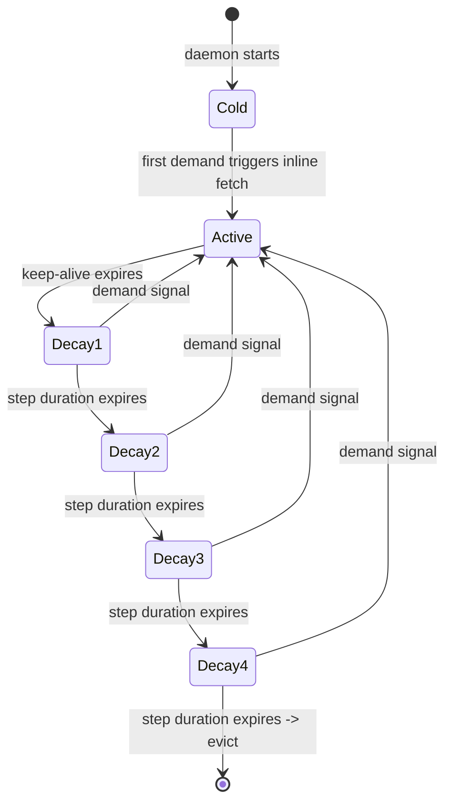
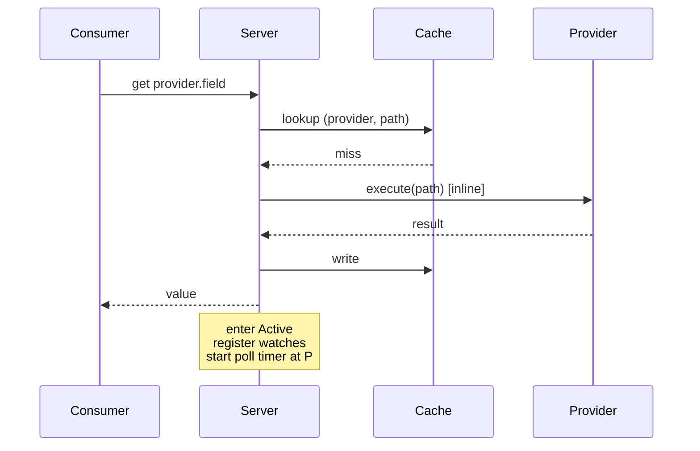
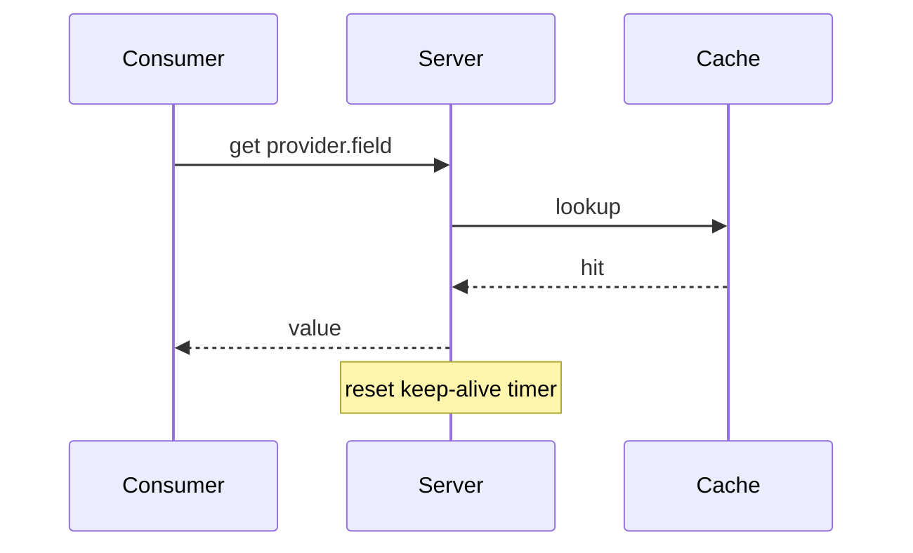
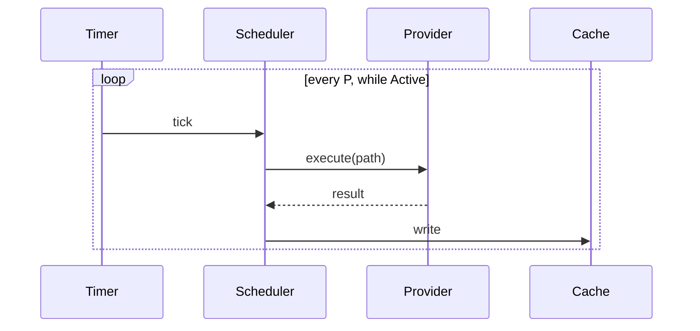
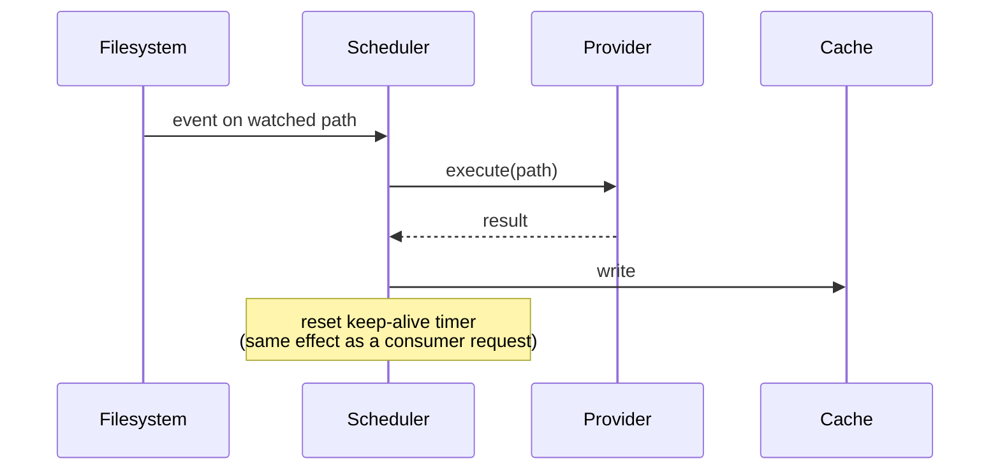
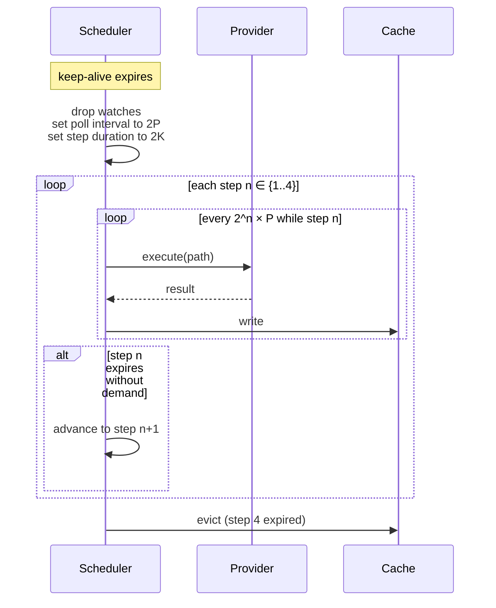
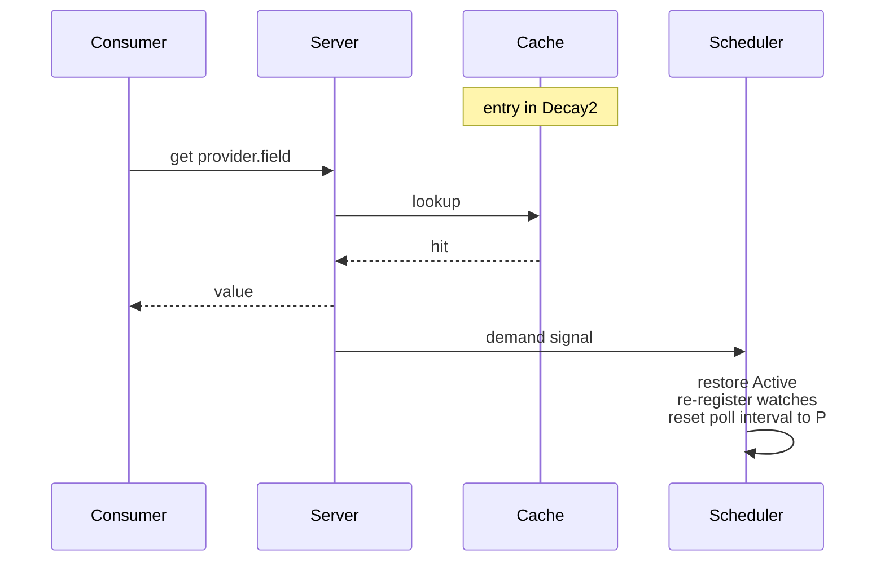
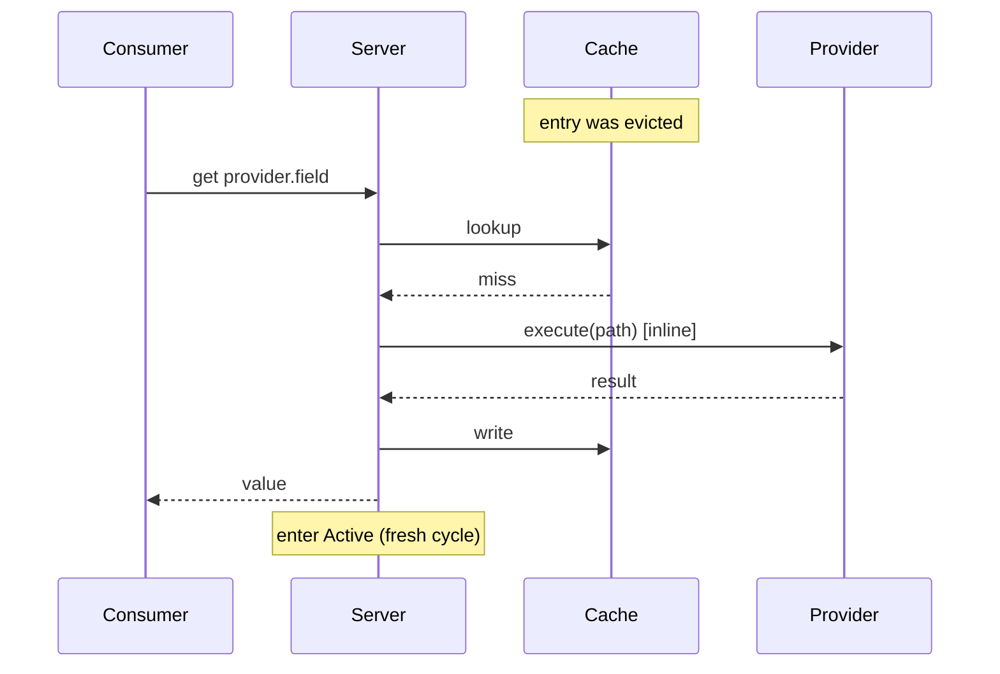

# Cache Lifecycle

**Status:** canonical. Describes how a cached property lives from first request to eviction. Tests must match this document; disagreements mean the code is wrong.

**Scope:** the demand/decay state machine. Out of scope items are listed at the end.

## Glossary

| Term | Meaning |
|---|---|
| **Property** | A single scalar value identified by `provider.field` (e.g., `git.branch`). |
| **Field** | A named component of a provider's output. Each field has a declared type and scope (Global or PathScoped). |
| **Provider** | Code that computes a set of fields on demand. A built-in `impl Provider` in Rust, a script, an HTTP endpoint, or a loaded shared library. |
| **Consumer** | Any caller that issues a cache request: CLI command, shell prompt integration, SDK client. Consumers are anonymous and transient. |
| **Cache entry** | One `(provider, path)` slot. Holds the complete `ProviderResult` — all fields the provider emitted in a single execution — plus timestamp and state metadata. |
| **Demand signal** | An event that counts as activity for a cache entry. Two sources: (a) a consumer request, (b) an fsevent on a filesystem path watched by that entry's provider. Both reset the keep-alive timer. |
| **Keep-alive window (`K`)** | The duration since the last demand signal within which the entry stays in the **Active** state. |
| **Base poll interval (`P`)** | Polling rate used in the Active state. Provider-declared default, overridable per-provider. |
| **Active** | State in which the entry is in live demand. Polls at `P`, filesystem watches are live. |
| **Decay step** | A post-Active state with geometrically larger poll interval and step duration than the previous step. Four decay steps total, numbered 1–4. |
| **Reinstate** | The effect of a demand signal arriving during decay: the entry returns to Active and the decay cycle resets. |
| **Evict** | Remove a cache entry after Decay step 4 expires without demand. |

## Core model

### States



### Decay schedule

For a provider with base poll interval `P` and keep-alive window `K`, decay step `n ∈ {1..4}` has:

- **Poll interval** at step `n`: `P × 2^n` — so `2P, 4P, 8P, 16P`.
- **Step duration** at step `n`: `K × 2^n` — so `2K, 4K, 8K, 16K`.

Total time from keep-alive expiry to eviction (no reinstatement): `K × (2+4+8+16) = 30K`.

With `K = 2 min`, `P = 60s` (git's defaults): decay lasts 60 minutes, polling at 2/4/8/16 minute intervals.

### Demand: two sources, same effect

A consumer request and an fsevent on a watched path are symmetric demand signals. Both:

1. Update the cache entry (the fsevent path executes the provider; the consumer path may hit cache).
2. Reset the keep-alive timer to 0.
3. Promote from any decay state back to Active.

Filesystem watches are registered only while in Active. Watches are torn down on transition to Decay1. During decay, only consumer requests can deliver demand.

## Sequence diagrams

### Cold read



### Warm read



### Active refresh: polling



### Active refresh: fsevent (equivalent to a consumer request)



### Decay progression



### Reinstatement during decay



### Post-eviction read



## Invariants

1. An entry is in exactly one state: Cold (not in cache), Active, Decay1, Decay2, Decay3, Decay4, or Evicted (removed).
2. Any demand signal in any non-Cold state promotes the entry to Active and resets the decay cycle.
3. Absent reinstatement, decay is strictly monotonic: Active → Decay1 → Decay2 → Decay3 → Decay4 → Evicted.
4. The decay ratio is fixed at 2. Decay step count is fixed at 4. Total decay window is `30K`.
5. Filesystem watches are registered only during Active. During Decay, only consumer requests can deliver demand.
6. After eviction, the next request goes through the Cold path — provider executes inline.
7. `K` (keep-alive window) and `P` (base poll interval) are per-provider configurable. Decay ratio and step count are not.

## Parameters

| Parameter | Scope | Configurability |
|---|---|---|
| Keep-alive window `K` | per-provider | configurable |
| Base poll interval `P` | per-provider | configurable, with provider-declared default |
| Decay step count | global | fixed at 4 |
| Decay ratio | global | fixed at 2 |

Current config keys that control these settings live in `src/config.rs`. Naming and exact semantics at the config-key level are subject to the implementation spec that closes out this design.

## Behaviour assertions

Tests (in `tests/cache_lifecycle.rs`, to be created) must assert every scenario below. Each `Scenario` is a one-to-one target for a test.

```gherkin
Feature: Cache lifecycle

  Scenario: Cold cache miss triggers inline fetch
    Given no cache entry for "hostname.short"
    When a consumer requests "hostname.short"
    Then the provider is executed inline
    And the result is returned to the consumer
    And the cache entry is created in Active state

  Scenario: Warm read returns cached value
    Given an entry for "git.branch" in Active state
    When a consumer requests "git.branch"
    Then the cached value is returned
    And the provider is not executed

  Scenario: Warm read resets keep-alive
    Given an entry for "git.branch" in Active state with keep-alive elapsed 100s
    When a consumer requests "git.branch"
    Then the entry remains in Active state
    And the keep-alive elapsed time is 0s

  Scenario: Polling refreshes an active entry
    Given an entry for "git.branch" in Active with base poll interval P
    When P seconds pass
    Then the provider is executed
    And the cache entry is updated

  Scenario: fsevent refreshes an active entry and resets keep-alive
    Given an entry for "git.branch" in Active state with watches registered
    When an fsevent fires on a watched path
    Then the provider is executed
    And the cache entry is updated
    And the keep-alive elapsed time is 0s

  Scenario: Keep-alive expiry enters Decay1
    Given an entry for "git.branch" in Active
    When K seconds pass with no demand signal
    Then the entry transitions to Decay1
    And the poll interval becomes 2P
    And the registered watches are torn down

  Scenario: Decay1 expiry advances to Decay2
    Given an entry for "git.branch" in Decay1
    When 2K seconds pass with no demand signal
    Then the entry transitions to Decay2
    And the poll interval becomes 4P

  Scenario: Decay2 expiry advances to Decay3
    Given an entry for "git.branch" in Decay2
    When 4K seconds pass with no demand signal
    Then the entry transitions to Decay3
    And the poll interval becomes 8P

  Scenario: Decay3 expiry advances to Decay4
    Given an entry for "git.branch" in Decay3
    When 8K seconds pass with no demand signal
    Then the entry transitions to Decay4
    And the poll interval becomes 16P

  Scenario: Decay4 expiry evicts the entry
    Given an entry for "git.branch" in Decay4
    When 16K seconds pass with no demand signal
    Then the entry is evicted from the cache

  Scenario: Consumer request in any decay state reinstates to Active
    Given an entry for "git.branch" in Decay<n> (n ∈ {1..4})
    When a consumer requests "git.branch"
    Then the entry transitions to Active
    And filesystem watches are re-registered
    And the poll interval returns to P

  Scenario: Request after eviction triggers the Cold path
    Given no cache entry for "git.branch"
    And a previous entry was evicted
    When a consumer requests "git.branch"
    Then the provider is executed inline
    And a fresh entry is created in Active state

  Scenario: fsevent during decay is not delivered (watches dropped)
    Given an entry for "git.branch" in Decay2
    When a file matching the provider's watch pattern is modified
    Then no refresh occurs
    And the entry remains in Decay2

  Scenario: Total decay window is 30K
    Given an entry for "git.branch" in Active
    When K + 30K seconds pass with no demand signal
    Then the entry is evicted
```

## Out of scope

- **Failure backoff.** A separate mechanism suppresses provider execution after repeated failures. Orthogonal to decay. Configured independently via `failure_reattempts` / `failure_backoff_interval`. See `src/scheduler.rs` for `FailureState`.
- **Virtual providers.** Entries created via `comb put` hold user-supplied data and have no `execute()`. Decay applies; reinstatement triggers nothing because there is nothing to re-execute. A stale virtual entry is served as-is; an evicted virtual entry is genuinely gone and a subsequent request misses.
- **`Once` providers.** Hostname, user, uname — computed at daemon startup, never again. They are not part of the decay cycle.
- **`--force` and `--wait`.** Explicit consumer overrides that bypass or modify default read semantics. Not part of the lifecycle; documented on the request API.
- **Demand signals from the wire protocol itself.** `comb refresh`, `comb watch`, and `comb get --force` all have distinct semantics covered in the protocol spec. This document treats them as varieties of demand signal; per-op nuances live in `docs/protocol-spec.md`.

## Relationship to the current implementation

As of 2026-04-23, the front half of this model (Cold → Active, warm reads, active polling, fsevent refresh) is correct and tested. The decay half is not wired — see `docs/roadmap.md` → Known Core Issues. The decay rebuild must bring the implementation into conformance with this document.
