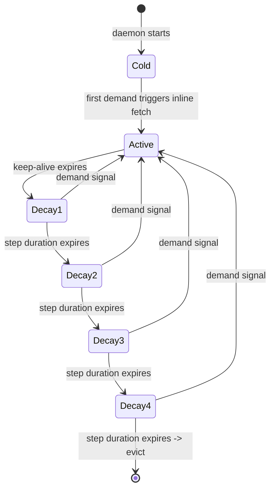
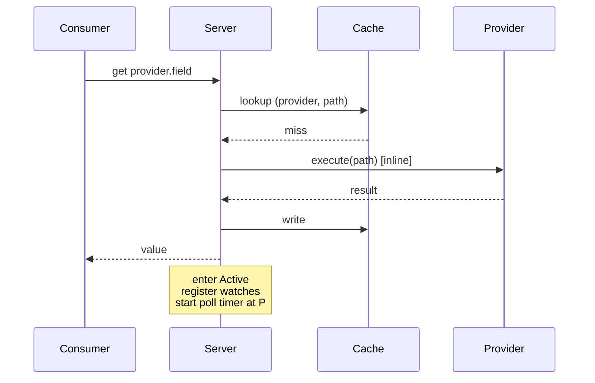
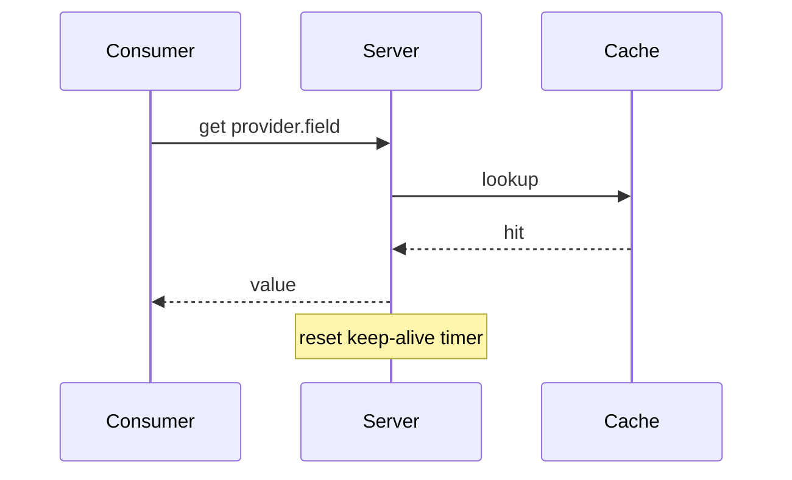
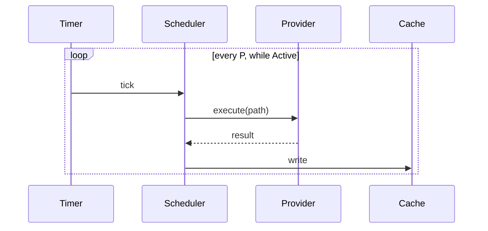
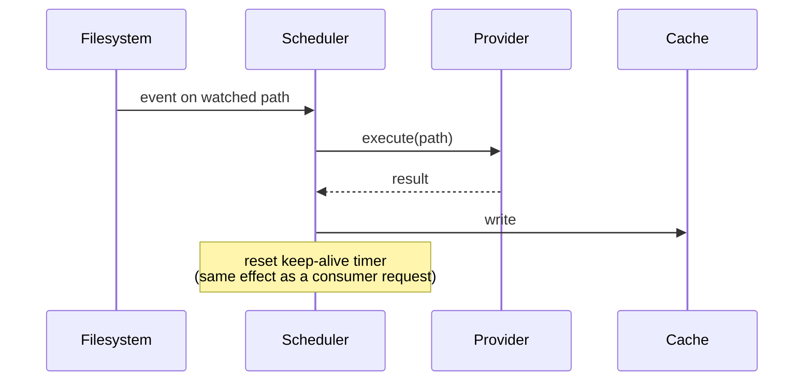
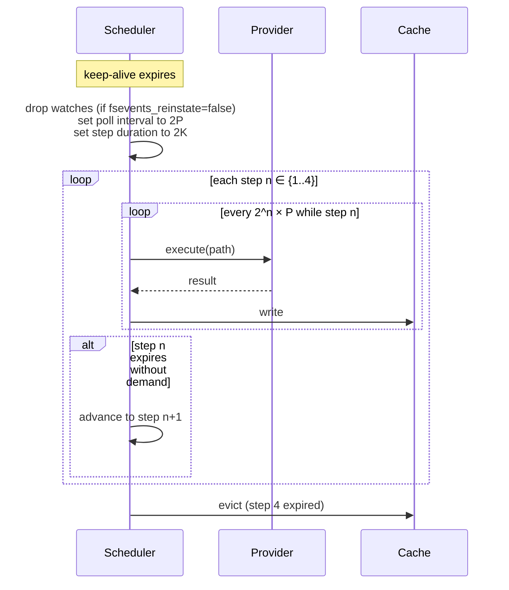
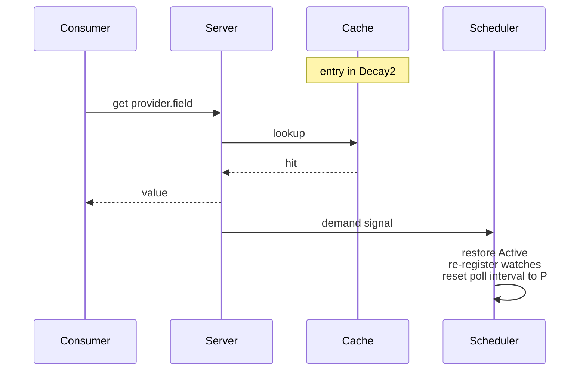
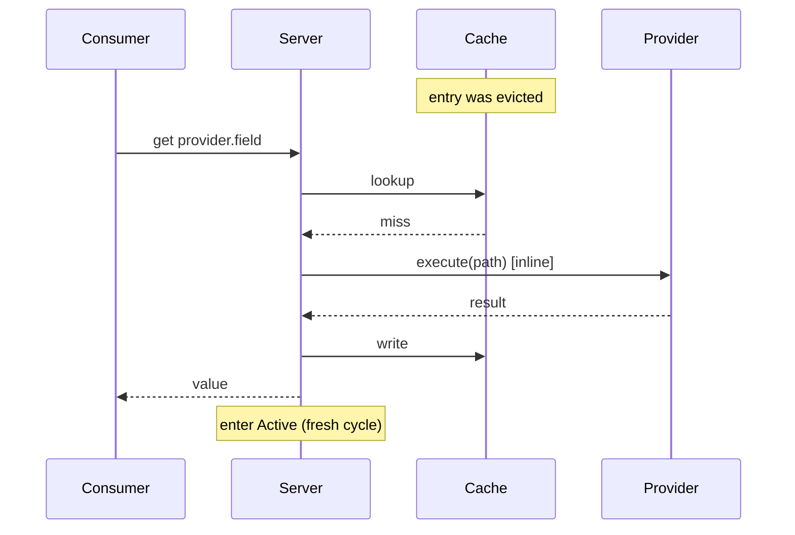

# Cache Lifecycle

**Status:** canonical. Describes how a cached property lives from first request to eviction. Tests must match this document; disagreements mean the code is wrong.

**Scope:** the demand/decay state machine. Out of scope items are listed at the end.

> **Relationship to the Source model.** This document describes the state machine for a single unit of refresh. Since the provider-source rebuild, that unit is a **Source instance**, keyed `(provider, path, source)`, not a whole provider — see [`provider_source.md`](./provider_source.md). The machine below runs independently per Source instance; a `(provider, path)` cache entry with multiple Sources runs one of these machines per Source, and the entry holds the union of each Source's disjoint Fields. Where this doc says "entry" or "the provider executes," read "Source instance" / "the Source executes" for the multi-Source case; the single-Source framing here is kept for readability and the math is identical.

## Glossary

| Term | Meaning |
|---|---|
| **Property** | A single scalar value identified by `provider.field` (e.g., `git.branch`). |
| **Field** | A named component of a provider's output. Each field has a declared type and scope (Global or PathScoped). |
| **Provider** | Code that computes a set of fields on demand. A built-in `impl Provider` in Rust, a script, an HTTP endpoint, or a loaded shared library. |
| **Consumer** | Any caller that issues a cache request: CLI command, shell prompt integration, SDK client. Consumers are anonymous and transient. |
| **Cache entry** | One `(provider, path)` slot. Holds the union of all the provider's Sources' Field outputs at that key (each Source contributes a disjoint Field subset), plus per-Source timestamp and state metadata. See [`provider_source.md`](./provider_source.md) for the composition model. |
| **Demand signal** | An event that counts as activity for a cache entry. Two sources: (a) a consumer request, (b) an fsevent on a filesystem path watched by that entry's provider. Both reset the keep-alive timer. |
| **Base poll interval (`P`)** | Polling rate used in the Active state. Provider-declared default, overridable per-provider. |
| **Keep-alive count (`K`)** | Number of base-rate polls' worth of time the entry stays in Active after the last demand signal. Expressed as an integer count, not a duration. Keep-alive duration in seconds is `K × P`. |
| **Active** | State in which the entry is in live demand. Polls at `P`, filesystem watches are live. |
| **Decay step** | A post-Active state with geometrically larger poll interval and step duration than the previous step. Four decay steps total, numbered 1–4. |
| **Reinstate** | The effect of a demand signal arriving during decay: the entry returns to Active and the decay cycle resets. |
| **Evict** | Remove a cache entry after Decay step 4 expires without demand. |

## Core model

### States



### Decay schedule

For a provider with base poll interval `P` seconds and keep-alive count `K` polls, decay step `n ∈ {1..4}` has:

- **Poll interval** at step `n`: `P × 2^n` seconds — so `2P, 4P, 8P, 16P`.
- **Step duration** at step `n`: `K × P × 2^n` seconds — so `2KP, 4KP, 8KP, 16KP`.

This keeps the unit invariant: **every state contains exactly `K` polls at its current rate.** Active contains `K` polls at `P`; Decay step `n` contains `K` polls at `P × 2^n`. The only thing that changes step-to-step is the rate.

Total time from keep-alive expiry to eviction (no reinstatement): `K × P × (2+4+8+16) = 30KP` seconds.

With `P = 10s`, `K = 12` polls: keep-alive is 120s, decay lasts 3600s (60 min), polling at 20s / 40s / 80s / 160s. Each step contains 12 polls regardless of which step.

### Demand: two sources, same effect

A consumer request and an fsevent on a watched path are symmetric demand signals. Both:

1. Update the cache entry (the fsevent path executes the provider; the consumer path may hit cache).
2. Reset the keep-alive timer to 0.
3. Promote from any non-Cold state back to Active.

### Filesystem watches during decay

Watch behaviour during decay is per-Source configurable via `fsevents_reinstate` (see [`provider_source.md`](./provider_source.md) §"fsevents_reinstate default"):

- **Keep-during-decay (default — `fsevents_reinstate = true` for `Watch`/`WatchAndPoll`):** watches remain registered through every decay step until eviction. An fsevent can reinstate an entry all the way down to Decay4. This is the default: a watch is cheap to keep registered, and keeping it lets an idle entry refresh promptly when its watched path finally changes (e.g., a config file consumers read once an hour).
- **Drop-on-decay (`fsevents_reinstate = false`):** watches torn down when the entry enters Decay1. Only consumer requests can reinstate during decay. Provider authors opt into this for Sources whose watched paths fire frequently during quiet periods, where reacting to every event during decay would defeat the decay's purpose.

### Timers

Two independent timers drive the lifecycle per entry:

- **Poll timer** — elapses at the current poll interval (`P` in Active, `P × 2^n` in Decay step `n`). Each elapse executes the provider and refreshes the entry. Resets on every elapse and on every provider execution.
- **Decay timer** — elapses at the current step duration (`K` in Active, `K × 2^n` in Decay step `n`). Each elapse advances the state to the next step (Active → Decay1 → … → Decay4 → Evicted). Resets to 0 on any demand signal.

The poll timer refreshes data; the decay timer governs state transitions. Either can fire independently of the other.

## Sequence diagrams

### Cold read



### Warm read



### Active refresh: polling



### Active refresh: fsevent (equivalent to a consumer request)



### Decay progression



### Reinstatement during decay



### Post-eviction read



## Invariants

1. An entry is in exactly one state: Cold (not in cache), Active, Decay1, Decay2, Decay3, Decay4, or Evicted (removed).
2. Any demand signal in any non-Cold state promotes the entry to Active and resets the decay cycle.
3. Absent reinstatement, decay is strictly monotonic: Active → Decay1 → Decay2 → Decay3 → Decay4 → Evicted.
4. The decay ratio is fixed at 2. Decay step count is fixed at 4. Total decay window (from Active exit to eviction) is `30K` polls at `P` seconds each = `30KP` seconds.
5. After eviction, the next request goes through the Cold path — provider executes inline.
6. Two timers govern each entry: the poll timer refreshes data; the decay timer advances state. They are independent.

## Parameters

| Parameter | Scope | Unit | Configurability |
|---|---|---|---|
| Base poll interval `P` | per-provider | seconds | configurable, with provider-declared default |
| Keep-alive count `K` | per-provider | polls (integer) | configurable, with provider-declared default |
| Watches-during-decay (`fsevents_reinstate`) | per-Source | bool | configurable, default keep-during-decay for `Watch`/`WatchAndPoll` |
| Decay step count | global | — | fixed at 4 |
| Decay ratio | global | — | fixed at 2 |

Keep-alive count is expressed in polls because every lifecycle window — Active and every decay step — contains exactly `K` polls at the relevant rate. Configuring `K = 12` means "stay in each state long enough for twelve polls at its rate, regardless of which state." Keep-alive duration in wall-clock seconds is `K × P`; total decay window is `30KP`.

## Worked examples

### Example 1 — `git.branch` in a monorepo

Provider: `git`, path-scoped, `P = 60s`, `K = 2` polls, drop-on-decay. Keep-alive duration in seconds: `K × P = 120s`. Total decay: `30KP = 3600s = 60 min`.

A developer runs `starship` (which polls `git.branch` every prompt) while coding, then switches to a long Slack conversation.

| Event | State | Timeline |
|---|---|---|
| First prompt fires `comb get git.branch /repo` | Cold → Active | t = 0 |
| Every prompt re-queries (< 1s apart) | Active, keep-alive resets | t = 0 .. 5 min |
| Developer starts writing Slack messages — no prompts for 2 min | keep-alive expires | t = 7 min |
| Enter Decay1 — poll at `2P = 120s`, step contains 2 polls (4 min), watches dropped | Decay1 | t = 7 min |
| Decay1 expires (no demand), advance | Decay2 | t = 11 min |
| Decay2: poll at `4P = 240s`, step contains 2 polls (8 min) | Decay2 | t = 11 min |
| Decay2 expires | Decay3 | t = 19 min |
| Decay3: poll at `8P = 480s`, step contains 2 polls (16 min) | Decay3 | t = 19 min |
| Decay3 expires | Decay4 | t = 35 min |
| Decay4: poll at `16P = 960s`, step contains 2 polls (32 min) | Decay4 | t = 35 min |
| Decay4 expires — no demand the whole time | Evicted | t = 67 min |

Every step contains exactly `K = 2` polls at its current rate. If the developer queries `git.branch` at t = 25 min (during Decay3), the entry reinstates to Active, watches re-register, poll interval returns to `P = 60s`, and the decay cycle resets.

### Example 2 — `battery.percent` on a laptop

Provider: `battery`, global, `P = 30s`, `K = 4` polls, no watches (pure poll). Keep-alive duration: `120s`. Total decay: `30KP = 3600s = 60 min`.

A tmux status bar polls every 10s. The user locks the laptop and doesn't touch it for an hour.

| Event | State | Timeline |
|---|---|---|
| tmux queries `battery.percent` | Cold → Active | t = 0 |
| tmux queries every 10s — always hits cache, keep-alive resets | Active | t = 0 .. lock |
| Screen locks; no more queries | keep-alive expires | t = lock + 2 min |
| Decay1: poll at `60s`, step contains 4 polls (4 min) | Decay1 | |
| ... 4 decay steps without reinstatement ... | Decay4 | |
| Evicted | | t = lock + 62 min |

`battery.percent` is never fsevent-driven; watches behaviour is irrelevant.

### Example 3 — mixed-scope `mise` provider with keep-during-decay on the global entry

Provider: `mise`, emits both a pathless global entry and a path-scoped project entry (see `docs/provider-development.md`). Suppose the global entry is configured `keep-during-decay` because `~/.config/mise/config.toml` changes rarely but needs to be picked up promptly when it does.

After the user hasn't queried `mise.global` for a while, the pathless entry enters Decay3. A filesystem change to `~/.config/mise/config.toml` fires an fsevent. Because watches are kept during decay for this provider, the fsevent executes the provider, writes a fresh global entry, and reinstates to Active. The user's next query hits a fresh value immediately.

The project entry (path-scoped) is governed independently — it may be in any decay state at the same time and progresses on its own schedule.

## Behaviour assertions

Tests (in `tests/cache_lifecycle.rs`, to be created) must assert every scenario below. Each `Scenario` is a one-to-one target for a test.

```gherkin
Feature: Cache lifecycle

  Scenario: Cold cache miss triggers inline fetch
    Given no cache entry for "hostname.short"
    When a consumer requests "hostname.short"
    Then the provider is executed inline
    And the result is returned to the consumer
    And the cache entry is created in Active state

  Scenario: Warm read returns cached value
    Given an entry for "git.branch" in Active state
    When a consumer requests "git.branch"
    Then the cached value is returned
    And the provider is not executed

  Scenario: Warm read resets keep-alive
    Given an entry for "git.branch" in Active state with keep-alive elapsed 100s
    When a consumer requests "git.branch"
    Then the entry remains in Active state
    And the keep-alive elapsed time is 0s

  Scenario: Polling refreshes an active entry
    Given an entry for "git.branch" in Active with base poll interval P
    When P seconds pass
    Then the provider is executed
    And the cache entry is updated

  Scenario: fsevent refreshes an active entry and resets keep-alive
    Given an entry for "git.branch" in Active state with watches registered
    When an fsevent fires on a watched path
    Then the provider is executed
    And the cache entry is updated
    And the keep-alive elapsed time is 0s

  Scenario: Keep-alive expiry enters Decay1
    Given an entry for "git.branch" in Active with base poll interval P and keep-alive count K
    When K × P seconds pass with no demand signal
    Then the entry transitions to Decay1
    And the poll interval becomes 2P
    And the registered watches are torn down (if drop-on-decay)

  Scenario: Decay1 expiry advances to Decay2
    Given an entry for "git.branch" in Decay1
    When K × 2P seconds pass with no demand signal
    Then the entry transitions to Decay2
    And the poll interval becomes 4P

  Scenario: Decay2 expiry advances to Decay3
    Given an entry for "git.branch" in Decay2
    When K × 4P seconds pass with no demand signal
    Then the entry transitions to Decay3
    And the poll interval becomes 8P

  Scenario: Decay3 expiry advances to Decay4
    Given an entry for "git.branch" in Decay3
    When K × 8P seconds pass with no demand signal
    Then the entry transitions to Decay4
    And the poll interval becomes 16P

  Scenario: Decay4 expiry evicts the entry
    Given an entry for "git.branch" in Decay4
    When K × 16P seconds pass with no demand signal
    Then the entry is evicted from the cache

  Scenario: Every lifecycle step contains exactly K polls at its rate
    Given an entry for "git.branch" in any state
    When the step duration elapses with no demand signal
    Then exactly K polls have fired within that step

  Scenario: Consumer request in any decay state reinstates to Active
    Given an entry for "git.branch" in Decay<n> (n ∈ {1..4})
    When a consumer requests "git.branch"
    Then the entry transitions to Active
    And filesystem watches are re-registered
    And the poll interval returns to P

  Scenario: Request after eviction triggers the Cold path
    Given no cache entry for "git.branch"
    And a previous entry was evicted
    When a consumer requests "git.branch"
    Then the provider is executed inline
    And a fresh entry is created in Active state

  Scenario: fsevent during decay is not delivered when drop-on-decay
    Given a provider configured with drop-on-decay watches
    And an entry for that provider in Decay2
    When a file matching the provider's watch pattern is modified
    Then no refresh occurs
    And the entry remains in Decay2

  Scenario: fsevent during decay reinstates when keep-during-decay
    Given a provider configured with keep-during-decay watches
    And an entry for that provider in Decay3
    When a file matching the provider's watch pattern is modified
    Then the provider is executed
    And the entry transitions to Active
    And the poll interval returns to P

  Scenario: Total lifetime from last demand to eviction is 31KP
    Given an entry for "git.branch" in Active immediately after a demand signal
    When 31 × K × P seconds pass with no further demand signal
    Then the entry is evicted

  Scenario: Poll timer and decay timer advance independently
    Given an entry in Active with P = 60s and K = 2 polls (keep-alive duration 120s)
    When 60s pass with no demand signal
    Then the provider is executed
    And the entry remains in Active
    And the decay timer has elapsed 60s
```

## Out of scope

- **Failure backoff.** A separate mechanism suppresses provider execution after repeated failures. Orthogonal to decay. Configured independently via `failure_reattempts` / `failure_backoff_interval`. See `src/scheduler.rs` for `FailureState`.
- **Virtual providers.** Entries created via `comb put` hold user-supplied data and have no `execute()`. Decay applies; reinstatement triggers nothing because there is nothing to re-execute. A stale virtual entry is served as-is; an evicted virtual entry is genuinely gone and a subsequent request misses.
- **`Once` providers.** Hostname, user, uname — computed at daemon startup, never again. They are not part of the decay cycle.
- **`--force` and `--wait`.** Explicit consumer overrides that bypass or modify default read semantics. Not part of the lifecycle; documented on the request API.
- **Demand signals from the wire protocol itself.** `comb refresh`, `comb watch`, and `comb get --force` all have distinct semantics covered in the protocol spec. This document treats them as varieties of demand signal; per-op nuances live in `docs/protocol-spec.md`.

## See also

- [`docs/status_ttl.md`](./status_ttl.md) — visual design for the `comb status` TTL column, the watch-friendly dual of this state machine.
