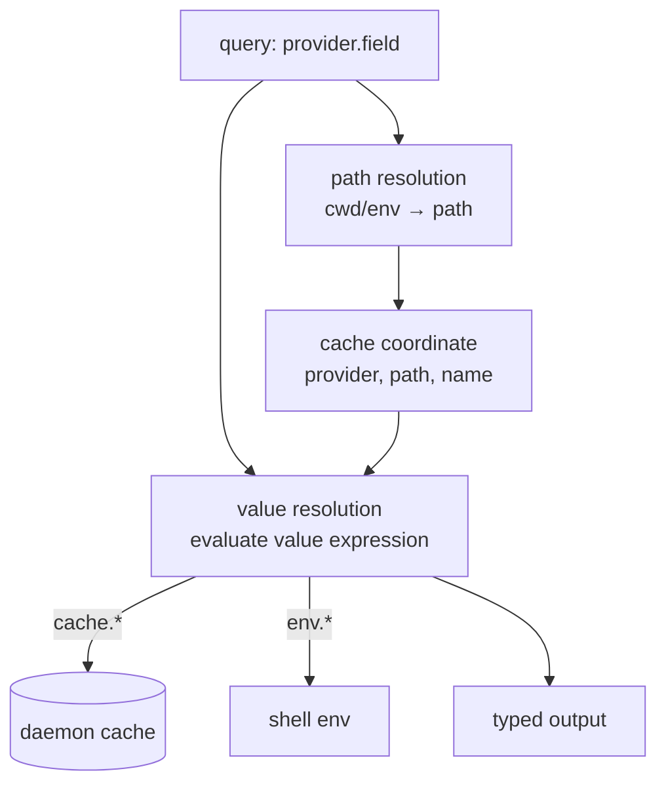

# Field Resolution

**Status:** canonical. Describes how a consumer query for `provider.field` is resolved into a typed value from the daemon's cache, the calling shell's environment, and its working directory — and where each step happens (daemon vs client). Tests must match this document; disagreements mean the code is wrong.

**Scope:** the client-side resolution layer — the field-type taxonomy, the `cache.*` and `env.*` namespaces, path resolution (which cached slot a query reads), value resolution (the per-field expression, cascades, selection), the value tree, and typed output. The daemon's Source refresh model — how cached values are produced and invalidated — is owned by [`provider_source.md`](./provider_source.md); the cache state machine by [`cache-lifecycle.md`](./cache-lifecycle.md). Out-of-scope items are listed at the end.

## Glossary

| Term | Meaning |
|---|---|
| **Consumer query** | A request for `provider.field` (e.g. `aws.region`). |
| **Resolution** | Producing a typed value for a consumer query, client-side, from the cache + `env.*` + `cwd`. |
| **Cache** | The daemon's store of values, keyed by `(provider, path, name)`. |
| **Cached value** | A value held in the cache. Addressed in expressions as `cache.<provider>.<field>`, read at the resolved path. |
| **Value expression** | The per-field expression that computes a field's resolved value. A cached field's default is the identity (its own cached value). |
| **Virtual field** | A field whose value expression is non-default — selection/computation over `cache.*` and `env.*`. It may have no cached value of its own. |
| **`env.*`** | The calling shell's environment, a value-only namespace; a miss yields `""`. |
| **`cwd`** | The calling shell's working directory; a variable available to path expressions. |
| **Path expression** | A client-side expression over `cwd`/`env.*` that computes a query's cache-key path; empty ⇒ global. |
| **Cascade** | A first-non-empty expression, `a or b or c`; the idiomatic shape for overrides and fallbacks. |
| **Selector** | A shell environment variable whose value designates which source a field's value comes from. |
| **Data provider** | A provider whose cached fields enumerate the variants of an env-selected source (e.g. `aws_profiles`). |
| **Consumer namespace** | A provider name composed of virtual fields presenting a user-facing surface (e.g. `aws`). |
| **Value tree** | The tree of resolved values. Addressable at any node: a leaf is a scalar, an interior node a subtree returned as an object. |

## Core model

The daemon is a **cache** of values keyed by `(provider, path, name)`. It produces and invalidates those values (see `provider_source.md`) but does not decide what a *consumer* sees. Resolution — the client's job — answers a query in two phases:

1. **Path resolution (identification)** — *which cached slot*: compute the cache-key path from `cwd`/`env.*` via the provider's path expression. With the provider and field name from the query, this fixes the cache coordinate `(provider, path, name)`.
2. **Value resolution** — *what the value is*: evaluate the field's value expression, where `cache.*` reads cached values at the resolved path and `env.*` reads the shell.



**Locus rule.** The daemon's environment is frozen at launch and wrong for the caller, so the daemon never reads the shell's `env` or `cwd`. The client supplies every per-shell input; the daemon receives only a concrete cache coordinate.

### Field types

Every field is one of five types. The first three are **cached values** (they differ only in *how* the cache is filled — a `provider_source.md` concern); the last two are computed client-side:

| Type | Value comes from | Where resolved | Cached? | Env-aware? |
|---|---|---|---|---|
| **native** | Rust `execute()` over files/syscalls | daemon | yes | no |
| **external** | a script / library / HTTP backend run by the daemon | daemon | yes | no |
| **literal** | literal data stored via `comb put` | daemon | yes (opt TTL) | no |
| **virtual** | a value expression over `cache.*` + `env.*` | client | no | **yes** |
| **env** | the caller's shell environment variable | client | no | by definition |

From the resolution layer the three cached types are identical — all read via `cache.*`. The type distinction that matters here is **cached vs virtual vs env**. `literal` and `virtual` are the two **user-defined** types — both declare a field without a Source: a literal is stored data (daemon-side, env-blind); a virtual is an expression (client-side, env-aware).

### The `cache.*` namespace

A cached value is addressed as `cache.<provider>.<field>` and read at the path fixed in phase 1. `cache.*` returns the stored value **directly**, bypassing any field's value expression — it is the raw material, not a resolved field.

A query's referenced fields fall into two kinds, and the distinction is load-bearing:

- `cache.<provider>.<field>` — the **raw cached value**.
- `<provider>.<field>` — another field's **resolved value** (its own value expression evaluated; recursive, cycle-detected).

For a cached field with the default identity expression the two coincide; they diverge only when a field is virtual.

### `env.*` namespace

`env.X` is the caller's `$X`, exposed as a value-only namespace.

- A **miss yields `""`**, never an error.
- **Directly queryable**: `comb get env.X` returns the value (valid, if rarely useful alone — its purpose is to be a term in a larger expression).
- **Never contacts the daemon**; carries no `age`/`ttl`/`stale` metadata (live by definition).
- Available wherever value expressions are evaluated, including inside `{{ }}` tags and in path expressions (`{{ env.X }}`).
- `--format json` emits the bare value (no metadata wrapper); `--format sh` shell-escapes it.

### Path resolution

A provider declares a **path expression**: a client-side expression over `cwd` and `env.*` whose result is the query's cache-key path.

- Non-empty result ⇒ the query reads the `(provider, result)` slot (path-scoped).
- Empty/falsy result ⇒ the pathless `(provider, None)` slot (global).
- Being a cascade, it expresses fallbacks naturally; a chain may end in `''` to fall through to global.

```jinja
path = "cwd"                                  {# path-scoped at the working directory #}
path = ""                                     {# global #}
path = "env.SELECTOR or '<default-path>'"     {# a selector chooses a path; default when unset #}
```

The path expression is the general form of the Global/PathScoped distinction. Built-in providers ship a compiled-in default; config-defined providers declare `path = "<expr>"`. A provider with no path expression keeps its declared scope.

### Value resolution

Every field has a **value expression**, written either bare (`env.A or cache.x.y`) or as a single tag (`{{ env.A or cache.x.y }}`) — the two are equivalent. A **template** — literal text around a tag, or more than one tag, e.g. `{{ git.branch }}*` — is a string-valued field: only a value expression written as exactly one tag keeps the expression's natural type. The documented form is `{{ }}`; bare stays accepted for backward compatibility.

- A **cached** field's value expression defaults to the **identity** — its own cached value, `cache.<provider>.<field>`.
- A **virtual** field's value expression is custom: selection or computation over `cache.*`, `env.*`, and other fields' resolved values. A virtual field **need not have a cached value of its own** — its value is entirely the expression.

Properties:

- **Cascade idiom:** `a or b or c` — the first non-empty term wins; all-empty ⇒ `""`.
- **Filters:** an expression may apply inline filter/transforms — e.g. `cache.python.local_venv_name or (env.VIRTUAL_ENV | basename)`.
- **Typed:** the result keeps its natural type (string/bool/number); a missing reference is falsy.
- **Ref discovery:** every reference in an expression is enumerated (nested undeclared-variable analysis, not byte scanning) — not only the first.
- **Cycle detection:** a `<provider>.<field>` reference that is itself virtual is evaluated recursively; a reference cycle is a config error, not a panic.

**Overriding a cached value under its own name.** When a consumer wants "env override on top of a single cached value," the expression references the **cached** value, not the resolved field:

```
terraform.workspace = env.TF_WORKSPACE or cache.terraform.workspace
```

This is not a cycle — `cache.terraform.workspace` is the stored value, distinct from the resolved field `terraform.workspace`. Because of this, a cached value **keeps its own name**; no rename is needed to let a same-named virtual field build on it.

**Selection over distinct cached values.** Where several *distinct* values feed one consumer field, each keeps its own name and the virtual field selects among them:

```
python.version = env.PYENV_VERSION or env.MISE_PYTHON_VERSION
                 or cache.mise.python or cache.asdf.python or cache.python.venv_version
```

`cache.python.venv_version` (the venv's version), `cache.mise.python`, `cache.asdf.python` are genuinely different things with their own names; `python.version` is the selection logic, with no cached value of its own.

### Env-driven selection

A selector is per-shell, so the daemon cannot apply it — but **either resolution phase can**. Where the selector acts depends on what it designates: a *slot*, or a *value within a slot*.

**It designates a slot → it drives the path phase.** Each selection is a different slot — typically a different file the shell points at — so the provider's path expression reads the selector and the query reads whatever slot it resolves to:

```jinja
path = "env.SELECTOR or '<default-location>'"
```

The value phase then does nothing special: the field resolves to the cached value at the chosen slot. The client supplies the resolved path as the cache coordinate; **producing and watching the value at it — including reading a file the path names — is the Source's job** (see [`provider_source.md`](./provider_source.md)). The daemon never reads the selector.

**It designates a value within a slot → it drives the value phase.** All variants live where the daemon already looks (one file or directory), so the daemon publishes the whole set as a **data provider**: a provider whose cached fields are the variants, keyed by variant name (e.g. `aws_profiles.default`, `aws_profiles.staging`, each an object of per-variant values). The consumer field is a virtual field that **indexes** the set by the selector's value:

```
<namespace>.<field> = env.<DIRECT> or cache.<data_provider>[ env.<SELECTOR> or <default_key> ].<field>
```

The daemon caches every variant regardless of the shell; the client does the indexing. `comb get <data_provider>` returns the whole set; `comb get <namespace>` returns the computed consumer fields.

The distinction is only *what the selector picks*. In both cases the daemon never reads the selector — the client converts it into a **path** (path phase) or an **index key** (value phase).

### The value tree

Resolution produces a **tree of values**. A query addresses any node by its path:

- a **leaf** resolves to a scalar value — `aws_profiles.staging.region` → `"us-east-1"`;
- an **interior node** resolves to its subtree, returned as an object — `aws_profiles.staging` → `{ region: … }`, `aws_profiles` → every profile, `aws` → its computed fields.

Whether a node is **cached** (stored by the daemon) or **computed** (a virtual field's expression) does not change how it is addressed. `provider` is the root of that provider's subtree; `provider.field.subkey…` walks down it; an expression walks the cached tree the same way (`cache.aws_profiles[key].region`).

### Typed output

A resolved value keeps its natural type. `--format json` emits bool / number / string (or object, for an interior node) as-is; `--format text`/`sh` stringify (and `sh` shell-escapes). The type is the expression's natural result type — no bespoke type tags.

## Invariants

1. Resolution is client-side. The daemon never reads the calling shell's `env` or `cwd`; it receives only a concrete cache coordinate `(provider, path, name)`.
2. A query's cache-key path is the result of the provider's path expression over `cwd`/`env.*`; an empty/falsy result selects the global slot.
3. The daemon is a cache of values keyed by `(provider, path, name)`, exposed to expressions as `cache.<provider>.<field>` and read at the resolved path.
4. Every field has a value expression. A cached field's default is the identity (its own cached value); a virtual field's is a custom expression and may have no cached value of its own.
5. `cache.<provider>.<field>` returns the stored value, bypassing field expressions; `<provider>.<field>` evaluates that field's value expression (recursive, cycle-detected). A field may override its own cached value via `cache.<self>` without self-reference; cached values keep their own names.
6. `env.*` is a value-only namespace: a miss yields `""`, never an error; it never contacts the daemon, carries no metadata, and is directly queryable.
7. A virtual field is evaluated client-side and is never cached in the daemon.
8. A resolved value keeps its natural type into `--format json`; `text`/`sh` stringify it. A missing reference is falsy.
9. A cascade resolves to its first non-empty term; all-empty resolves to `""`. A reference cycle is a config error, not a panic.
10. Value-phase env selection — the selector designates a value within a slot — publishes the whole set as a data provider keyed by variant; the client indexes it by the selector value; the daemon never reads the selector.
11. Path-phase env selection — the selector designates a slot — resolves the selector to a path client-side; the daemon receives only that path as the cache coordinate, never the selector env var. Producing and watching the value at the path is the Source's concern (`provider_source.md`).
12. A query may address any node of the value tree: a leaf resolves to a scalar, an interior node (a field whose value is an object, or a bare provider/namespace) to its subtree as an object. A consumer namespace's subtree is its evaluated virtual fields; a cached provider's, its cached fields. Addressing is independent of whether a node is cached or computed.
13. Built-in value and path expressions are built into the client; configuration overrides them per provider/field.
14. A value expression written as exactly one `{{ expr }}` evaluates to the expression's natural type; one written with literal text or more than one tag evaluates to a string.

## Parameters

This document defines no tunable runtime parameters. Per-field value expressions and per-provider path expressions are **configuration**, governed by the user-facing config documentation; their built-in defaults are built into the client.

## Worked examples

### Example 1 — fixed cascade over distinct cached values: `python.version`

```
python.version = env.PYENV_VERSION or env.MISE_PYTHON_VERSION
                 or cache.mise.python or cache.asdf.python or cache.python.venv_version
```

There is no cached `python.version`; it is pure selection logic. `cache.python.venv_version` (the venv's version), `cache.mise.python`, and `cache.asdf.python` are distinct cached values with their own names, read at the resolved (cwd) path. First non-empty wins; all-empty ⇒ `""`.

### Example 2 — single-value override: `terraform.workspace`

```
terraform.workspace = env.TF_WORKSPACE or cache.terraform.workspace
```

One underlying cached value (the workspace from `.terraform/environment`) with an env override on top. The cached value keeps the name `workspace`; the expression references `cache.terraform.workspace`, so there is no self-reference and no rename.

### Example 3 — enumerable selection: `aws.region`

`aws_profiles` is the data provider (a cached field per profile, each an object); `aws` is the consumer namespace.

```
aws.profile = env.AWS_PROFILE or env.AWS_VAULT or env.AWS_DEFAULT_PROFILE or "default"
aws.region  = env.AWS_REGION or env.AWS_DEFAULT_REGION
              or cache.aws_profiles[ env.AWS_PROFILE or env.AWS_VAULT or env.AWS_DEFAULT_PROFILE or "default" ].region
```

With `$AWS_PROFILE=staging` the client indexes the cached `aws_profiles` object at `["staging"].region`; unset → `["default"]`. `$AWS_REGION` short-circuits before the index. The daemon caches every profile regardless of the shell's selector.

### Example 4 — slot chosen by env: `kubecontext.context`

`kubecontext` declares `path = "env.KUBECONFIG or '~/.kube/config'"`. With `$KUBECONFIG=/work/staging.yaml` the client sends that path as the cache coordinate; the value expression is the identity `cache.kubecontext.context`. Unset → `~/.kube/config`. Producing and watching the value at that slot — reading the file, merging a `:`-joined list (later file wins) — is the Source's job (`provider_source.md`).

### Example 5 — addressing an interior node: `comb get aws` vs `comb get aws_profiles`

Both address a provider root — an interior node — and return its subtree as an object. `comb get aws` evaluates the `aws` namespace's virtual fields (`region`, `profile`, `expiration`) — the computed surface. `comb get aws_profiles` returns the raw cached enumeration (every profile object). They differ only in whether the subtree is computed or cached.

## Behaviour assertions

```gherkin
Feature: Field resolution

  Scenario: a bare value expression is equivalent to a single tag
    Given field A has value expression written bare as "env.X or cache.a.y"
    And field B has the same expression written as a single tag "{{ env.X or cache.a.y }}"
    When each field is resolved
    Then both yield the same value with the expression's natural type

  Scenario: a single-tag expression keeps the expression's natural type
    Given a value expression "{{ cache.provider.flag }}" where cache.provider.flag is a boolean
    When the field is resolved
    Then the value is a boolean, not a string

  Scenario: a template expression resolves to a string
    Given a value expression "{{ git.branch }}*"
    When the field is resolved
    Then the value is a string

  Scenario: a cached field resolves to its cached value by default
    Given a cached field provider.f with no custom value expression
    When provider.f is resolved
    Then the value is the cached cache.provider.f at the resolved path

  Scenario: every reference in an expression is fetched, not only the first
    Given a value expression "cache.a.x or cache.b.y or cache.c.z"
    When it is resolved
    Then all of cache.a.x, cache.b.y, cache.c.z are fetched as needed

  Scenario: overriding a cached value under its own name is not a cycle
    Given the value expression "env.X or cache.provider.f" for field provider.f
    And $X is unset
    When provider.f is resolved
    Then the value is the cached cache.provider.f
    And resolution does not recurse into provider.f

  Scenario: a virtual field selects across distinct cached values
    Given python.version = "cache.mise.python or cache.python.venv_version"
    And cache.mise.python is empty and cache.python.venv_version is "3.12"
    When python.version is resolved
    Then the value is "3.12"

  Scenario: env.* miss yields empty string with no daemon round-trip
    Given the calling shell has no $NOPE
    When env.NOPE is resolved
    Then the value is ""
    And no request is sent to the daemon

  Scenario: env.* is directly queryable
    Given $FOO is "bar"
    When env.FOO is resolved
    Then the value is "bar"

  Scenario: empty path expression selects the global slot
    Given a provider whose path expression evaluates to ""
    When a query for that provider is resolved
    Then the query reads the pathless (provider, None) slot

  Scenario: a selector path expression chooses a path with a default
    Given a provider declares path "env.SEL or '/default/path'"
    When $SEL is "/chosen/path"
    Then the client sends path "/chosen/path"
    When $SEL is unset
    Then the client sends path "/default/path"

  Scenario: the daemon never reads the selector env var
    Given the daemon process has $SEL set to path A
    And the calling shell has $SEL set to path B
    When the selector-driven field is resolved
    Then the value reflects path B

  Scenario: value-phase selection indexes the published set
    Given a data provider caches { default:{v:1}, chosen:{v:2} }
    And the shell selector designates "chosen"
    When the consumer field is resolved
    Then it indexes the cached set by "chosen" and yields 2
    When the selector is unset
    Then it indexes by the default key and yields 1

  Scenario: a direct env value wins over the indexed value
    Given a direct env override is set
    When the consumer field is resolved
    Then the override wins and the data provider is not indexed

  Scenario: a slot selector hands off the resolved path, list included
    Given a provider's path expression resolves to "/a/config:/b/config"
    When the field is resolved
    Then the client sends "/a/config:/b/config" as the cache coordinate
    And merging and watching the path is the Source's concern

  Scenario: a bare consumer namespace evaluates all its virtual fields
    Given a namespace of virtual fields with no cached provider
    When the bare namespace is queried
    Then each virtual field is evaluated and returned as one object

  Scenario: a bare cached provider returns its cached fields
    When a bare cached/data provider is queried
    Then its cached fields are returned as one object

  Scenario: typed output is preserved
    Given a value expression that yields a boolean
    When resolved with --format json
    Then the output is a JSON boolean
    When resolved with --format text or sh
    Then the output is the stringified value

  Scenario: a reference cycle is a config error
    Given two virtual fields whose expressions reference each other as resolved fields
    When either is resolved
    Then resolution returns a config error
    And the process does not panic
```

## Out of scope

- **Daemon Source refresh model** — how cached values are produced and invalidated (Source structure, invalidation, scope, lifecycle, failure, cache-entry composition): see [`provider_source.md`](./provider_source.md).
- **Cache state machine** — Active / Decay / Evicted: see [`cache-lifecycle.md`](./cache-lifecycle.md).
- **Wire protocol / NDJSON encoding** — request/response shapes are protocol documentation, not this model.
- **User-facing config file syntax** — how `[providers.<name>]`, `path`, and value-expression keys are written is governed by the user-facing config documentation.
- **SDK behaviour** — SDK API shapes and surfaces are SDK documentation, not this model. The resolution model itself binds every consumer, CLI and SDKs alike.

## See also

- [`provider_source.md`](./provider_source.md) — the daemon Source refresh model that produces cached values and path-scoped slots.
- [`cache-lifecycle.md`](./cache-lifecycle.md) — the Active/Decay/Evicted state machine of the slots this layer reads.
