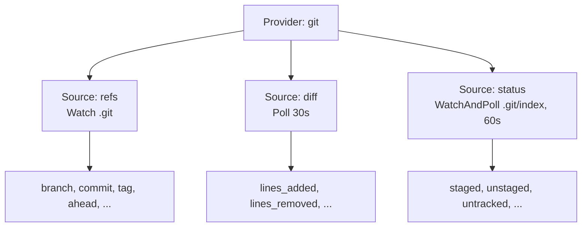
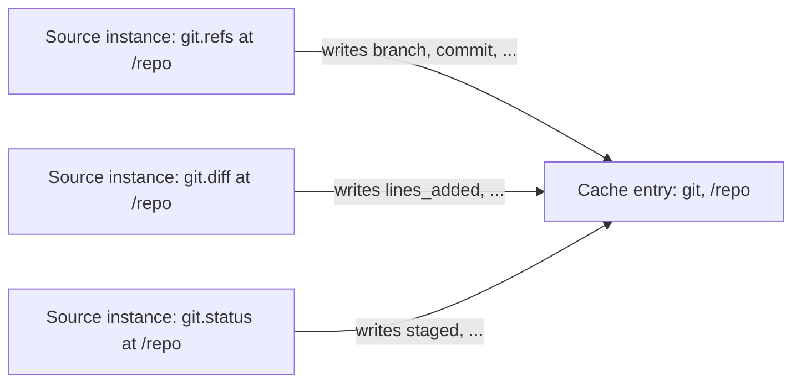
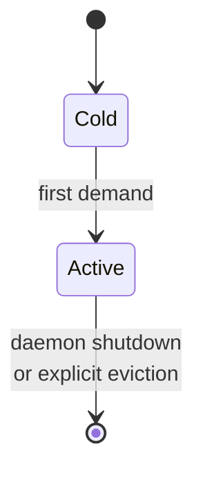

# Provider Source

**Status:** canonical. Defines the Source abstraction within a Provider, how Sources relate to Providers and Fields, and how multiple Sources within one Provider compose to populate cache entries. Tests must match this document; disagreements mean the code is wrong.

**Scope:** the Source as a unit of refresh — its structure, invalidation strategies, scoping, lifecycle interaction, failure handling, and composition into cache entries. The cache entry's underlying state machine (Active / Decay1..4 / Evicted) is owned by [`cache-lifecycle.md`](./cache-lifecycle.md); this doc references that model and extends it for the per-Source case. Out-of-scope items are listed at the end.

## Glossary

| Term | Meaning |
|---|---|
| **Provider** | The public namespace for a related set of Fields (e.g., `git`, `mise`). A Provider declares 1+ Sources and emits no Fields directly outside of Sources. Identified by name. |
| **Source** | The unit of refresh inside a Provider. Has its own invalidation strategy, scope, lifecycle, and computes a declared subset of the Provider's Fields. Identified by `(provider_name, source_name)`. |
| **Field** | A named scalar value produced by exactly one Source. Identified by `provider.field` (e.g., `git.branch`). |
| **Cache entry** | The `(provider, path)` slot. Holds the union of all Sources' Field outputs for that key. Sources writing to the same cache entry contribute disjoint Field subsets; Field-name conflicts are not allowed. |
| **Source instance** | The runtime per-Source state at `(provider_name, path, source_name)`. Owns the Source's lifecycle state, watch registrations, poll timer, keep-alive timer, and failure-backoff state. Instances at the same `(provider, path)` share a cache entry but have independent runtime state. |
| **Source scope** | `Global` or `PathScoped`. Determines whether the Source's results live in the pathless cache slot or path-keyed slots. A single Provider may have Sources of either scope. |
| **Pure-watch Source** | A Source whose invalidation strategy is `Watch`. Refreshes only on filesystem events; never polls. |
| **Failback** | Per-Source failure-backoff state. Distinct from cache lifecycle keep-alive; governs retries after refresh failures, not decay-on-idle. |

## Core model

### Provider–Source–Field relationship



Each Field belongs to exactly one Source. Field names are unique within a Provider. The Provider name plus the Field name resolves uniquely to a single Source.

### Source structure

A Source is declared by these properties:

| Property | Type | Purpose |
|---|---|---|
| `name` | String | Unique within the Provider; used in keys, status, telemetry |
| `fields` | List of FieldSchema | The Fields this Source produces. Field names must be unique within the Provider. |
| `scope` | `Global \| PathScoped` | Where this Source's output is keyed in the cache |
| `invalidation` | InvalidationStrategy | How and when the Source refreshes (see below) |
| `keep_alive` | KeepAlive | How long the Source instance stays Active without demand (see Lifecycle) |
| `failback` | FailbackConfig | Retry / suppression behaviour on refresh failure (see Failure handling) |
| `fsevents_reinstate` | bool | Whether watches survive decay; default `true` for `Watch`/`WatchAndPoll`, meaningless for `Poll` |

### Invalidation strategies

Three strict variants. Each is a distinct refresh discipline; they are not interchangeable.

```rust
enum InvalidationStrategy {
    Poll {
        interval_secs: u64,
    },
    Watch {
        patterns: Vec<String>,    // path components matched within the Source's scope path
        abs_paths: Vec<String>,   // absolute paths; Provider expands ~/$XDG_CONFIG_HOME at metadata time
    },
    WatchAndPoll {
        patterns: Vec<String>,
        abs_paths: Vec<String>,
        interval_secs: u64,
    },
}
```

**`Poll`** — the Source executes on a timer at `interval_secs`. No filesystem watches.

**`Watch`** — the Source executes on filesystem events from `patterns` (relative) and/or `abs_paths` (absolute). It does not poll. Ever. If watch registration fails (e.g., OS resource exhaustion, missing path), the Source has no refresh path; cache fields owned by the Source serve their last value until the next consumer demand triggers a re-attempt of watch registration. Provider authors who want safety against watch-registration failure declare `WatchAndPoll` instead.

**`WatchAndPoll`** — the Source executes on filesystem events AND on a timer at `interval_secs`. The two refresh paths are independent. Use when fs events catch most state changes but some changes don't touch a watched path (e.g., `git fetch` from elsewhere catching up remote refs without modifying the local working tree).

There is no general "fallback poll on watch failure" mechanism. The strategy is a contract about *how* the Source refreshes; failure of the chosen mechanism does not implicitly switch modes.

### Source scope

A Source declares one of:

- **`Global`** — the Source's output lives in the pathless cache slot `(provider_name, None)`. The Source instance is keyed `(provider_name, None, source_name)`. Examples: `mise.global`, `battery.level`, `hostname.name`.
- **`PathScoped`** — the Source's output lives in path-keyed cache slots. Source instances are created on demand per path: `(provider_name, Some(path), source_name)`. Examples: `mise.project`, `git.refs`, `python.venv`.

A Provider may declare Sources of either scope. The scope is per-Source, not per-Provider.

### Watch registration

For `Watch` and `WatchAndPoll` Sources, when the Source instance enters Active state:

- Each entry in `patterns` is registered as a relative path component to be matched within the Source's scope path. For `PathScoped`, that path is the source instance's path. For `Global`, `patterns` is not meaningful; use `abs_paths`.
- Each entry in `abs_paths` is registered as an absolute filesystem watch root. The Provider is responsible for expanding `~`, `$HOME`, `$XDG_CONFIG_HOME`, etc., during `metadata()` so the scheduler receives canonical absolute paths.

A filesystem event whose path is under any registered watch root and matches any registered pattern (or hits any watched abs_path) triggers refresh of the corresponding Source instance.

### File-path scope and per-instance watched files

A `PathScoped` Source's scope path is usually a directory (e.g. a project root), within which `Watch` patterns are matched. A Source may instead be scoped by a **file path** — or a separator-joined list of file paths — when its value lives in a file the *consumer* selects (the path-phase of env-driven selection; see [`field_resolution.md`](./field_resolution.md)). Such a Source:

- reads (and, for a list, merges) the file(s) named by its scope path in `execute(path)`;
- declares the absolute files to watch for that instance via `watched_files(path)` (default: none). For a `Watch`/`WatchAndPoll` Source the scheduler registers a watch on each returned file, so the instance is invalidated by changes to its component files even though the scope path is not a single watchable directory.

The cache coordinate is the file-path scope; distinct selections are distinct Source instances sharing the normal `PathScoped` lifecycle and decay. The Source never reads the selector env var — consumer-side resolution supplies the concrete path.

### Cache entry composition

A cache entry at `(provider, path)` holds the union of all Source instances' Field outputs at that key:



When a Source instance refreshes, it overwrites only its own declared Fields in the cache entry. Other Sources' Fields are untouched. The entry has multiple per-Field provenance records — which Source wrote each Field, and when.

### Watch backend health (self-test and polling fallback)

At startup, the daemon verifies that the kernel fs-event backend delivers events at all: it registers a watch on a private temp directory, touches a file inside it, and waits up to 2s for the corresponding event. The self-test runs concurrently with the scheduler loop — a failure verdict swaps the live watcher for the polling backend and re-registers every watch path — so the timeout adds no startup latency.

- **Delivered** → provider file-watching uses the kernel-native backend (FSEvents / inotify).
- **Not delivered** → provider file-watching uses the polling backend for the life of the process. The degradation is logged and surfaced by `comb check daemon` and `comb status`.

The 2s timeout sits well above load-degraded delivery: healthy-idle delivery is ~10ms, but hundreds of ms under heavy filesystem load (parallel builds), and the timeout must not misclassify a loaded-but-healthy backend as dead.

The test probes the capability, not the environment: detecting "am I sandboxed" is fragile and platform-specific, while "do events arrive" is exactly the property the watch subsystem depends on. Without this, a daemon whose stream delivers nothing serves watch-invalidated entries that silently never invalidate. Watch health is in-process state exposed over the protocol, with no external consumer.

## Lifecycle

A Source instance follows the [`cache-lifecycle.md`](./cache-lifecycle.md) state machine: Cold → Active → Decay1..4 → Evicted, with demand signals reinstating from any Decay step. The state machine is **per Source instance**, not per cache entry. Sibling Sources at the same `(provider, path)` decay independently.

### Keep-alive parameter

Keep-alive is configured per Source. Its unit depends on strategy:

- **`Poll` and `WatchAndPoll`**: `KeepAlive::Polls(K)` — the entry stays Active for `K` polls' worth of time (`K × interval_secs` seconds). Decay step `n` lasts `K × interval_secs × 2^n` seconds. Matches `cache-lifecycle.md`'s `K × P` model exactly.
- **`Watch`**: `KeepAlive::Duration(K_secs)` — direct seconds, since there is no `P`. Decay step `n` lasts `K_secs × 2^n` seconds. Total decay window from Active exit to Evicted is `30 × K_secs`.

### Pure-watch globals never decay

A Source with strategy `Watch` and scope `Global` is exempt from decay. It transitions Cold → Active on first demand and remains Active until daemon restart or explicit eviction. Justification: zero ongoing cost (no poll subprocess, single OS watch), refreshes only on fs events (cost-free while idle), and `Global` scope means there is no per-directory churn that decay would meaningfully address.

This is the only exception to the universal Active→Evicted progression in `cache-lifecycle.md`. All other Source instances — including pure-watch `PathScoped` — decay normally.



### fsevents_reinstate default

For `Watch` and `WatchAndPoll` Sources, `fsevents_reinstate` defaults to `true`. Watches survive decay; an fs event during any Decay step reinstates the Source instance to Active.

For `Poll` Sources, `fsevents_reinstate` is meaningless (no watches exist to drop or reinstate).

Provider authors may override the default to `false` — appropriate for a Source with very high event volume during quiet periods, where reacting to every event during decay would defeat the decay's purpose.

### Demand signals

A Source instance receives demand from two equivalent signals:
1. A consumer queries any Field owned by the Source.
2. A filesystem event fires on a watched path (only when the Source's strategy is `Watch` or `WatchAndPoll`).

Both signals reset keep-alive and reinstate from any Decay step to Active. This matches `cache-lifecycle.md`'s symmetric-demand-signals model, scoped to the Source.

A consumer query for `git.branch` is demand for the Source that owns `branch`; it is not demand for sibling Sources at the same `(provider, path)`.

## Failure handling

Each Source instance has independent failure-backoff state:

```rust
struct FailbackConfig {
    reattempts: u32,        // K-equivalent: max consecutive failures before suppression
    interval_secs: u64,     // P-equivalent: suppression duration after reattempts hit
}
```

When a Source's refresh attempt fails (subprocess error, file-not-found during read, watch-registration error, timeout), `consecutive_failures` increments. After `reattempts` consecutive failures, the Source enters suppression for `interval_secs`. Successful refresh resets the counter.

A suppressed Source does not refresh. Cache Fields owned by it serve their last value (or are absent if never populated). The status display shows a warning glyph for affected Fields.

**Failback config is independent of lifecycle keep-alive.** They are different concepts and may have different values:

- Lifecycle keep-alive controls decay-on-idle (no demand for K time).
- Failback controls retry-on-failure (reattempts × interval_secs).

A Source with `KeepAlive::Polls(12)` may have `FailbackConfig { reattempts: 3, interval_secs: 60 }` — twelve polls of decay capacity before idling toward eviction; three failures before sixty seconds of suppression after a refresh outage.

## Field freshness

Each Field's freshness is the freshness of its owning Source's last successful refresh at that path. The cache entry at `(provider, path)` may carry multiple per-Field ages — one per Source contributing to it.

`comb status` renders one row per Field (per existing convention). The age column for each row reflects the age of that Field's owning Source, not the entry as a whole. Two Fields in the same entry may show different ages if they come from different Sources.

## Worked examples

### Example 1: Mise (two Sources, both `Watch`, mixed scope)

```
Provider: mise

Source: global
  scope: Global
  invalidation: Watch { patterns: [], abs_paths: ["$HOME/.config/mise"] }
  keep_alive: never  (pure-watch global)
  fsevents_reinstate: true (default)
  fields: dynamic <tool> (one String per installed tool)

Source: project
  scope: PathScoped
  invalidation: Watch { patterns: [".mise.toml", "mise.toml"], abs_paths: [] }
  keep_alive: Duration(120s)
  fsevents_reinstate: true (default)
  fields: dynamic <tool> (one String per project tool)
```

The `global` Source instance never decays. It transitions Cold → Active on first demand and stays Active until daemon restart. Its watch on `$HOME/.config/mise` fires on any change in that directory; the Source re-executes and overwrites tool Fields in the `(mise, None)` cache entry.

The `project` Source has one instance per visited project root. Each instance decays through Decay1..4 over `30 × 120s = 3600s` (60 min) without demand. Watches survive decay; an `.mise.toml` edit during decay reinstates the instance to Active.

### Example 2: Git (multiple Sources, mixed strategies)

```
Provider: git

Source: refs
  scope: PathScoped
  invalidation: Watch { patterns: [".git"], abs_paths: [] }
  keep_alive: Duration(120s)
  fields: branch, commit, tag, ahead, behind, upstream, detached, state, state_step, state_total, stash

Source: diff
  scope: PathScoped
  invalidation: Poll { interval_secs: 30 }
  keep_alive: Polls(4)  (= 120s)
  fields: lines_added, lines_removed, lines_staged_added, lines_staged_removed

Source: status
  scope: PathScoped
  invalidation: WatchAndPoll { patterns: [".git/index"], abs_paths: [], interval_secs: 60 }
  keep_alive: Polls(2)  (= 120s)
  fields: staged, unstaged, untracked, conflicted, dirty
```

`git.branch` (in `refs`) refreshes only on `.git` fs events — no polling overhead. `git.lines_added` (in `diff`) refreshes every 30s while the Source is Active — file-watching cannot cheaply observe working-tree edits. `git.staged` (in `status`) refreshes both on `.git/index` events and as a 60s backstop.

A consumer who queries `git.branch` repeatedly but never queries `git.lines_added` keeps `refs` Active while `diff` decays and eventually evicts. Each Source's lifecycle is independent.

### Example 3: Battery on Linux (two Sources, mixed-cost mechanisms)

```
Provider: battery

Source: level
  scope: Global
  invalidation: Poll { interval_secs: 30 }
  keep_alive: Polls(4)
  fields: percent, charging, status_raw  (from /sys/class/power_supply/<bat>/{capacity,status})

Source: upower
  scope: Global
  invalidation: Poll { interval_secs: 60 }
  keep_alive: Polls(2)
  fields: time_remaining_secs, status (from `upower -i`)
```

`level` polls cheap sysfs reads frequently; `upower` polls the expensive subprocess less often. Each Source has its own demand timestamps, decay timeline, and failure backoff.

## Read-always Sources

A Source may be **read-always**: its `execute` is a cheap file or syscall read, so the request path re-executes it on every `get` / `context` / `watch` initial snapshot instead of serving the cached value. The Source declares this by returning `true` from `read_always()` (default: `false`).

Read-always is reserved for Sources whose `execute` cost is comparable to a single file read (e.g. reading `<gitdir>/HEAD`). Expensive Sources — subprocess spawns, worktree scans, network calls — must remain `false` and stay event/poll-driven.

The cache entry for a read-always Source is still written on every re-execution and remains available to the scheduler's poll/watch path. The distinction is only in the request path: instead of returning the cached value, it re-executes first.

## Invariants

1. Every Field belongs to exactly one Source. Field names are unique within a Provider.
2. A Source's invalidation strategy is exactly one of `Poll`, `Watch`, or `WatchAndPoll`.
3. `Watch` Sources never poll. The poll timer for a `Watch` Source instance never fires; no execute occurs from the timer path.
4. `Poll` Sources never register filesystem watches.
5. `WatchAndPoll` Sources do both: watches register on entry to Active, the poll timer fires at `interval_secs`. fs events and polls are independent refresh paths.
6. A Source instance's lifecycle state is independent of other Source instances at the same `(provider, path)`.
7. Pure-watch global Sources (`Watch` + `Global`) do not decay. They transition Cold → Active and remain Active until daemon shutdown or explicit eviction.
8. All other Source instances decay per `cache-lifecycle.md`.
9. `fsevents_reinstate` defaults to `true` for `Watch` and `WatchAndPoll` Sources. Provider authors may override to `false`.
10. `Failback` config is per-Source and is distinct from lifecycle keep-alive.
11. A Source's refresh produces exactly the Fields the Source declares — no more, no less.
12. Sources writing to the same cache entry produce disjoint Field sets. A Field-name overlap between Sources of the same Provider is a configuration error.
13. A consumer query for `provider.field` is demand for the Source that owns `field`. It is not demand for sibling Sources of the same Provider.
14. A read-always Source is re-executed on every request-path read; its value is never served from cache. Read-always is reserved for Sources whose `execute` is a cheap file/syscall read.
15. A `PathScoped` Source may be scoped by a file path or separator-joined file list; it reads/merges those file(s) in `execute` and declares the files to watch via `watched_files`. For `Watch`/`WatchAndPoll` Sources the scheduler registers a watch on each declared file. The Source never reads the selector env var.
16. Provider file-watching is never silently dead: the watch self-test either confirms event delivery or flips to the polling backend, and the degradation is observable via `comb check daemon` and `comb status`.

## Behaviour assertions

```gherkin
Feature: Source-level invalidation

  Scenario: Pure-watch source never polls
    Given a Source with strategy Watch
    And the Source instance is Active
    When no filesystem event fires
    Then the Source's poll timer never fires
    And no execute occurs from the timer path

  Scenario: Watch source refreshes on filesystem event
    Given a Source with strategy Watch and registered watches
    When a filesystem event fires on a path matching the Source's patterns or abs_paths
    Then the Source's execute fires
    And only the Source's declared Fields are written to the cache entry

  Scenario: WatchAndPoll source refreshes on both paths
    Given a Source with strategy WatchAndPoll
    When a filesystem event fires on a watched path
    Then the Source's execute fires
    When the poll interval elapses with no event
    Then the Source's execute also fires

  Scenario: Pure-watch global source never decays
    Given a Source with strategy Watch and scope Global
    And the Source instance is Active
    When no demand or filesystem event fires for any duration
    Then the Source instance remains Active
    And does not transition to any Decay step

  Scenario: Path-scoped Watch source decays per K-as-duration
    Given a Source with strategy Watch and scope PathScoped, keep_alive Duration(60s)
    And the Source instance is Active
    When 60 seconds pass with no demand or filesystem event
    Then the Source instance transitions to Decay1
    And the Decay1 step duration is 120 seconds

  Scenario: Source-level failure backoff suppresses refresh
    Given a Source with FailbackConfig { reattempts: 3, interval_secs: 60 }
    When 3 consecutive refresh attempts fail
    Then the Source instance enters failure suppression for 60 seconds
    And cache Fields owned by this Source are not refreshed during suppression
    And status displays a warning glyph for affected Fields

  Scenario: Successful refresh resets failure counter
    Given a Source with FailbackConfig { reattempts: 3, interval_secs: 60 }
    And 2 consecutive refresh attempts have failed
    When the next refresh succeeds
    Then the consecutive_failures counter is reset to 0
    And no suppression occurs

  Scenario: Sibling Sources have independent lifecycles
    Given a Provider with two Sources at the same (provider, path)
    And only one Source's Fields are queried by consumers
    When the unqueried Source's keep-alive expires
    Then the unqueried Source transitions to Decay1 independently
    And the queried Source remains Active

  Scenario: fsevents_reinstate default is true for Watch sources
    Given a Source with strategy Watch and no explicit fsevents_reinstate setting
    Then the effective fsevents_reinstate is true
    And watches survive transitions through Decay1..4

  Scenario: fsevents_reinstate default is true for WatchAndPoll sources
    Given a Source with strategy WatchAndPoll and no explicit fsevents_reinstate setting
    Then the effective fsevents_reinstate is true

  Scenario: Field freshness reflects owning Source's last refresh
    Given a cache entry with two Sources contributing Fields
    And Source A refreshed at t=0
    And Source B refreshed at t=10
    When status is queried at t=10
    Then the Field from Source A shows age 10 seconds
    And the Field from Source B shows age 0 seconds

  Scenario: Watch source with absolute path watches that absolute path
    Given a Source with strategy Watch, abs_paths=["/Users/x/.config/foo"], scope=Global
    When a file under /Users/x/.config/foo changes
    Then the Source's execute fires
    And the (provider, None) cache entry is updated

  Scenario: Cross-source Field write isolation
    Given a Provider with Source A producing Fields {a1, a2} and Source B producing Fields {b1}
    And both Sources are Active at the same (provider, path)
    When Source A refreshes
    Then Fields a1 and a2 in the cache entry are overwritten with new values
    And Field b1 is unchanged

  Scenario: Demand for a Field is demand for its owning Source only
    Given a Provider with Source A producing Field a1 and Source B producing Field b1
    Both Sources have keep-alive elapsed near to expiry
    When a consumer queries provider.a1
    Then Source A's keep-alive timer is reset
    And Source B's keep-alive timer is unchanged

  Scenario: Watch registration failure for a Watch-only source leaves cache stale
    Given a Source with strategy Watch
    And the underlying fs watcher returns an error during registration
    Then the Source has no refresh path
    And cache Fields owned by the Source serve their last cached values (or are absent)
    And no automatic poll fallback occurs
  Scenario: Watch self-test failure flips provider watching to polling
    Given a daemon starting where fs events do not deliver within 2s
    Then provider file-watching uses the polling backend
    And the degradation is reported by comb check daemon
```

## Out of scope

- **User-facing config syntax.** How `[providers.<name>.<source>]` blocks look in TOML, and which knobs are user-overridable per Source, is governed by the user-facing config documentation, not this canonical model.
- **Subprocess and file-read implementation details.** Which specific binaries each Source runs, or which files it reads, is provider-internal.
- **Cache key encoding.** The internal byte layout (e.g., `provider\0path` separators) is implementation detail.
- **Status TTL column rendering.** The visual representation of pure-watch sources (e.g., the F-only glyph render with no `D PxK` element) is governed by `docs/status_ttl.md`.
- **Migration / phasing.** How the codebase moves from monolithic `Provider::execute()` to the per-Source dispatch model is implementation planning, not part of the canonical model.
- **Failure backoff on watch-registration failure.** This canonical model does not specify automatic retry of failed watch registrations; whether and how the scheduler retries is an implementation concern bounded by the FailbackConfig contract.
- **Field resolution.** How a consumer query is resolved into a value — the field-type taxonomy, `cache.*`/`env.*`, path expressions, virtual fields, and env-driven selection — is governed by [`field_resolution.md`](./field_resolution.md), not this model.

## See also

- [`field_resolution.md`](./field_resolution.md) — how cached values, `env.*`, and path expressions resolve into the values consumers query
- [`cache-lifecycle.md`](./cache-lifecycle.md) — the universal Active/Decay/Evicted state machine that Source instances follow
- [`singleton.md`](./singleton.md) — daemon-singleton invariants (orthogonal; included here as the third canonical doc for cross-reference)
- `docs/status_ttl.md` — TTL column rendering, including pure-watch source render
