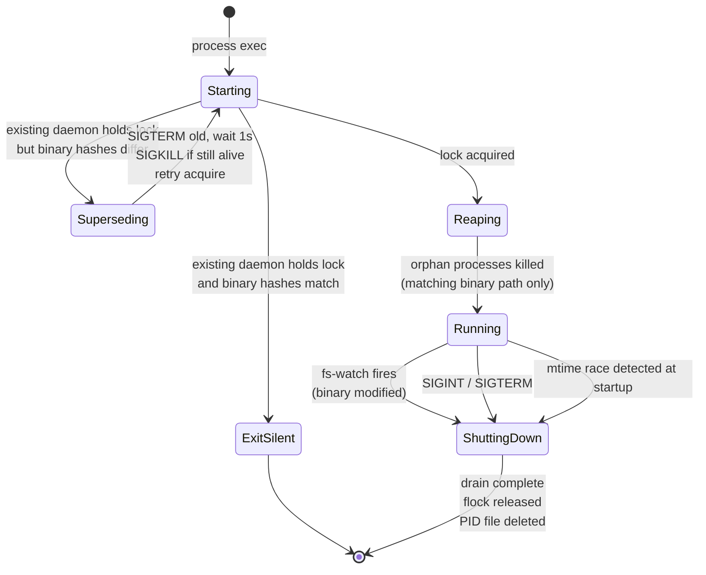
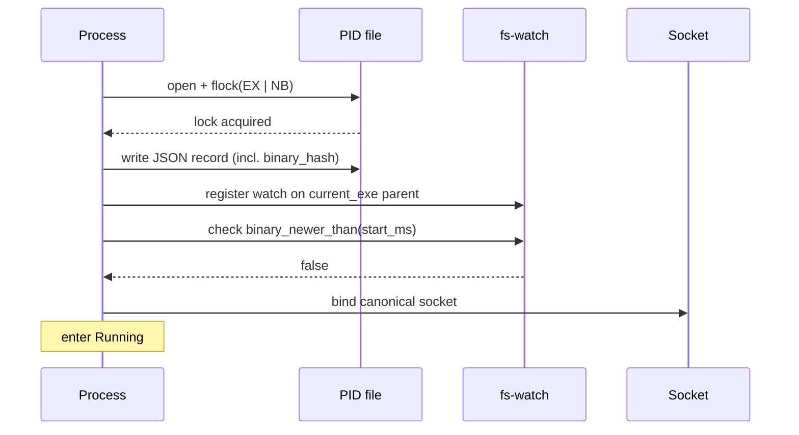
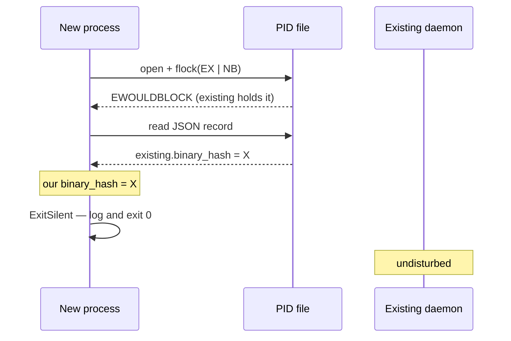
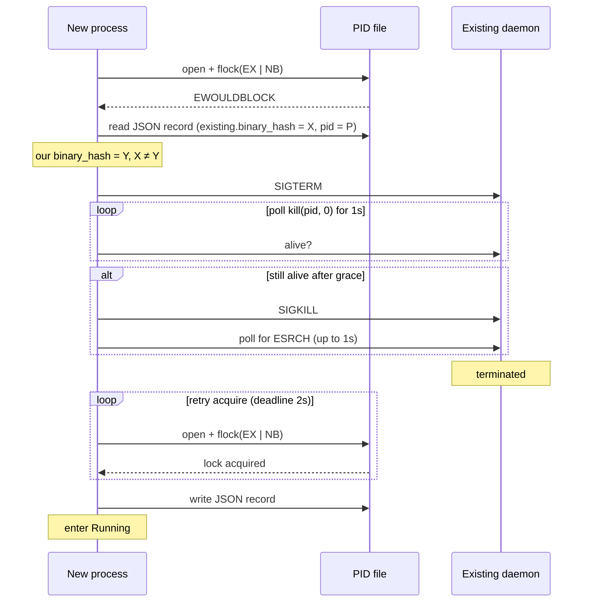
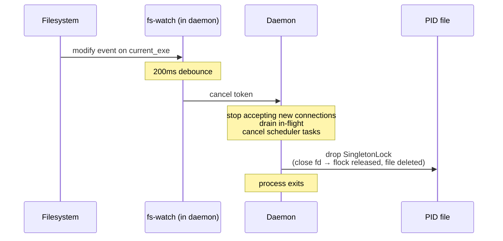
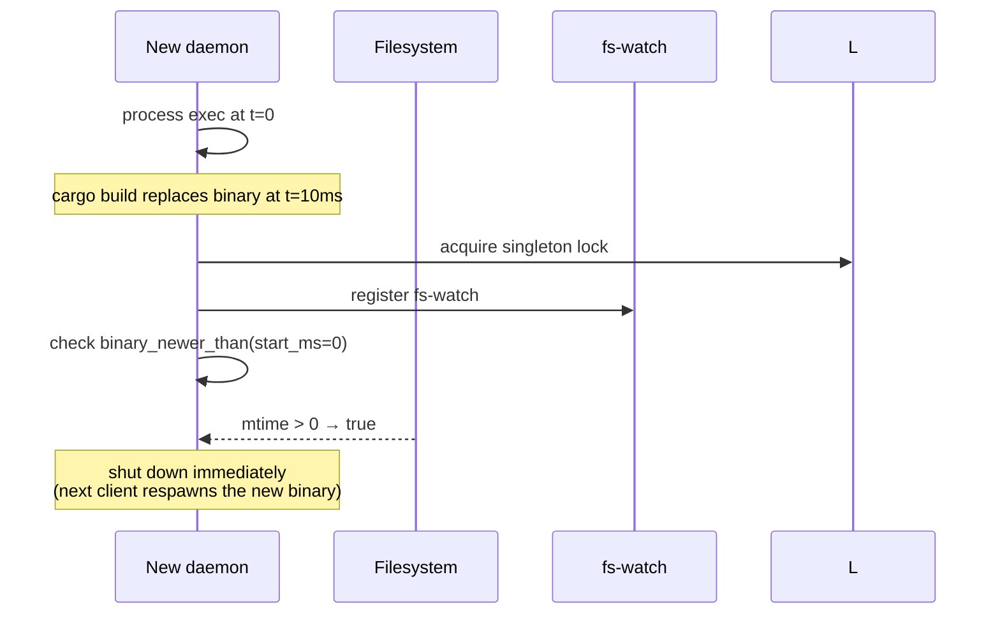
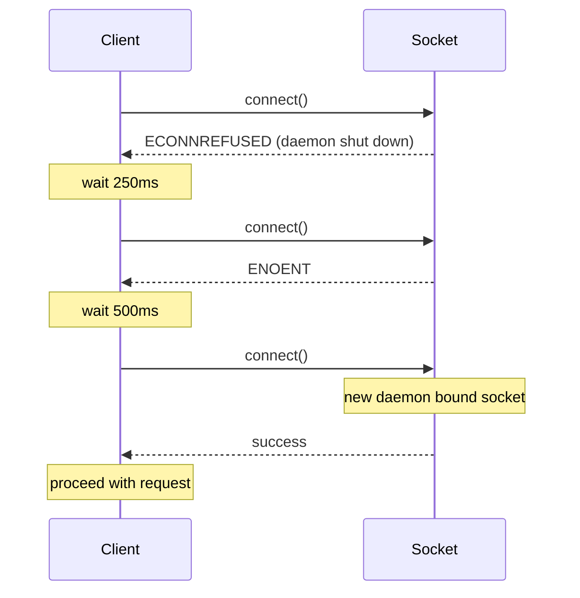
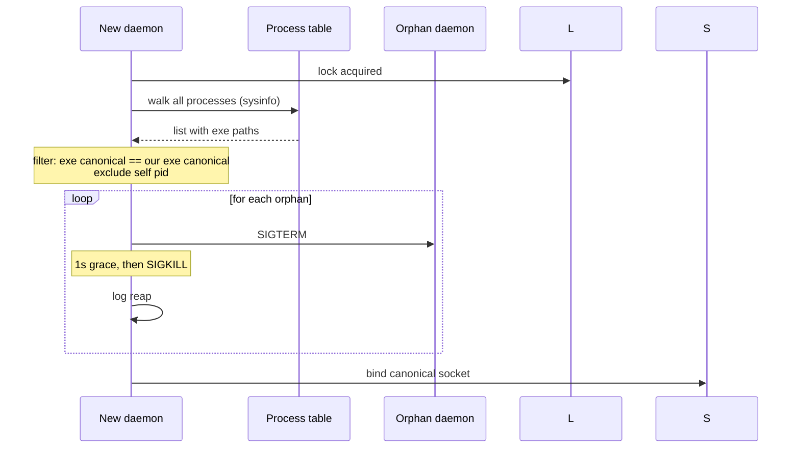

# Daemon Singleton

**Status:** canonical. Describes how at most one beachcomber daemon runs per user at any time, how startup detects existing instances, how a rebuilt binary triggers automatic restart, and how clients tolerate the brief restart window. Tests must match this document; disagreements mean the code is wrong.

**Scope:** the daemon-lifetime singleton property — startup contention, version-mismatch supersession, self-triggered restart on binary change, orphan reaping, client-side connect retry. Out-of-scope items at the end.

## Glossary

| Term | Meaning |
|---|---|
| **Singleton** | The invariant that at most one beachcomber daemon process runs per `<uid>` at any time, with brief transition windows during supersession explicitly excluded. |
| **Canonical socket path** | The Unix socket path a client connects to and a starting daemon binds. Resolution is identical across macOS and Linux given identical env state. |
| **PID file** | JSON record at `<socket-parent>/pid` written and held under exclusive `flock` by the running daemon. Released on graceful shutdown. |
| **Build identity** | A SHA256 of the daemon binary file content, computed at startup. The canonical answer to "is the running daemon the same physical build as the one that just started?" |
| **Human version** | A user-facing build label (e.g., `0.5.1` or `0.5.1+sha.abc12345.dirty`) emitted into the binary at compile time. Stored alongside build identity in the PID file but **not** used for singleton decisions. |
| **Supersession** | The act of a starting daemon killing an existing daemon with a different build identity, then taking the lock itself. |
| **Reap** | At startup, kill any other process whose `current_exe()` matches ours (orphan daemons left over from prior socket-path schemes or `--socket` overrides). |
| **Self-supervision** | The running daemon watches its own binary file. On modify, it gracefully shuts down so the next client invocation respawns the new binary. |
| **Connect retry** | Each client (CLI + every SDK) retries a failed `connect()` three times with 250ms / 500ms / 1s backoff before surfacing the error. Covers the daemon-restart window. |

## Core model

### States



### Canonical socket path resolution

Four steps, identical on macOS and Linux:

1. **Config override** — `config.daemon.socket_path` if set.
2. **`$BEACHCOMBER_SOCKET`** — if set and non-empty (any platform). Lets a user or integration point the daemon (and, identically, every client) at an explicit socket. Clients honor the same variable, so daemon and clients always agree.
3. **`$XDG_RUNTIME_DIR/beachcomber/sock`** — if the env var is set (any platform).
4. **`/tmp/beachcomber-<uid>/sock`** — hardcoded `/tmp` fallback. **Does NOT consult `$TMPDIR`.**

The TMPDIR step was removed because macOS gives every shell session a unique TMPDIR (sandbox/launchd-managed). With the TMPDIR step, two shells produced two socket paths and two daemons — violating singleton.

### PID file with `flock`

At startup, the daemon opens `<socket-parent>/pid` and takes an exclusive non-blocking `flock` on the file descriptor. Content is JSON:

```json
{
  "pid": 12345,
  "version": "0.5.1+sha.abc12345.dirty",
  "binary": "/path/to/comb",
  "binary_hash": "deadbeef...",
  "started_unix_ms": 1714000000000
}
```

Lock semantics: `flock` is per-file-descriptor on POSIX. The lock releases when the fd closes (process death, including SIGKILL, ungraceful exit, or `Drop` on graceful shutdown). The PID file itself is removed on graceful shutdown via `Drop`. A crashed daemon leaves the PID file but releases the flock; the next starting daemon takes the lock and overwrites the file.

### Build identity, separated from human version

Two distinct concerns:

- **Human version** (`BEACHCOMBER_VERSION`) — emitted by `build.rs` at compile time. Reads `COMB_BUILD_SHA` / `COMB_BUILD_DIRTY` env vars (set by CI for releases); falls back to bare `CARGO_PKG_VERSION` for dev builds. Build-cache safe: changes to git state do **not** invalidate the cache.
- **Build identity** (`binary_hash`) — SHA256 of the running binary's file content, computed at daemon startup (~50ms one-time cost). Always uniquely identifies the physical build artefact, regardless of what version string is embedded in it.

`decide_supersession` compares on `binary_hash`. Same hash = same physical build = the existing daemon is fine, exit silently. Different hash = supersede.

### Self-supervision

The daemon registers an `fs-watch` (via `notify`) on the parent directory of `current_exe()`. On modify/create/remove events that touch the binary path:

1. Debounce 200ms (catches multi-event rewrites like `cargo build`).
2. Trigger the existing `CancellationToken` for the daemon.
3. Daemon proceeds through graceful shutdown.

Additionally, immediately after the watch is registered, the daemon checks `binary_newer_than(current_exe, our_start_unix_ms)`. If true (binary was replaced between exec and watch arming), trigger shutdown immediately. Catches the small race window before the watch is live.

### Orphan reaping

Once the lock is acquired, the new daemon walks all processes (`sysinfo`), filters to those whose `current_exe()` canonicalises to the same path as ours, excludes self, and SIGTERM-then-SIGKILLs each. Worktree daemons (different binary path) are **not** killed.

### Client connect retry

Every client (CLI + Python/Go/Node/Ruby/C/Lua SDKs + `beachcomber-client`) retries `connect()` three times with backoffs `250ms / 500ms / 1000ms` (total worst-case ~1.75s) on `ECONNREFUSED` or `ENOENT`. Other errors surface immediately. Once a connection is established, mid-request errors are NOT retried.

## Sequence diagrams

### Cold daemon start



### Same-build start: exit silently



### Different-build start: supersede



### Binary modified during run



### Mtime startup race



### Client retry through restart window



### Reap orphans on startup



## Invariants

1. At any instant, at most one process holds the canonical PID file's `flock`. That process is the singleton.
2. A daemon holding the singleton lock has a build identity (`binary_hash`) recorded in the PID file. Any starting daemon reads it.
3. Same-build-identity contention resolves to the existing daemon staying live; the new process exits silently.
4. Different-build-identity contention resolves to the new daemon taking over; the existing daemon receives SIGTERM (1s grace) then SIGKILL.
5. The PID file is deleted on graceful shutdown (`SingletonLock::drop`). The flock is released when the file descriptor closes — including on SIGKILL or ungraceful exit.
6. Stale PID files (file present but no process holds the flock) do not block startup — `flock(LOCK_EX | LOCK_NB)` succeeds and the new daemon overwrites the file.
7. The daemon's binary on disk being modified causes the daemon to shut down within `200ms (debounce) + drain time`. Next client invocation respawns from the new binary.
8. Orphan reaping kills only processes whose canonicalised `current_exe()` matches the new daemon's. Worktree daemons (different binary path) are unaffected.
9. Clients tolerate up to ~1.75s of socket-unavailable through retry. Connection errors surfacing past that point indicate genuine daemon-down conditions.
10. Connect retry only fires on initial `connect()` failure. Mid-request socket errors propagate immediately to the caller.

## Parameters

| Parameter | Scope | Unit | Configurability |
|---|---|---|---|
| Canonical socket path | per-user | path | config override → `$BEACHCOMBER_SOCKET` → `$XDG_RUNTIME_DIR/beachcomber/sock` → `/tmp/beachcomber-<uid>/sock` |
| PID file location | per-user | path | derived: `<socket-parent>/pid` |
| `BEACHCOMBER_VERSION` (human) | per-build | string | `build.rs` reads `COMB_BUILD_SHA` / `COMB_BUILD_DIRTY` env at compile time |
| `binary_hash` (build identity) | per-build | hex SHA256 | computed at daemon startup; not configurable |
| SIGTERM grace before SIGKILL | global | seconds | fixed at 1s |
| Post-SIGKILL wait | global | seconds | fixed at 1s |
| Acquire-after-supersession retry deadline | global | seconds | fixed at 2s |
| fs-watch debounce | global | milliseconds | fixed at 200ms |
| Client connect retry count | per-SDK | retries | fixed at 3 |
| Client connect retry backoffs | per-SDK | milliseconds | fixed at 250 / 500 / 1000 |

Resolution is hardcoded throughout. Singleton enforcement should not be tunable — there is no useful "per-user 5 daemons" config.

## Worked examples

### Example 1 — fresh dev workflow with rebuild

Developer working on the `beachcomber` repo:

| Event | State | Notes |
|---|---|---|
| Run `comb status` (first time today) | Cold | CLI auto-spawns daemon; daemon starts at canonical socket path. |
| Daemon binds, takes flock, computes binary_hash = `A`, writes PID file, registers fs-watch, enters Running. | Running | |
| Run `comb status` again immediately | Running | Hits existing daemon. |
| Run `cargo build` — binary on disk is replaced | Running → ShuttingDown | fs-watch fires after 200ms debounce. Daemon drains and exits. |
| Run `comb status` again | Cold (auto-spawn) | Old socket gone (PID file deleted on Drop). CLI's connect_with_retry hits ENOENT, retries; CLI's `ensure_daemon` forks a new daemon from the now-current binary. |
| New daemon starts: binary_hash = `B`, takes flock, etc. | Running | |

### Example 2 — concurrent shells racing to start the daemon

Two shells run `comb get hostname.short` at the same time. Both find no daemon and try to spawn:

| Process | Action | Outcome |
|---|---|---|
| Shell A's daemon | Calls `acquire_or_supersede` first | Acquires flock; binary_hash = `A`; enters Running. |
| Shell B's daemon | Calls `acquire_or_supersede` second | flock contended; reads existing.binary_hash = `A`; our binary_hash = `A`; **exits silently with log line.** |
| Both shells' clients | Connect to canonical socket | Both hit Shell A's daemon; both succeed. |

No supersession. No SIGTERM. Idempotent contention.

### Example 3 — orphan TMPDIR-derived daemons after upgrade

User upgrades from a pre-singleton beachcomber to the current one. Their machine has 4 stale `comb daemon` processes from prior shell sessions, each on a TMPDIR-derived socket path.

| Event | Outcome |
|---|---|
| Run `comb status` | CLI auto-spawns new daemon at `/tmp/beachcomber-501/sock` (canonical). |
| New daemon's startup | Acquires flock at `/tmp/beachcomber-501/pid`. Walks process table. Finds 4 other `comb daemon` processes whose binary canonicalises to the same path as ours. SIGTERMs each; SIGKILLs the stragglers. Logs the reap. |
| Subsequent `ps -ef \| grep comb` | One `comb daemon` process remains. |

The 4 orphan daemons' sockets become orphaned files on disk; they are not the canonical socket and no client will reconnect to them. Cleanup of those stale socket files is not part of the singleton work (orphan socket files don't violate the singleton invariant).

## Behaviour assertions

```gherkin
Feature: Daemon singleton

  Scenario: Cold start — no existing daemon
    Given no daemon is running and no PID file exists
    When a daemon starts
    Then the canonical PID file is created with our pid, version, binary, binary_hash, started_unix_ms
    And an exclusive flock is held on the PID file
    And the daemon enters Running

  Scenario: Same binary hash — exit silently
    Given an existing daemon holds the lock with binary_hash = X
    When a new daemon starts with binary_hash = X
    Then the new daemon exits with status 0
    And the existing daemon is undisturbed
    And the PID file is unchanged

  Scenario: Different binary hash — supersede
    Given an existing daemon holds the lock with binary_hash = X (pid = P)
    When a new daemon starts with binary_hash = Y, Y ≠ X
    Then the new daemon sends SIGTERM to P
    And waits up to 1s for P to exit
    And sends SIGKILL to P if still alive
    And acquires the flock once released
    And writes a new PID file with binary_hash = Y

  Scenario: Crashed daemon leaves stale PID file
    Given a daemon previously crashed leaving a PID file but no process
    When a new daemon starts
    Then flock is acquired immediately (no other holder)
    And the PID file is overwritten with our record

  Scenario: Daemon binary modified during run
    Given a daemon is Running with binary at path B
    When the file at B is modified (mtime changes)
    Then within 200ms + drain time, the daemon exits
    And the PID file is deleted
    And the flock is released

  Scenario: Mtime startup race
    Given a daemon process starts at unix_ms T
    And the binary file at current_exe is modified at unix_ms > T (race window before fs-watch armed)
    When the daemon checks binary_newer_than(T) after registering the fs-watch
    Then the check returns true
    And the daemon initiates graceful shutdown

  Scenario: Orphan reaping kills matching binaries
    Given an orphan daemon is running whose current_exe canonicalises to the new daemon's current_exe
    When the new daemon completes startup lock acquisition
    Then the orphan is sent SIGTERM
    And SIGKILL if still alive after 1s
    And the orphan is removed from the process table

  Scenario: Worktree daemon is not reaped
    Given an orphan daemon is running whose current_exe is a different path (worktree)
    When the new daemon completes startup lock acquisition
    Then the orphan is not signalled

  Scenario: Self pid is not reaped
    Given the new daemon scans for orphans
    When its own pid appears in the process list
    Then it is excluded

  Scenario: PID 1 is not reaped
    Given supersede_existing is invoked with pid 1
    Then it returns Err without sending any signal

  Scenario: Already-dead pid is treated as success
    Given supersede_existing is invoked with a pid that has already exited
    Then it returns Ok
    And no error is logged

  Scenario: Client connect retries through restart window
    Given the daemon's canonical socket does not exist yet
    And in 400ms a daemon will bind it
    When a client invokes connect_with_retry on the canonical socket
    Then the client's connect succeeds before total elapsed time exceeds 1.75s
    And no error is surfaced to the caller

  Scenario: Client connect retries exhaust on dead daemon
    Given no daemon ever binds the canonical socket
    When a client invokes connect_with_retry
    Then connect_with_retry returns Err after waiting at least 1.75s
    And the error is ECONNREFUSED or ENOENT

  Scenario: Mid-request errors are not retried
    Given a client successfully connected to a daemon
    When the daemon dies mid-request causing a socket error
    Then the error propagates to the caller immediately
    And no retry is performed

  Scenario: Graceful shutdown releases lock and deletes PID file
    Given a daemon is Running with the singleton lock held
    When SIGINT or fs-watch triggers graceful shutdown
    Then the daemon completes drain
    And the PID file at the canonical path no longer exists
    And the flock is released

  Scenario: Canonical socket path ignores TMPDIR
    Given XDG_RUNTIME_DIR is unset
    And TMPDIR is set to "/per/shell/tmpdir"
    When resolve_socket_path is called with no config override
    Then the result starts with "/tmp/beachcomber-" and ends with "/sock"
    And the result does not contain "/per/shell/tmpdir"
```

## Out of scope

- **Multi-user daemons.** Each `<uid>` has its own canonical path. Two users on the same machine each run their own singleton; they do not collide.
- **Network / TCP daemons.** Singleton enforcement is per-user-per-host via Unix socket. There is no networked variant.
- **Backwards compatibility with old TMPDIR-derived sockets.** The TMPDIR-step removal is a breaking change for users with running daemons on old paths. Orphan reaping handles them on next canonical-daemon startup; no in-place migration of clients with cached socket paths.
- **`daemon.pid` (the older file).** A separate `daemon.pid` is written by `fork_daemon` for the auto-spawn mechanism. It is unrelated to the singleton's `pid` file. Coexists today; possible future cleanup to merge or remove.
- **In-process drain semantics.** The acceptor loop and connection-handler tasks do not currently honour the cancellation token cleanly — they are abandoned mid-await on shutdown rather than draining gracefully. Pre-existing concern, tracked separately. The singleton design assumes graceful shutdown completes; in practice, in-flight requests may be aborted abruptly. Not a singleton-property violation, but a quality-of-shutdown gap.
- **Distributed coordination.** Singleton applies to one host. There is no cross-host election.

## See also

- [`docs/cache-lifecycle.md`](./cache-lifecycle.md) — the cache state machine. Orthogonal: cache lifecycle governs entries within one daemon; singleton governs the daemon itself.
- `docs/superpowers/specs/2026-04-24-daemon-singleton-design.md` — the design brainstorm that drove this spec.
- `docs/superpowers/plans/2026-04-24-daemon-singleton.md` — the implementation plan.
- `src/singleton.rs` — implementation.
