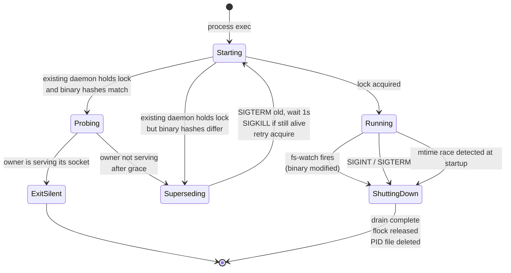
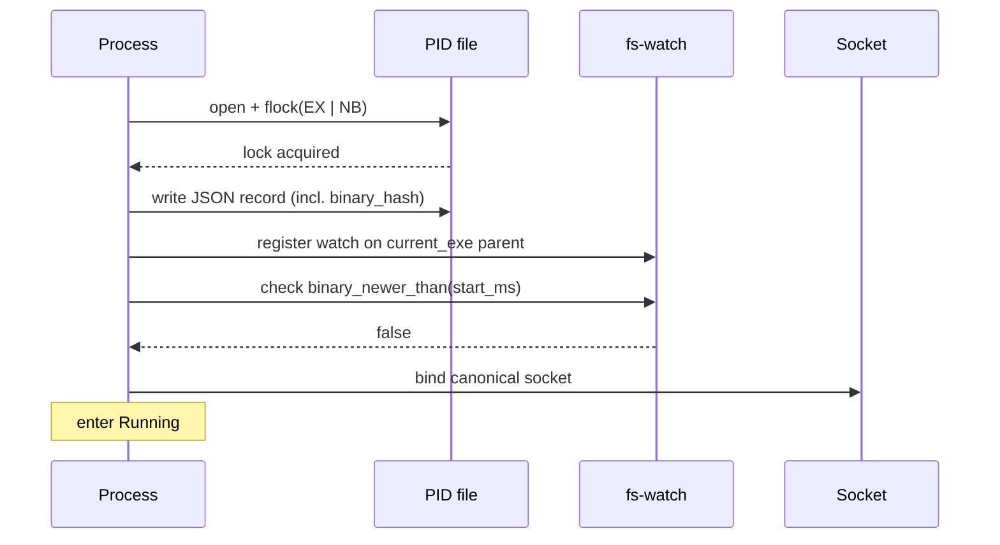
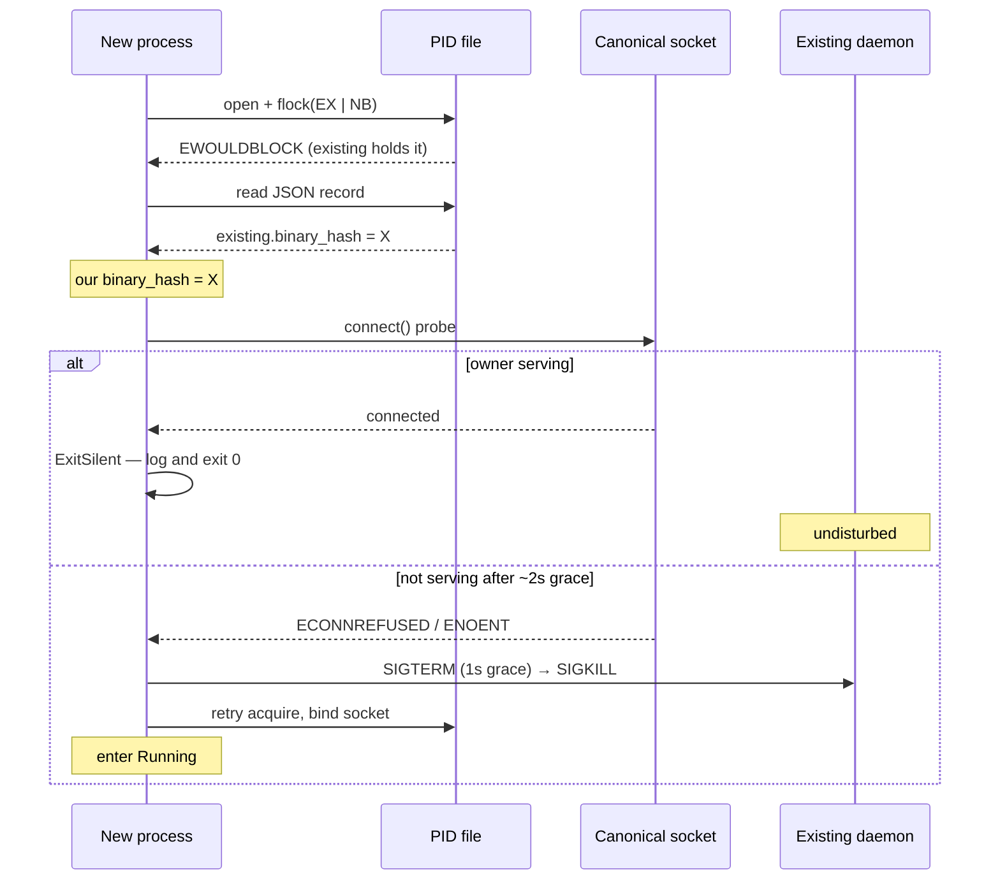
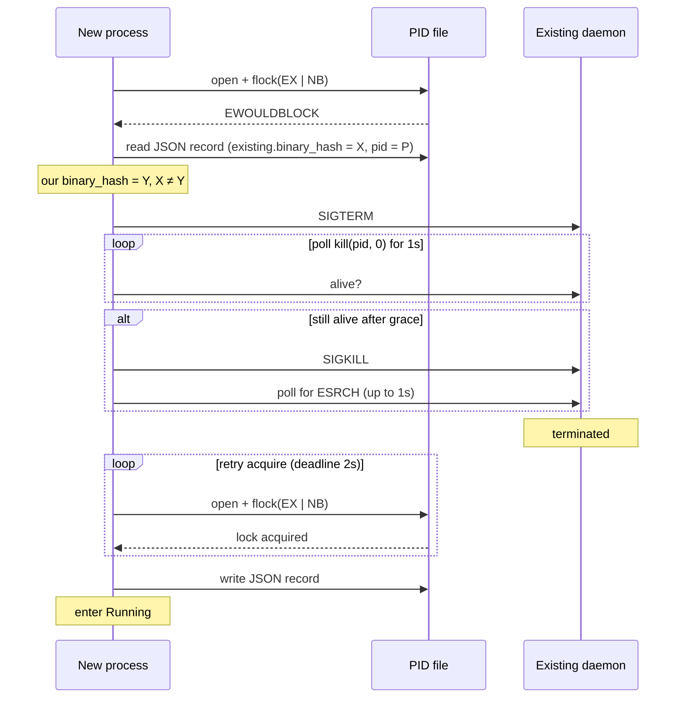
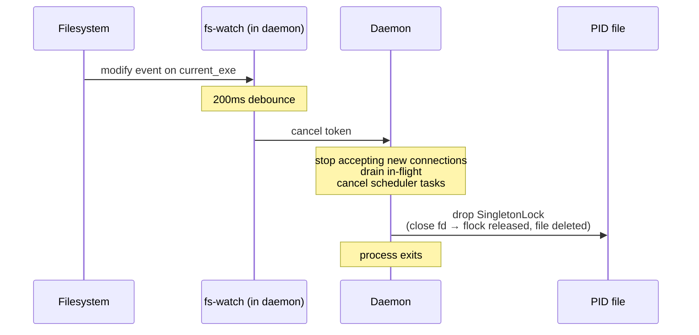
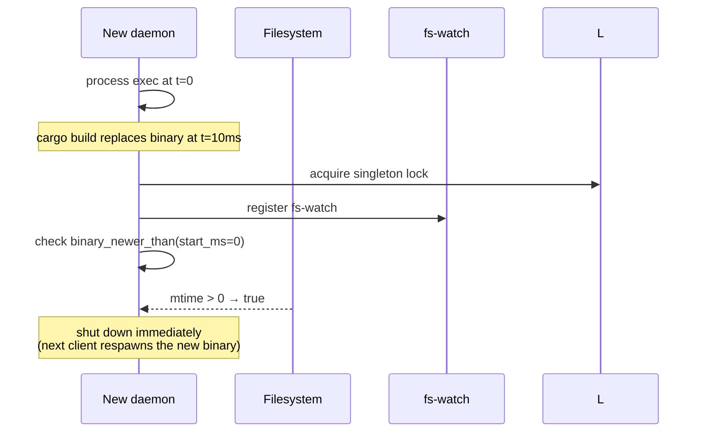
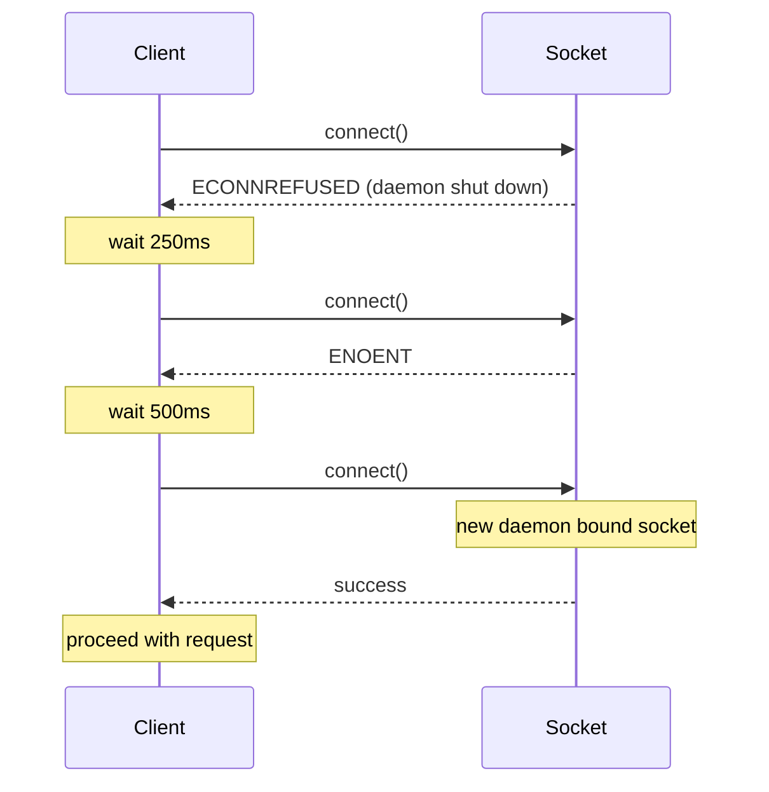

# Daemon Singleton

**Status:** canonical. Describes how at most one beachcomber daemon runs per user at any time, how startup detects existing instances, how a rebuilt binary triggers automatic restart, and how clients tolerate the brief restart window. Tests must match this document; disagreements mean the code is wrong.

**Scope:** the daemon-lifetime singleton property — startup contention, version-mismatch supersession, same-build serving-probe supersession, self-triggered restart on binary change, client-side connect retry. Out-of-scope items at the end.

## Glossary

| Term | Meaning |
|---|---|
| **Singleton** | The invariant that at most one beachcomber daemon process runs per `<uid>` at any time, with brief transition windows during supersession explicitly excluded. |
| **Canonical socket path** | The Unix socket path a client connects to and a starting daemon binds. Resolution is identical across macOS and Linux given identical env state. |
| **PID file** | JSON record at `<socket-parent>/pid` written and held under exclusive `flock` by the running daemon. Released on graceful shutdown. |
| **Build identity** | A SHA256 of the daemon binary file content, computed at startup. The canonical answer to "is the running daemon the same physical build as the one that just started?" |
| **Human version** | A user-facing build label (e.g., `0.5.1` or `0.5.1+sha.abc12345.dirty`) emitted into the binary at compile time. Stored alongside build identity in the PID file but **not** used for singleton decisions. |
| **Supersession** | The act of a starting daemon killing an existing daemon with a different build identity, then taking the lock itself. |
| **Serving probe** | A fast `connect()` to the canonical socket used during same-build contention to decide whether the existing owner is actually serving. A serving owner is left alone; a non-serving owner (wedged between flock and bind, or with a deleted socket) is superseded after a short grace. |
| **Self-supervision** | The running daemon watches its own binary file. On modify, it gracefully shuts down so the next client invocation respawns the new binary. |
| **Connect retry** | Each client (CLI + every SDK) retries a failed `connect()` three times with 250ms / 500ms / 1s backoff before surfacing the error. Covers the daemon-restart window. |

## Core model

### States



### Canonical socket path resolution

Three steps, identical on macOS and Linux:

1. **Config override** — `config.daemon.socket_path` if set.
2. **`$BEACHCOMBER_SOCKET`** — if set and non-empty (any platform). Lets a user or integration point the daemon (and, identically, every client) at an explicit socket. Clients honor the same variable, so daemon and clients always agree.
3. **`/tmp/beachcomber-<uid>/sock`** — hardcoded per-user default.

Resolution consults no session-scoped environment: not `$TMPDIR` (macOS gives every shell session a unique one, sandbox/launchd-managed) and not `$XDG_RUNTIME_DIR` (sandboxes, containers, and per-session shims remap it). Singleton enforcement is per-socket-path, so any session-scoped input to resolution produces one daemon per session instead of one per user — violating singleton. Environments that want a different placement (e.g. `/run/user/<uid>` on systemd) say so explicitly via `$BEACHCOMBER_SOCKET` or the config override.

### PID file with `flock`

At startup, the daemon opens `<socket-parent>/pid` and takes an exclusive non-blocking `flock` on the file descriptor. Content is JSON:

```json
{
  "pid": 12345,
  "version": "0.5.1+sha.abc12345.dirty",
  "binary": "/path/to/comb",
  "binary_hash": "deadbeef...",
  "started_unix_ms": 1714000000000
}
```

Lock semantics: `flock` is per-file-descriptor on POSIX. The lock releases when the fd closes (process death, including SIGKILL, ungraceful exit, or `Drop` on graceful shutdown). The PID file itself is removed on graceful shutdown via `Drop`. A crashed daemon leaves the PID file but releases the flock; the next starting daemon takes the lock and overwrites the file.

### Build identity, separated from human version

Two distinct concerns:

- **Human version** (`BEACHCOMBER_VERSION`) — emitted by `build.rs` at compile time. Reads `COMB_BUILD_SHA` / `COMB_BUILD_DIRTY` env vars (set by CI for releases); falls back to bare `CARGO_PKG_VERSION` for dev builds. Build-cache safe: changes to git state do **not** invalidate the cache.
- **Build identity** (`binary_hash`) — SHA256 of the running binary's file content, computed at daemon startup (~50ms one-time cost). Always uniquely identifies the physical build artefact, regardless of what version string is embedded in it.

`decide_supersession` compares on `binary_hash` and the existing owner's serving state. Different hash = supersede. Same hash **and the owner is serving** its socket = the existing daemon is fine, exit silently. Same hash but the owner is **not serving** (wedged between flock and bind, or its socket was deleted) = supersede, so a healthy daemon rebinds the socket.

### Self-supervision

The daemon registers an `fs-watch` (via `notify`) on the parent directory of `current_exe()`. On modify/create/remove events that touch the binary path:

1. Debounce 200ms (catches multi-event rewrites like `cargo build`).
2. Trigger the existing `CancellationToken` for the daemon.
3. Daemon proceeds through graceful shutdown.

Additionally, immediately after the watch is registered, the daemon checks `binary_newer_than(current_exe, our_start_unix_ms)`. If true (binary was replaced between exec and watch arming), trigger shutdown immediately. Catches the small race window before the watch is live.

### Same-build serving probe

When flock contention reveals an existing owner with the **same** `binary_hash`, the new daemon does not blindly exit. It probes the canonical socket with a fast `connect()`:

- **Serving** (connect succeeds) → the existing daemon is healthy; exit silently. This is the common idempotent-contention path.
- **Not serving** (connect fails) → the owner may be wedged between acquiring the flock and binding the socket, or its socket file was deleted. The new daemon grace-retries the probe for ~2s; if the owner never starts serving, it supersedes the owner (SIGTERM→SIGKILL) and rebinds the socket itself.

The grace window preserves the concurrent-start race (Example 2): the losing process waits for the winner to bind rather than killing a daemon that is merely slow to reach `bind`.

### Client connect retry

Every client (CLI + Python/Go/Node/Ruby/C/Lua SDKs + `beachcomber-client`) retries `connect()` three times with backoffs `250ms / 500ms / 1000ms` (total worst-case ~1.75s) on `ECONNREFUSED` or `ENOENT`. Other errors surface immediately. Once a connection is established, mid-request errors are NOT retried.

## Sequence diagrams

### Cold daemon start



### Same-build start: probe, then exit silently or supersede



### Different-build start: supersede



### Binary modified during run



### Mtime startup race



### Client retry through restart window



## Invariants

1. At any instant, at most one process holds the canonical PID file's `flock`. That process is the singleton.
2. A daemon holding the singleton lock has a build identity (`binary_hash`) recorded in the PID file. Any starting daemon reads it.
3. Same-build-identity contention resolves by probing the canonical socket: if the existing owner is serving, the new process exits silently; if it is not serving after a short grace, the new daemon supersedes it and rebinds the socket.
4. Different-build-identity contention resolves to the new daemon taking over; the existing daemon receives SIGTERM (1s grace) then SIGKILL.
5. The PID file is deleted on graceful shutdown (`SingletonLock::drop`). The flock is released when the file descriptor closes — including on SIGKILL or ungraceful exit.
6. Stale PID files (file present but no process holds the flock) do not block startup — `flock(LOCK_EX | LOCK_NB)` succeeds and the new daemon overwrites the file.
7. The daemon's binary on disk being modified causes the daemon to shut down within `200ms (debounce) + drain time`. Next client invocation respawns from the new binary.
8. Clients tolerate up to ~1.75s of socket-unavailable through retry. Connection errors surfacing past that point indicate genuine daemon-down conditions.
9. Connect retry only fires on initial `connect()` failure. Mid-request socket errors propagate immediately to the caller.

## Parameters

| Parameter | Scope | Unit | Configurability |
|---|---|---|---|
| Canonical socket path | per-user | path | config override → `$BEACHCOMBER_SOCKET` → `/tmp/beachcomber-<uid>/sock` |
| PID file location | per-user | path | derived: `<socket-parent>/pid` |
| `BEACHCOMBER_VERSION` (human) | per-build | string | `build.rs` reads `COMB_BUILD_SHA` / `COMB_BUILD_DIRTY` env at compile time |
| `binary_hash` (build identity) | per-build | hex SHA256 | computed at daemon startup; not configurable |
| SIGTERM grace before SIGKILL | global | seconds | fixed at 1s |
| Post-SIGKILL wait | global | seconds | fixed at 1s |
| Acquire-after-supersession retry deadline | global | seconds | fixed at 2s |
| Same-build serving-probe grace | global | seconds | fixed at 2s |
| fs-watch debounce | global | milliseconds | fixed at 200ms |
| Client connect retry count | per-SDK | retries | fixed at 3 |
| Client connect retry backoffs | per-SDK | milliseconds | fixed at 250 / 500 / 1000 |

Resolution is hardcoded throughout. Singleton enforcement should not be tunable — there is no useful "per-user 5 daemons" config.

## Worked examples

### Example 1 — fresh dev workflow with rebuild

Developer working on the `beachcomber` repo:

| Event | State | Notes |
|---|---|---|
| Run `comb status` (first time today) | Cold | CLI auto-spawns daemon; daemon starts at canonical socket path. |
| Daemon binds, takes flock, computes binary_hash = `A`, writes PID file, registers fs-watch, enters Running. | Running | |
| Run `comb status` again immediately | Running | Hits existing daemon. |
| Run `cargo build` — binary on disk is replaced | Running → ShuttingDown | fs-watch fires after 200ms debounce. Daemon drains and exits. |
| Run `comb status` again | Cold (auto-spawn) | Old socket gone (PID file deleted on Drop). CLI's connect_with_retry hits ENOENT, retries; CLI's `ensure_daemon` forks a new daemon from the now-current binary. |
| New daemon starts: binary_hash = `B`, takes flock, etc. | Running | |

### Example 2 — concurrent shells racing to start the daemon

Two shells run `comb get hostname.short` at the same time. Both find no daemon and try to spawn:

| Process | Action | Outcome |
|---|---|---|
| Shell A's daemon | Calls `acquire_or_supersede` first | Acquires flock; binary_hash = `A`; enters Running. |
| Shell B's daemon | Calls `acquire_or_supersede` second | flock contended; reads existing.binary_hash = `A`; our binary_hash = `A`; **exits silently with log line.** |
| Both shells' clients | Connect to canonical socket | Both hit Shell A's daemon; both succeed. |

No supersession. No SIGTERM. Idempotent contention.

### Example 3 — wedged same-build owner not serving

A daemon acquired the flock and wrote its PID file, then stalled before binding the socket (or its socket file was deleted out from under it). Its `binary_hash` equals the new process's.

| Event | Outcome |
|---|---|
| Run `comb status` | CLI auto-spawns a new daemon; it contends on the flock. |
| New daemon reads PID file | `existing.binary_hash` = ours; same build. |
| New daemon probes canonical socket | `connect()` fails (owner never bound, or socket deleted). Retries the probe for ~2s; still failing. |
| New daemon supersedes | SIGTERM→SIGKILL the wedged owner, re-acquires the flock, binds the socket, enters Running. |
| Client retry | The client's connect retry covers the brief window; the next `connect()` lands on the new daemon. |

Without the serving probe, the new process would have exited silently on the matching hash, leaving the socket unbound and clients hitting "nothing here boss" indefinitely.

## Behaviour assertions

```gherkin
Feature: Daemon singleton

  Scenario: Cold start — no existing daemon
    Given no daemon is running and no PID file exists
    When a daemon starts
    Then the canonical PID file is created with our pid, version, binary, binary_hash, started_unix_ms
    And an exclusive flock is held on the PID file
    And the daemon enters Running

  Scenario: Same binary hash and owner serving — exit silently
    Given an existing daemon holds the lock with binary_hash = X
    And the existing daemon is serving its canonical socket
    When a new daemon starts with binary_hash = X
    Then the new daemon probes the socket and finds it serving
    And the new daemon exits with status 0
    And the existing daemon is undisturbed
    And the PID file is unchanged

  Scenario: Same binary hash but owner not serving — supersede
    Given an existing daemon holds the lock with binary_hash = X (pid = P)
    And the existing daemon is not serving its canonical socket
    When a new daemon starts with binary_hash = X
    And the socket probe still fails after the grace window
    Then the new daemon sends SIGTERM to P
    And acquires the flock once released
    And binds the canonical socket

  Scenario: Different binary hash — supersede
    Given an existing daemon holds the lock with binary_hash = X (pid = P)
    When a new daemon starts with binary_hash = Y, Y ≠ X
    Then the new daemon sends SIGTERM to P
    And waits up to 1s for P to exit
    And sends SIGKILL to P if still alive
    And acquires the flock once released
    And writes a new PID file with binary_hash = Y

  Scenario: Crashed daemon leaves stale PID file
    Given a daemon previously crashed leaving a PID file but no process
    When a new daemon starts
    Then flock is acquired immediately (no other holder)
    And the PID file is overwritten with our record

  Scenario: Daemon binary modified during run
    Given a daemon is Running with binary at path B
    When the file at B is modified (mtime changes)
    Then within 200ms + drain time, the daemon exits
    And the PID file is deleted
    And the flock is released

  Scenario: Mtime startup race
    Given a daemon process starts at unix_ms T
    And the binary file at current_exe is modified at unix_ms > T (race window before fs-watch armed)
    When the daemon checks binary_newer_than(T) after registering the fs-watch
    Then the check returns true
    And the daemon initiates graceful shutdown

  Scenario: PID 1 is not reaped
    Given supersede_existing is invoked with pid 1
    Then it returns Err without sending any signal

  Scenario: Already-dead pid is treated as success
    Given supersede_existing is invoked with a pid that has already exited
    Then it returns Ok
    And no error is logged

  Scenario: Client connect retries through restart window
    Given the daemon's canonical socket does not exist yet
    And in 400ms a daemon will bind it
    When a client invokes connect_with_retry on the canonical socket
    Then the client's connect succeeds before total elapsed time exceeds 1.75s
    And no error is surfaced to the caller

  Scenario: Client connect retries exhaust on dead daemon
    Given no daemon ever binds the canonical socket
    When a client invokes connect_with_retry
    Then connect_with_retry returns Err after waiting at least 1.75s
    And the error is ECONNREFUSED or ENOENT

  Scenario: Mid-request errors are not retried
    Given a client successfully connected to a daemon
    When the daemon dies mid-request causing a socket error
    Then the error propagates to the caller immediately
    And no retry is performed

  Scenario: Graceful shutdown releases lock and deletes PID file
    Given a daemon is Running with the singleton lock held
    When SIGINT or fs-watch triggers graceful shutdown
    Then the daemon completes drain
    And the PID file at the canonical path no longer exists
    And the flock is released

  Scenario: Canonical socket path ignores session-scoped environment
    Given XDG_RUNTIME_DIR is set to "/per/session/runtime"
    And TMPDIR is set to "/per/shell/tmpdir"
    When resolve_socket_path is called with no config override
    Then the result starts with "/tmp/beachcomber-" and ends with "/sock"
    And the result does not contain "/per/shell/tmpdir"
    And the result does not contain "/per/session/runtime"
```

## Out of scope

- **Multi-user daemons.** Each `<uid>` has its own canonical path. Two users on the same machine each run their own singleton; they do not collide.
- **Network / TCP daemons.** Singleton enforcement is per-user-per-host via Unix socket. There is no networked variant.
- **Backwards compatibility with sockets on non-canonical paths** (e.g. TMPDIR- or XDG_RUNTIME_DIR-derived paths from earlier resolution rules). Daemons on such sockets are unreachable by any client following canonical resolution; they age out on their own (self-supervision on rebuild, or manual kill). No in-place migration of clients with cached socket paths, and no startup reaping.
- **`daemon.pid` (the older file).** A separate `daemon.pid` is written by `fork_daemon` for the auto-spawn mechanism. It is unrelated to the singleton's `pid` file. Coexists today; possible future cleanup to merge or remove.
- **In-process drain semantics.** The acceptor loop and connection-handler tasks do not currently honour the cancellation token cleanly — they are abandoned mid-await on shutdown rather than draining gracefully. Pre-existing concern, tracked separately. The singleton design assumes graceful shutdown completes; in practice, in-flight requests may be aborted abruptly. Not a singleton-property violation, but a quality-of-shutdown gap.
- **Distributed coordination.** Singleton applies to one host. There is no cross-host election.

## See also

- [`docs/cache-lifecycle.md`](./cache-lifecycle.md) — the cache state machine. Orthogonal: cache lifecycle governs entries within one daemon; singleton governs the daemon itself.
- `docs/superpowers/specs/2026-04-24-daemon-singleton-design.md` — the design brainstorm that drove this spec.
- `docs/superpowers/plans/2026-04-24-daemon-singleton.md` — the implementation plan.
- `src/singleton.rs` — implementation.
