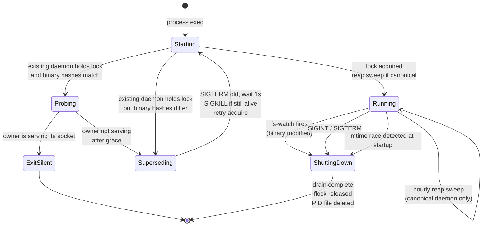
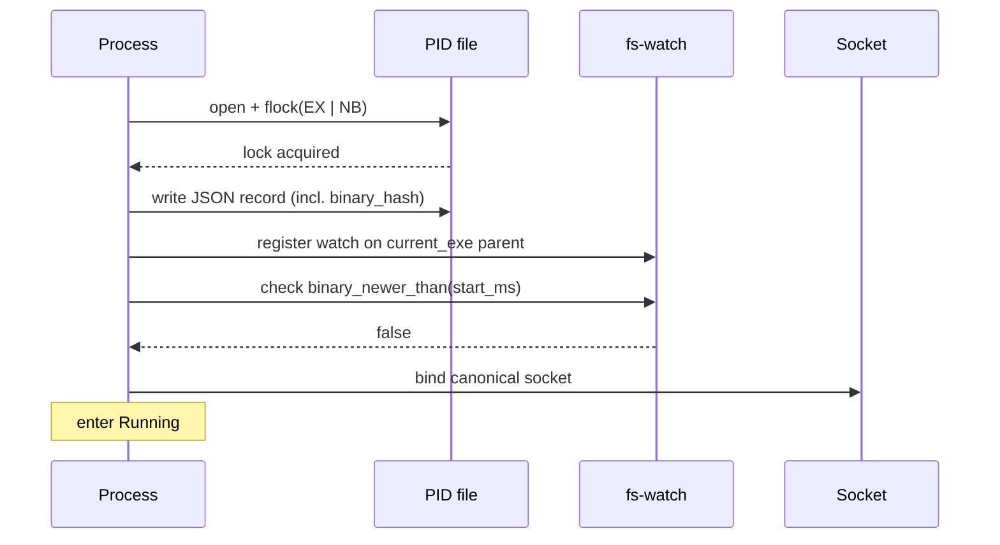
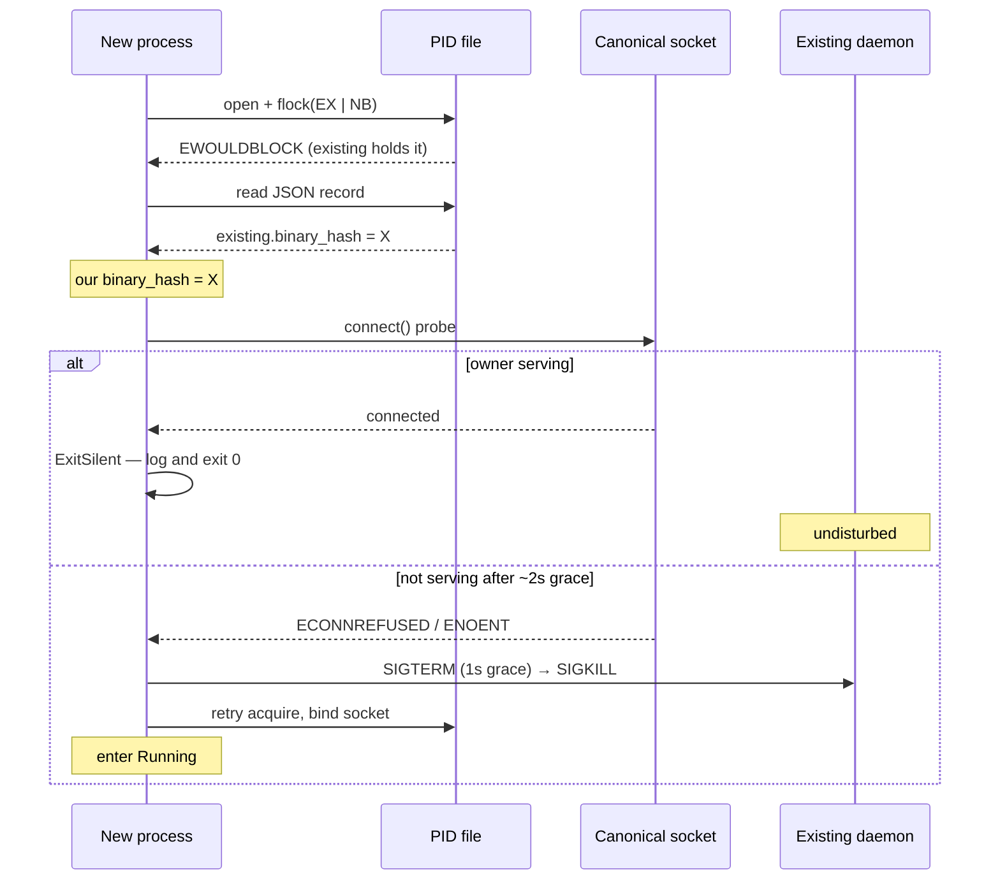
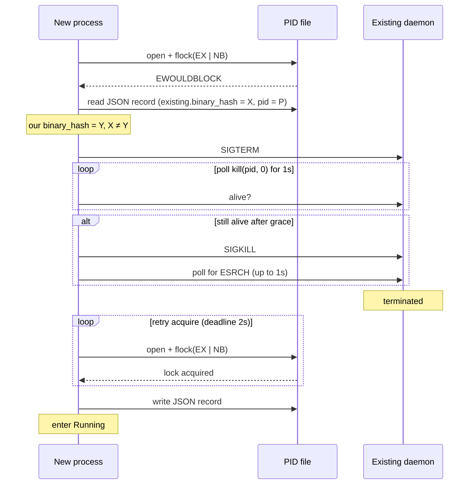
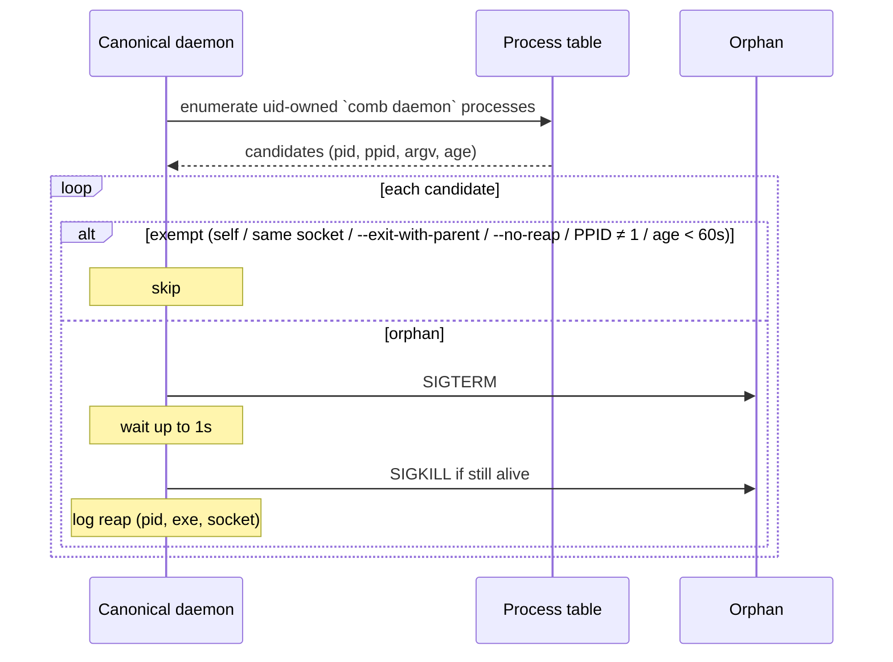
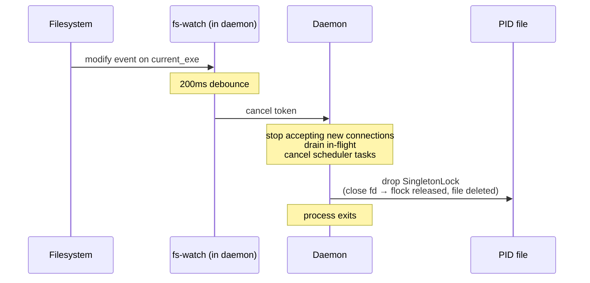
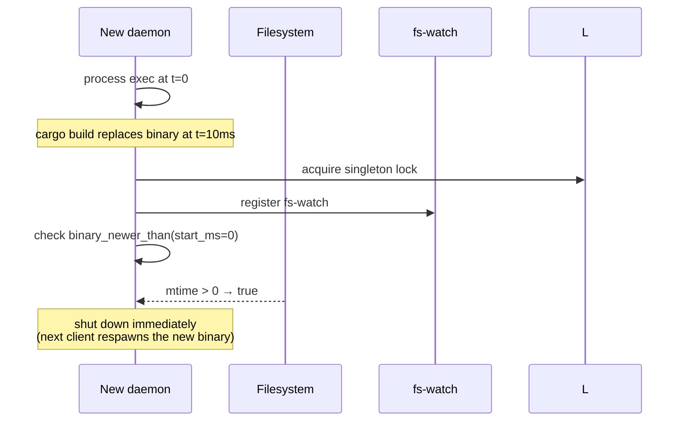
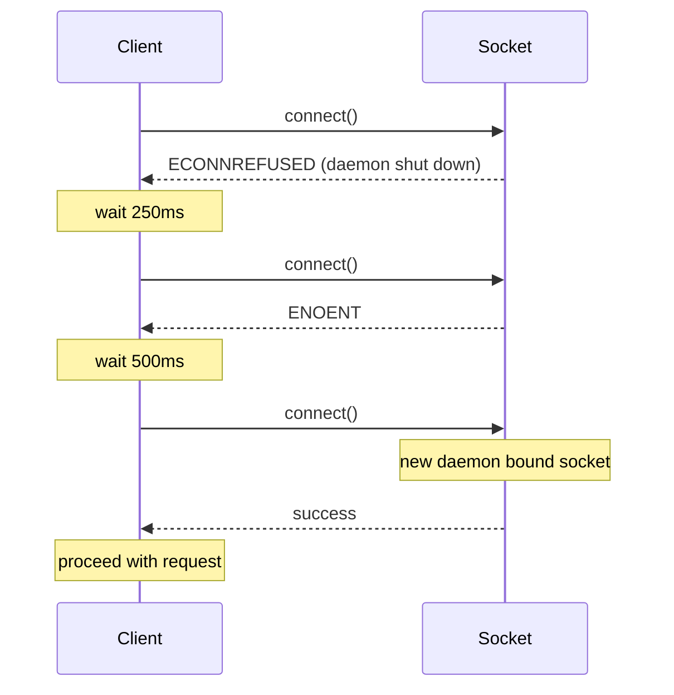

# Daemon Singleton

**Status:** canonical. Describes how at most one beachcomber daemon runs per user at any time, how startup detects existing instances, how a rebuilt binary triggers automatic restart, how the canonical daemon reaps orphaned daemons, and how clients tolerate the brief restart window. Tests must match this document; disagreements mean the code is wrong.

**Scope:** the daemon-lifetime singleton property — startup contention, version-mismatch supersession, same-build serving-probe supersession, self-triggered restart on binary change, orphan reaping, watch self-test, client-side connect retry. Out-of-scope items at the end.

## Glossary

| Term | Meaning |
|---|---|
| **Singleton** | The invariant that at most one beachcomber daemon process runs per `<uid>` at any time, with brief transition windows during supersession explicitly excluded. |
| **Canonical socket path** | The Unix socket path a client connects to and a starting daemon binds. Resolution is identical across macOS and Linux given identical env state. |
| **Canonical daemon** | A daemon whose bound socket equals its own resolution of the canonical socket path, computed ignoring any `--socket` override. This is the daemon clients reach under that environment. |
| **Reaping daemon** | The daemon whose bound socket equals the **env-free** resolution (config override → `/tmp/beachcomber-<uid>/sock`, ignoring both `--socket` and `$BEACHCOMBER_SOCKET`). Only it reaps. The distinction matters because `$BEACHCOMBER_SOCKET` is per-process: two daemons under divergent env would each self-assess "canonical" and reap each other (see §"Orphan reaping"). The config-file override stays in the reaper resolution — it is per-user-stable, so all processes of one uid agree on it. |
| **Side daemon** | A daemon bound to any other socket (explicit `--socket`, or an env override differing from the env-free resolution). Test daemons, foreground debug runs, supervised custom deployments. A side daemon never reaps. |
| **Orphan** | A uid-owned `comb daemon` process that is not on the reaper's socket path, has been reparented to PID 1, carries neither `--exit-with-parent` nor `--no-reap`, and is older than the reap grace age. Orphans are unreachable dead weight: nothing resolves their socket, and nothing will ever supersede them. |
| **Reaping** | The canonical daemon terminating orphans (SIGTERM, 1s grace, SIGKILL) — at startup and on an hourly sweep. |
| **Reaper visibility self-test** | A probe verifying process enumeration plausibly spans the whole system: PID 1 (launchd/init) must appear in the raw enumeration. Failure means the daemon is confined (sandbox, `hidepid`) and can neither see nor police daemons outside its confinement; the degradation is surfaced, never silent. |
| **Watch self-test** | A startup probe verifying the kernel fs-event backend actually delivers events. Failure flips provider watching to the polling backend. |
| **PID file** | JSON record at `<socket-parent>/pid` written and held under exclusive `flock` by the running daemon. Released on graceful shutdown. |
| **Build identity** | A SHA256 of the daemon binary file content, computed at startup. The canonical answer to "is the running daemon the same physical build as the one that just started?" |
| **Human version** | A user-facing build label (e.g., `0.5.1` or `0.5.1+sha.abc12345.dirty`) emitted into the binary at compile time. Stored alongside build identity in the PID file but **not** used for singleton decisions. |
| **Supersession** | The act of a starting daemon killing an existing daemon with a different build identity, then taking the lock itself. |
| **Serving probe** | A fast `connect()` to the canonical socket used during same-build contention to decide whether the existing owner is actually serving. A serving owner is left alone; a non-serving owner (wedged between flock and bind, or with a deleted socket) is superseded after a short grace. |
| **Self-supervision** | The running daemon watches its own binary file and its resolved config file — an fs-event watch as the fast path, and a guaranteed mtime poll as the backstop. On binary change, or on a config change that parses as valid, it gracefully shuts down so the next client invocation respawns it; a config change that fails to parse is logged and ignored, never restarted into. |
| **Connect retry** | Each client (CLI + every SDK) retries a failed `connect()` three times with 250ms / 500ms / 1s backoff before surfacing the error. Covers the daemon-restart window. |

## Core model

### States



### Canonical socket path resolution

Three steps, identical on macOS and Linux:

1. **Config override** — `config.daemon.socket_path` if set.
2. **`$BEACHCOMBER_SOCKET`** — if set and non-empty (any platform). Lets a user or integration point the daemon (and, identically, every client) at an explicit socket. Clients honor the same variable, so daemon and clients always agree.
3. **`/tmp/beachcomber-<uid>/sock`** — hardcoded per-user default.

Resolution consults no session-scoped environment: not `$TMPDIR` (macOS gives every shell session a unique one, sandbox/launchd-managed) and not `$XDG_RUNTIME_DIR` (sandboxes, containers, and per-session shims remap it). Singleton enforcement is per-socket-path, so any session-scoped input to resolution produces one daemon per session instead of one per user — violating singleton. Environments that want a different placement (e.g. `/run/user/<uid>` on systemd) say so explicitly via `$BEACHCOMBER_SOCKET` or the config override.

### PID file with `flock`

At startup, the daemon opens `<socket-parent>/pid` and takes an exclusive non-blocking `flock` on the file descriptor. Content is JSON:

```json
{
  "pid": 12345,
  "version": "0.5.1+sha.abc12345.dirty",
  "binary": "/path/to/comb",
  "binary_hash": "deadbeef...",
  "started_unix_ms": 1714000000000
}
```

Lock semantics: `flock` is per-file-descriptor on POSIX. The lock releases when the fd closes (process death, including SIGKILL, ungraceful exit, or `Drop` on graceful shutdown). The PID file itself is removed on graceful shutdown via `Drop`. A crashed daemon leaves the PID file but releases the flock; the next starting daemon takes the lock and overwrites the file.

### Build identity, separated from human version

Two distinct concerns:

- **Human version** (`BEACHCOMBER_VERSION`) — emitted by `build.rs` at compile time. Reads `COMB_BUILD_SHA` / `COMB_BUILD_DIRTY` env vars (set by CI for releases); falls back to bare `CARGO_PKG_VERSION` for dev builds. Build-cache safe: changes to git state do **not** invalidate the cache.
- **Build identity** (`binary_hash`) — SHA256 of the running binary's file content, computed at daemon startup (~50ms one-time cost). Always uniquely identifies the physical build artefact, regardless of what version string is embedded in it.

`decide_supersession` compares on `binary_hash` and the existing owner's serving state. Different hash = supersede. Same hash **and the owner is serving** its socket = the existing daemon is fine, exit silently. Same hash but the owner is **not serving** (wedged between flock and bind, or its socket was deleted) = supersede, so a healthy daemon rebinds the socket.

### Self-supervision

The daemon supervises its own binary through two mechanisms; either one triggers graceful shutdown:

1. **fs-event watch (fast path).** An fs-watch (via `notify`) on the parent directory of `current_exe()`. Modify/create/remove events touching the binary path are debounced 200ms, then trigger the `CancellationToken`.
2. **mtime poll (guarantee).** Every 5s, the daemon checks `binary_newer_than(current_exe, our_start_unix_ms)`. One `stat` per interval — effectively free.

The poll exists because fs-event backends can be silently non-functional or degraded: a stream is created without error and then delivers nothing, or delivers too late to be useful — seen on sandboxed CI hosts and under a degraded or heavily loaded `fseventsd`. With an event-only watch, such a daemon outlives every rebuild of its binary indefinitely. The poll bounds staleness at one interval regardless of backend health.

Immediately after the watch is registered, the daemon performs the same `binary_newer_than` check once against its own start time. If true (binary replaced between exec and watch arming), shutdown begins immediately. Catches the race window before the watch is live.

### Watch self-test

At startup, the daemon verifies that the kernel fs-event backend delivers events at all: it registers a watch on a private temp directory, touches a file inside it, and waits up to 2s for the corresponding event. The self-test runs concurrently with the scheduler loop — a failure verdict swaps the live watcher for the polling backend and re-registers every watch path — so the timeout adds no startup latency.

- **Delivered** → provider file-watching uses the kernel-native backend (FSEvents / inotify).
- **Not delivered** → provider file-watching uses the polling backend for the life of the process. The degradation is logged and surfaced by `comb check daemon` and `comb status`.

The 2s timeout sits well above load-degraded delivery: healthy-idle delivery is ~10ms, but hundreds of ms under heavy filesystem load (parallel builds), and the timeout must not misclassify a loaded-but-healthy backend as dead.

The test probes the capability, not the environment: detecting "am I sandboxed" is fragile and platform-specific, while "do events arrive" is exactly the property the watch subsystem depends on. Without this, a daemon whose stream delivers nothing serves watch-invalidated entries that silently never invalidate. The PID file schema is unchanged — watch health is in-process state exposed over the protocol, with no external consumer.

### Same-build serving probe

When flock contention reveals an existing owner with the **same** `binary_hash`, the new daemon does not blindly exit. It probes the canonical socket with a fast `connect()`:

- **Serving** (connect succeeds) → the existing daemon is healthy; exit silently. This is the common idempotent-contention path.
- **Not serving** (connect fails) → the owner may be wedged between acquiring the flock and binding the socket, or its socket file was deleted. The new daemon grace-retries the probe for ~2s; if the owner never starts serving, it supersedes the owner (SIGTERM→SIGKILL) and rebinds the socket itself.

The grace window preserves the concurrent-start race (Example 2): the losing process waits for the winner to bind rather than killing a daemon that is merely slow to reach `bind`.

### Orphan reaping

The singleton property is per-user, but enforcement through the flock alone is per-socket-path: a daemon on a socket nothing resolves to is invisible to startup contention and lives forever by default. Orphans arise from dev flows — test harnesses SIGKILLed before their daemons (predating `--exit-with-parent`), worktree builds whose binaries were deleted, sandbox-spawned daemons whose event-driven self-supervision never fired. The canonical daemon closes this gap by reaping.

**Who reaps.** Only the reaping daemon. Every daemon determines this for itself at startup: it resolves the **env-free** canonical socket path (config override → `/tmp/beachcomber-<uid>/sock`, ignoring both its `--socket` CLI override **and** `$BEACHCOMBER_SOCKET`) and compares it to the socket it actually bound. Equal → it reaps. Different → side daemon; it never signals any process outside its own socket path's contention domain.

`$BEACHCOMBER_SOCKET` is excluded because it is per-process: a daemon auto-spawned under the override resolves *itself* as canonical while the default-path daemon does too, and each would classify the other as an unflagged PPID-1 orphan — mutual reaping on alternating sweeps (fratricide). With env excluded, at most one daemon per uid (under one config) can ever hold the reaper role. The corollary is accepted and documented: an environment where *every* client is pointed at an override socket runs no reaper at all.

**Env-override spawns are flagged.** When auto-spawn (`ensure_daemon` in the CLI, `auto_start` in `libbeachcomber`) resolves the socket path from `$BEACHCOMBER_SOCKET`, it appends `--no-reap` to the daemon it forks. A deliberate override daemon thereby expresses its supervised status without user action, and the reaping daemon's exemption rule 3 spares it. Spawns resolving from config or the default are not flagged.

**When.** Once on entering Running, then hourly.

**Reap set.** Uid-owned processes running `comb daemon` (matched on process argv), **excluding** any that are:

1. the reaper itself, or on the reaper's own socket path (startup contention — the flock and serving probe govern those);
2. carrying `--exit-with-parent` — self-cleaning; they exit when their spawner dies;
3. carrying `--no-reap` — the explicit opt-out for a deliberate, supervised, non-canonical daemon (a supervised process is parented to PID 1, so it needs the flag);
4. still parented (PPID ≠ 1) — an attended foreground run under a live shell;
5. younger than 60s — never race a daemon mid-startup.

What remains — orphaned, unattended, unflagged daemons on sockets nothing resolves — receives SIGTERM, 1s grace, then SIGKILL. Each reap is logged with pid, exe, and socket path.

**Corpse cleanup.** After a reaped orphan's death, its socket file and sibling pid files (`pid`, `daemon.pid`) are removed. A corpse socket is a trap: clients with existence-probing discovery (pre-0.6.1 resolution rules) latch onto the dead path and respawn a daemon there on the next query — the mechanism that kept one orphan path continuously resurrected for four months. Cleanup probes the socket first and **never unlinks a serving socket**: if a racing respawn bound the path between kill and cleanup, the live daemon keeps its socket (and is itself subject to the next sweep's rules). Additionally, **every sweep logs a summary** (debug level): rows enumerated, `comb daemon` candidates, exemption tallies by rule, and reaped pids — so a sweep that found nothing eligible is distinguishable from a sweep that could not see anything, without an instrumented build.

The exemptions make deliberate side daemons expressible instead of heuristically guessed: alive parent means attended, `--exit-with-parent` means self-cleaning, `--no-reap` means opted out. A daemon fitting none of these is unreachable dead weight by construction.

**Process enumeration** is a boundary trait (hand-rolled: `sysctl KERN_PROC_ALL` on macOS, `/proc` on Linux; no external dependency). On macOS the pid list must come from `sysctl KERN_PROC_ALL`, **not** `libproc`'s `proc_listallpids`: seatbelt sandbox profiles filter the latter to the session's own processes while leaving the sysctl unrestricted — a canonical daemon that happened to be auto-spawned from a sandboxed client shell enumerated 51 of 737 system pids and silently never saw the orphans it existed to reap (2026-07-16 incident). Per-pid detail (`proc_pidinfo`, `KERN_PROCARGS2`) is unaffected. A process whose exe has been deleted from disk remains enumerable and reapable — deleted-worktree daemons are a primary target.

### Reaper visibility self-test

Enumeration mechanisms can be silently confined: a seatbelt profile, a `hidepid` mount, or a future platform quirk can shrink the visible process table without any call failing. A confined reaper sweeps clean logs forever while orphans accumulate — exactly the failure the reaper exists to prevent, made invisible.

The self-test probes the capability, not the environment (same doctrine as the watch self-test): **PID 1 must appear in the raw enumeration**. `launchd`/`init` always exists, is never the daemon's own descendant, and a view filtered to the daemon's session or namespace will not contain it. In a PID namespace (container), PID 1 is the namespace's own init and *is* visible — correctly reporting healthy, since reaping within the namespace is exactly the reaper's jurisdiction there.

- **Evaluated** when the canonical daemon arms the reaper, and again on every sweep (the sweep already enumerates; the check is free).
- **Visible** → reaper healthy; sweeps proceed normally.
- **Not visible** → the daemon logs a warning (once at arming, not per sweep) and marks reaper visibility degraded. Sweeps continue — orphans that *are* visible (same-session test leaks) are still reaped. The degradation is surfaced via `comb check daemon`, `comb status`, and introspect `reaper.visibility`.

A degraded verdict also implies the daemon itself is running confined (it was auto-spawned from a sandboxed client), which the operator may want to remedy by restarting it from an unconfined shell; the surfaced state is what makes that decision possible.

**Signal capability** is not probed synthetically (there is no guaranteed-present same-uid foreign target to probe against); instead, reap kill attempts that fail with `EPERM` are counted as `kill_denied` and surfaced through the same introspection — capability observed at point of use.

### Client connect retry

Every client (CLI + Python/Go/Node/Ruby/C/Lua SDKs + `beachcomber-client`) retries `connect()` three times with backoffs `250ms / 500ms / 1000ms` (total worst-case ~1.75s) on `ECONNREFUSED` or `ENOENT`. Other errors surface immediately. Once a connection is established, mid-request errors are NOT retried.

## Sequence diagrams

### Cold daemon start



### Same-build start: probe, then exit silently or supersede



### Different-build start: supersede



### Reap sweep (canonical daemon)



### Binary modified during run



### Mtime startup race



### Client retry through restart window



## Invariants

1. At any instant, at most one process holds the canonical PID file's `flock`. That process is the singleton.
2. A daemon holding the singleton lock has a build identity (`binary_hash`) recorded in the PID file. Any starting daemon reads it.
3. Same-build-identity contention resolves by probing the canonical socket: if the existing owner is serving, the new process exits silently; if it is not serving after a short grace, the new daemon supersedes it and rebinds the socket.
4. Different-build-identity contention resolves to the new daemon taking over; the existing daemon receives SIGTERM (1s grace) then SIGKILL.
5. The PID file is deleted on graceful shutdown (`SingletonLock::drop`). The flock is released when the file descriptor closes — including on SIGKILL or ungraceful exit.
6. Stale PID files (file present but no process holds the flock) do not block startup — `flock(LOCK_EX | LOCK_NB)` succeeds and the new daemon overwrites the file.
7. The daemon's binary on disk being modified causes the daemon to shut down — within `200ms (debounce) + drain time` when the fs-event watch is live, and within `5s (poll interval) + drain time` regardless of fs-event backend health. Next client invocation respawns from the new binary.
8. Clients tolerate up to ~1.75s of socket-unavailable through retry. Connection errors surfacing past that point indicate genuine daemon-down conditions.
9. Connect retry only fires on initial `connect()` failure. Mid-request socket errors propagate immediately to the caller.
10. Only the reaping daemon (bound socket == env-free resolution: config → default, ignoring `--socket` and `$BEACHCOMBER_SOCKET`) reaps. A side daemon never signals a process outside its own socket path's contention domain. Two daemons of one uid never reap each other.
11. A reaped process is never: the reaper, a process on the reaper's socket path, a process with a live parent, a process carrying `--exit-with-parent` or `--no-reap`, or a process younger than the reap grace age. Auto-spawn appends `--no-reap` whenever the spawn path was resolved from `$BEACHCOMBER_SOCKET`.
12. Provider file-watching is never silently dead: the watch self-test either confirms event delivery or flips to the polling backend, and the degradation is observable via `comb check daemon` and `comb status`.
13. Reaper capability is never silently degraded: the visibility self-test (PID 1 present in raw enumeration) runs at arming and on every sweep, kill attempts denied by the OS are counted, and both are observable via `comb check daemon`, `comb status`, and introspect `reaper`. Every sweep leaves a log trace (summary at debug; reaps at info; failures at warn).
14. Reaping leaves no corpse: after a reaped orphan's confirmed death, its socket and pid files are removed — unless the socket is serving again, which is never unlinked.

## Parameters

| Parameter | Scope | Unit | Configurability |
|---|---|---|---|
| Canonical socket path | per-user | path | config override → `$BEACHCOMBER_SOCKET` → `/tmp/beachcomber-<uid>/sock` |
| PID file location | per-user | path | derived: `<socket-parent>/pid` |
| `BEACHCOMBER_VERSION` (human) | per-build | string | `build.rs` reads `COMB_BUILD_SHA` / `COMB_BUILD_DIRTY` env at compile time |
| `binary_hash` (build identity) | per-build | hex SHA256 | computed at daemon startup; not configurable |
| SIGTERM grace before SIGKILL | global | seconds | fixed at 1s |
| Post-SIGKILL wait | global | seconds | fixed at 1s |
| Acquire-after-supersession retry deadline | global | seconds | fixed at 2s |
| Same-build serving-probe grace | global | seconds | fixed at 2s |
| fs-watch debounce | global | milliseconds | fixed at 200ms |
| Client connect retry count | per-SDK | retries | fixed at 3 |
| Client connect retry backoffs | per-SDK | milliseconds | fixed at 250 / 500 / 1000 |
| Self-watch poll interval | global | seconds | fixed at 5s |
| Watch self-test timeout | global | seconds | fixed at 2s |
| Reap sweep period | global | duration | fixed at 1h (plus once at startup) |
| Reap grace age | global | seconds | fixed at 60s |
| Reaper visibility probe | global | predicate | fixed: PID 1 present in raw enumeration |

Resolution is hardcoded throughout. Singleton enforcement should not be tunable — there is no useful "per-user 5 daemons" config.

## Worked examples

### Example 1 — fresh dev workflow with rebuild

Developer working on the `beachcomber` repo:

| Event | State | Notes |
|---|---|---|
| Run `comb status` (first time today) | Cold | CLI auto-spawns daemon; daemon starts at canonical socket path. |
| Daemon binds, takes flock, computes binary_hash = `A`, writes PID file, registers fs-watch, enters Running. | Running | |
| Run `comb status` again immediately | Running | Hits existing daemon. |
| Run `cargo build` — binary on disk is replaced | Running → ShuttingDown | fs-watch fires after 200ms debounce. Daemon drains and exits. |
| Run `comb status` again | Cold (auto-spawn) | Old socket gone (PID file deleted on Drop). CLI's connect_with_retry hits ENOENT, retries; CLI's `ensure_daemon` forks a new daemon from the now-current binary. |
| New daemon starts: binary_hash = `B`, takes flock, etc. | Running | |

### Example 2 — concurrent shells racing to start the daemon

Two shells run `comb get hostname.short` at the same time. Both find no daemon and try to spawn:

| Process | Action | Outcome |
|---|---|---|
| Shell A's daemon | Calls `acquire_or_supersede` first | Acquires flock; binary_hash = `A`; enters Running. |
| Shell B's daemon | Calls `acquire_or_supersede` second | flock contended; reads existing.binary_hash = `A`; our binary_hash = `A`; **exits silently with log line.** |
| Both shells' clients | Connect to canonical socket | Both hit Shell A's daemon; both succeed. |

No supersession. No SIGTERM. Idempotent contention.

### Example 3 — wedged same-build owner not serving

A daemon acquired the flock and wrote its PID file, then stalled before binding the socket (or its socket file was deleted out from under it). Its `binary_hash` equals the new process's.

| Event | Outcome |
|---|---|
| Run `comb status` | CLI auto-spawns a new daemon; it contends on the flock. |
| New daemon reads PID file | `existing.binary_hash` = ours; same build. |
| New daemon probes canonical socket | `connect()` fails (owner never bound, or socket deleted). Retries the probe for ~2s; still failing. |
| New daemon supersedes | SIGTERM→SIGKILL the wedged owner, re-acquires the flock, binds the socket, enters Running. |
| Client retry | The client's connect retry covers the brief window; the next `connect()` lands on the new daemon. |

Without the serving probe, the new process would have exited silently on the matching hash, leaving the socket unbound and clients hitting "nothing here boss" indefinitely.

### Example 4 — orphaned dev daemons reaped, live ones spared

A test harness was SIGKILLed weeks ago, leaking a daemon on a tempdir socket (spawned by a build predating `--exit-with-parent`); its worktree — including its binary — has since been deleted. Its fs-event stream delivered nothing, so event-only self-supervision never fired; before reaping existed it was immortal. Meanwhile a nextest run is currently executing, and the developer has a foreground `comb d --socket /tmp/debug.sock` open in a shell.

| Candidate | Exemption check | Outcome |
|---|---|---|
| Leaked daemon (PPID 1, no flags, socket `/tmp/.tmpXYZ/…`, age 3 weeks, exe deleted) | none apply | SIGTERM → exits. |
| Live nextest `TestDaemon` (`--exit-with-parent`, parent alive) | exempt twice over (rules 2 and 4) | untouched. |
| Foreground debug daemon (parented to the developer's shell) | exempt (rule 4) | untouched. |
| The canonical daemon itself | exempt (rule 1) | continues Running. |

## Behaviour assertions

```gherkin
Feature: Daemon singleton

  Scenario: Cold start — no existing daemon
    Given no daemon is running and no PID file exists
    When a daemon starts
    Then the canonical PID file is created with our pid, version, binary, binary_hash, started_unix_ms
    And an exclusive flock is held on the PID file
    And the daemon enters Running

  Scenario: Same binary hash and owner serving — exit silently
    Given an existing daemon holds the lock with binary_hash = X
    And the existing daemon is serving its canonical socket
    When a new daemon starts with binary_hash = X
    Then the new daemon probes the socket and finds it serving
    And the new daemon exits with status 0
    And the existing daemon is undisturbed
    And the PID file is unchanged

  Scenario: Same binary hash but owner not serving — supersede
    Given an existing daemon holds the lock with binary_hash = X (pid = P)
    And the existing daemon is not serving its canonical socket
    When a new daemon starts with binary_hash = X
    And the socket probe still fails after the grace window
    Then the new daemon sends SIGTERM to P
    And acquires the flock once released
    And binds the canonical socket

  Scenario: Different binary hash — supersede
    Given an existing daemon holds the lock with binary_hash = X (pid = P)
    When a new daemon starts with binary_hash = Y, Y ≠ X
    Then the new daemon sends SIGTERM to P
    And waits up to 1s for P to exit
    And sends SIGKILL to P if still alive
    And acquires the flock once released
    And writes a new PID file with binary_hash = Y

  Scenario: Crashed daemon leaves stale PID file
    Given a daemon previously crashed leaving a PID file but no process
    When a new daemon starts
    Then flock is acquired immediately (no other holder)
    And the PID file is overwritten with our record

  Scenario: Daemon binary modified during run
    Given a daemon is Running with binary at path B
    When the file at B is modified (mtime changes)
    Then within 200ms + drain time, the daemon exits
    And the PID file is deleted
    And the flock is released

  Scenario: Mtime startup race
    Given a daemon process starts at unix_ms T
    And the binary file at current_exe is modified at unix_ms > T (race window before fs-watch armed)
    When the daemon checks binary_newer_than(T) after registering the fs-watch
    Then the check returns true
    And the daemon initiates graceful shutdown

  Scenario: PID 1 is not reaped
    Given supersede_existing is invoked with pid 1
    Then it returns Err without sending any signal

  Scenario: Already-dead pid is treated as success
    Given supersede_existing is invoked with a pid that has already exited
    Then it returns Ok
    And no error is logged

  Scenario: Client connect retries through restart window
    Given the daemon's canonical socket does not exist yet
    And in 400ms a daemon will bind it
    When a client invokes connect_with_retry on the canonical socket
    Then the client's connect succeeds before total elapsed time exceeds 1.75s
    And no error is surfaced to the caller

  Scenario: Client connect retries exhaust on dead daemon
    Given no daemon ever binds the canonical socket
    When a client invokes connect_with_retry
    Then connect_with_retry returns Err after waiting at least 1.75s
    And the error is ECONNREFUSED or ENOENT

  Scenario: Mid-request errors are not retried
    Given a client successfully connected to a daemon
    When the daemon dies mid-request causing a socket error
    Then the error propagates to the caller immediately
    And no retry is performed

  Scenario: Graceful shutdown releases lock and deletes PID file
    Given a daemon is Running with the singleton lock held
    When SIGINT or fs-watch triggers graceful shutdown
    Then the daemon completes drain
    And the PID file at the canonical path no longer exists
    And the flock is released

  Scenario: Canonical socket path ignores session-scoped environment
    Given XDG_RUNTIME_DIR is set to "/per/session/runtime"
    And TMPDIR is set to "/per/shell/tmpdir"
    When resolve_socket_path is called with no config override
    Then the result starts with "/tmp/beachcomber-" and ends with "/sock"
    And the result does not contain "/per/shell/tmpdir"
    And the result does not contain "/per/session/runtime"

  Scenario: Canonical daemon reaps an orphaned side daemon
    Given a uid-owned comb daemon on a non-canonical socket
    And its parent has died (PPID = 1)
    And its argv contains neither --exit-with-parent nor --no-reap
    And it is older than 60s
    When the canonical daemon runs a reap sweep
    Then the orphan receives SIGTERM, then SIGKILL after 1s if still alive

  Scenario: Live test daemon is exempt from reaping
    Given a comb daemon spawned with --exit-with-parent whose parent is alive
    When the canonical daemon runs a reap sweep
    Then the test daemon is not signalled

  Scenario: Attended foreground daemon is exempt from reaping
    Given a comb daemon on a non-canonical socket whose parent process is alive
    When the canonical daemon runs a reap sweep
    Then the daemon is not signalled

  Scenario: Flagged side daemon is exempt from reaping
    Given a comb daemon started with --no-reap, reparented to PID 1
    When the canonical daemon runs a reap sweep
    Then the daemon is not signalled

  Scenario: Young daemon is not reaped
    Given a uid-owned comb daemon on a non-canonical socket younger than 60s
    When the canonical daemon runs a reap sweep
    Then the daemon is not signalled

  Scenario: Side daemon never reaps
    Given a daemon bound to a socket that differs from its own env-free canonical resolution
    When its reap schedule would fire
    Then it enumerates no processes and signals nothing

  Scenario: Env-override daemon does not claim the reaper role
    Given BEACHCOMBER_SOCKET is set to "/custom/sock"
    And a daemon is bound to "/custom/sock"
    When the daemon evaluates the reaper role
    Then it is a side daemon and never reaps
    Because reaper resolution ignores BEACHCOMBER_SOCKET

  Scenario: Auto-spawn flags env-override daemons no-reap
    Given BEACHCOMBER_SOCKET is set to "/custom/sock"
    When ensure_daemon or libbeachcomber auto-start forks a daemon
    Then the forked argv contains --no-reap
    And the reaping daemon's sweep exempts it (rule 3)

  Scenario: Auto-spawn does not flag default-path daemons
    Given BEACHCOMBER_SOCKET is unset and no config override exists
    When ensure_daemon forks a daemon at the default path
    Then the forked argv does not contain --no-reap

  Scenario: Reap removes the orphan's corpse files
    Given a reap-eligible orphan with a socket file and sibling pid files
    When the sweep reaps it and death is confirmed
    Then the orphan's socket file and pid files no longer exist

  Scenario: A serving socket is never unlinked by corpse cleanup
    Given a reaped orphan's socket path was re-bound by a new daemon before cleanup
    When corpse cleanup probes the socket
    Then the socket file is left in place

  Scenario: Confined enumeration is detected and surfaced
    Given process enumeration whose raw view does not contain PID 1
    When the canonical daemon arms the reaper or runs a sweep
    Then reaper visibility is reported degraded via introspect daemon
    And comb check daemon emits a WARN verdict for the reaper
    And sweeps still reap orphans that are visible

  Scenario: Healthy enumeration reports system-wide visibility
    Given process enumeration whose raw view contains PID 1
    When the canonical daemon runs a sweep
    Then reaper visibility is reported healthy via introspect daemon

  Scenario: Every sweep leaves a log trace
    Given the canonical daemon runs a reap sweep
    Then a summary with enumerated rows, candidate count, exemption tallies, and reaped pids is logged at debug level

  Scenario: OS-denied kills are counted and surfaced
    Given a reap-eligible orphan whose kill fails with EPERM
    When the sweep attempts to reap it
    Then the failure is logged at warn level
    And the kill_denied counter surfaced via introspect daemon increments

  Scenario: Poll catches binary replacement when fs events are dead
    Given a Running daemon whose fs-event watch delivers no events
    When the binary at current_exe is replaced
    Then within 5s + drain time the daemon exits gracefully

  Scenario: Watch self-test failure flips provider watching to polling
    Given a daemon starting where fs events do not deliver within 2s
    Then provider file-watching uses the polling backend
    And the degradation is reported by comb check daemon
```

## Out of scope

- **Multi-user daemons.** Each `<uid>` has its own canonical path. Two users on the same machine each run their own singleton; they do not collide.
- **Network / TCP daemons.** Singleton enforcement is per-user-per-host via Unix socket. There is no networked variant.
- **Backwards compatibility with sockets on non-canonical paths** (e.g. TMPDIR- or XDG_RUNTIME_DIR-derived paths from earlier resolution rules). Daemons on such sockets are unreachable by any client following canonical resolution. Orphaned ones are removed by the canonical daemon's reap sweep; attended or flagged side daemons persist by design. No in-place migration of clients with cached socket paths.
- **`daemon.pid` (the older file).** A separate `daemon.pid` is written by `fork_daemon` for the auto-spawn mechanism. It is unrelated to the singleton's `pid` file. Coexists today; possible future cleanup to merge or remove.
- **In-process drain semantics.** The acceptor loop and connection-handler tasks do not currently honour the cancellation token cleanly — they are abandoned mid-await on shutdown rather than draining gracefully. Pre-existing concern, tracked separately. The singleton design assumes graceful shutdown completes; in practice, in-flight requests may be aborted abruptly. Not a singleton-property violation, but a quality-of-shutdown gap.
- **Distributed coordination.** Singleton applies to one host. There is no cross-host election.

## See also

- [`docs/cache-lifecycle.md`](./cache-lifecycle.md) — the cache state machine. Orthogonal: cache lifecycle governs entries within one daemon; singleton governs the daemon itself.
- `docs/superpowers/specs/2026-04-24-daemon-singleton-design.md` — the design brainstorm that drove this spec.
- `docs/superpowers/plans/2026-04-24-daemon-singleton.md` — the implementation plan.
- `src/singleton.rs` — implementation.
