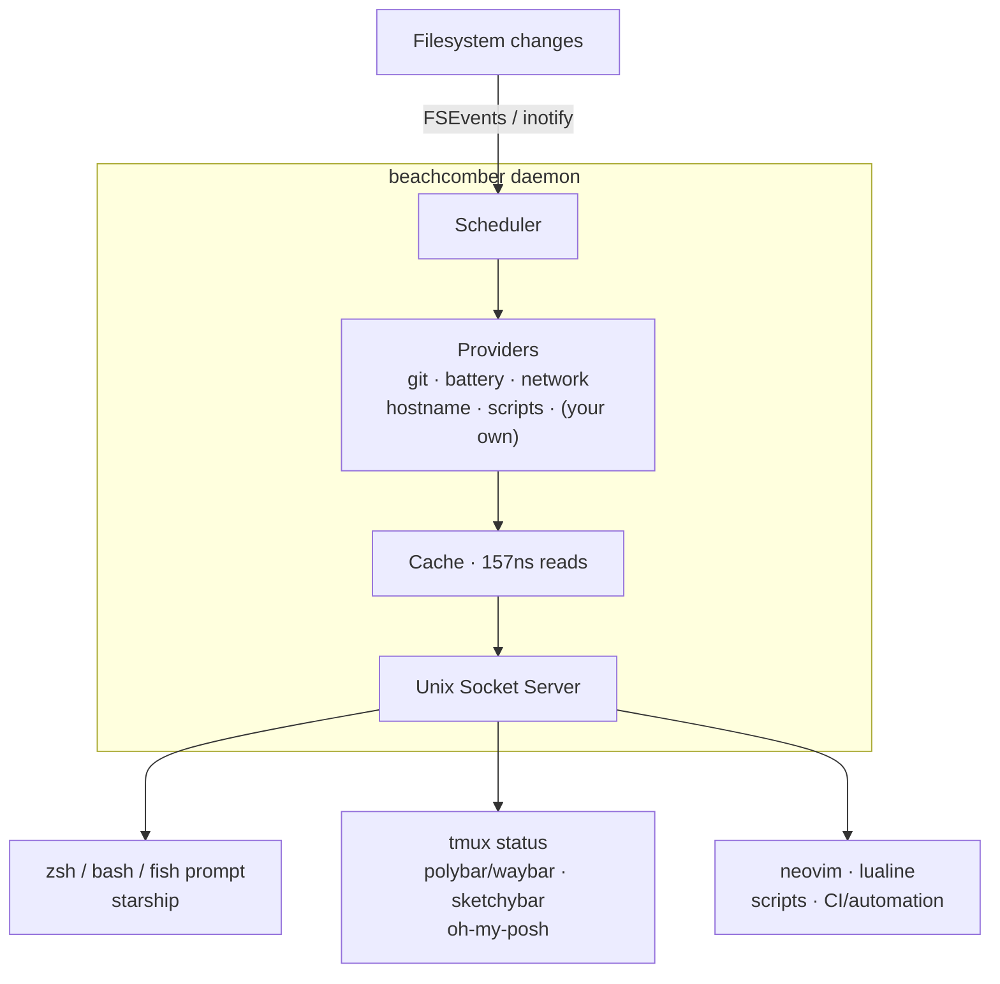

# How It Works

beachcomber is a single async daemon that:

1. Serves queries from consumers (prompts, status bars, editors) via a Unix socket
2. Watches filesystem directories using native FSEvents (macOS) or inotify (Linux)
3. Executes providers when files change or poll timers fire — not on every query
4. Caches results in a shared in-memory map (157ns reads)
5. Returns cached data instantly to any number of concurrent readers

The daemon is socket-activated: it starts automatically when any client connects, and shuts down after an idle period when all connections drop.

**Providers are never re-executed on every query.** A git status is computed once when `.git` changes, then served from cache to every reader — whether that's one prompt or a hundred tmux panes. The filesystem watcher is registered once for all concurrent readers.

**Connection context** means consumers can set a working directory once on connect. `comb g git.branch` without an explicit path uses the connection's context directory, making prompt integration natural.

**Demand-driven lifecycle:** the daemon watches nothing until queried. Each `get` request signals demand, keeping the provider warm automatically. Resource usage scales with actual query patterns. Entries enter a backoff/drain sequence after queries stop — staying warm for a grace period (30s default) in case a new shell opens, then progressively slowing and eventually evicting.
