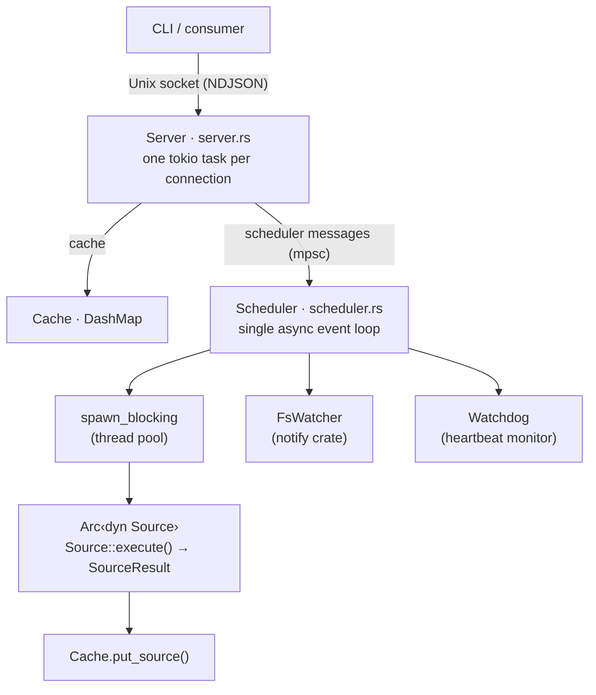
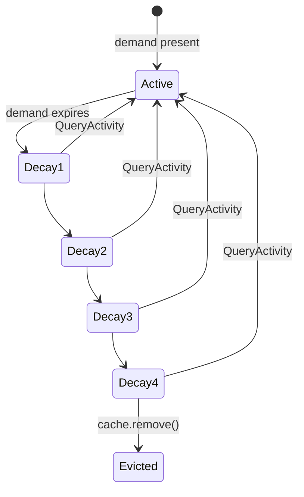

# beachcomber Architecture

Internal reference for contributors. Describes how the daemon (`comb daemon`) is structured, how components relate, and the reasoning behind key design choices.

---

## 1. System Overview



Data flow summary:

- **Read path**: client -> Server -> Cache.get() -> response (no provider involved)
- **Write path**: trigger (fs event or poll timer) -> Scheduler -> spawn_blocking(source.execute()) -> Cache.put_source()
- **Miss path**: client asks for uncached key -> Server executes provider inline (synchronous, blocking) -> result written to Cache -> response returned to client

The Server and Scheduler share `Arc<Cache>` and `Arc<ProviderRegistry>`. The Server sends messages to the Scheduler over an `mpsc::Sender<SchedulerMessage>`. The Scheduler owns the `FsWatcher` and all demand/poll state.

---

## 2. Module Map

| File | Responsibility |
|---|---|
| `src/lib.rs` | Module declarations; no logic |
| `src/daemon.rs` | Process lifecycle: fork, pid file, wait-for-socket, `run_daemon_with_cancel`; watchdog task monitors scheduler heartbeat |
| `src/singleton/` | Singleton enforcement: pid-file flock, build-identity supersession, serving probe, binary self-watch (fs-event + mtime poll), orphan reaping |
| `src/server.rs` | Unix socket accept loop; one task per connection; request dispatch; response formatting |
| `src/scheduler/mod.rs` | Single event loop: handles Refresh/FsEvent/QueryActivity/poll tick; dispatches lifecycle events into `LifecycleRegistry` and applies `TickActions`; heartbeat counter for watchdog liveness detection |
| `src/scheduler/lifecycle.rs` | `LifecycleRegistry` state machine: Active → Decay1..4 → Evicted. Per-entry poll and decay timers. Canonical behaviour in `docs/cache-lifecycle.md` |
| `src/cache.rs` | Lock-free DashMap store mapping `"provider\0path"` keys to `CacheEntry`; generation counter |
| `src/watcher.rs` | Thin wrapper around the `notify` crate; exposes `watch(path)` / `unwatch(path)` and an mpsc receiver of path events |
| `src/protocol.rs` | Serde types for the wire protocol: `Request`, `Response`; `split_key()` — first-dot-only `provider.field` split. Source-aware parsing lives in `src/query.rs` |
| `src/query.rs` | Source-aware request planning: `parse_key` (`provider` / `provider.field` / `provider.source` / `provider.source.field`), `resolve_path`, `split_metadata_suffix`, and `QueryPlan::build` which derives the `SourceDemand` (which Sources a query warms). Consumed by both `Get` and `Watch` |
| `src/config.rs` | TOML config loading from XDG directories; `Config`, `DaemonConfig`, `LifecycleConfig`, `ScriptProviderConfig`, `SourceOverrideConfig` |
| `src/provider/mod.rs` | `Provider` and `Source` traits; `ProviderMetadata`, `SourceMetadata`, `SourceScope`, `FieldSchema`, `InvalidationStrategy`, `KeepAlive`, `FailbackConfig`, `SourceResult`; `expand_abs_path()` helper |
| `src/provider/registry.rs` | `ProviderRegistry`: `sources: HashMap<(String, String), Arc<dyn Source>>` keyed by `(provider_name, source_name)` and `providers: HashMap<String, ProviderMetadata>` (metadata snapshot); `Box<dyn Provider>` objects are consumed at `register()` and not retained; `field → source` reverse map (`HashMap<(provider, field), source_name>`); built-in registration; validation at registration |
| `src/watcher_registry.rs` | Broadcast channel registry for watch subscribers; subscription keyed per `(provider, path, source)` with support for both relative `patterns` and absolute `abs_paths` |
| `src/provider/hostname.rs` | `HostnameProvider`: libc `gethostname`, pure-watch global (`KeepAlive::Never`), `Watch { patterns: [], abs_paths: [...] }` — no `Once` strategy |
| `src/provider/git.rs` | `GitProvider`: three sources — `refs` (Watch, `.git/`), `diff` (Poll, 30s), `status` (WatchAndPoll, `.git/index`, 60s) |
| `src/provider/script.rs` | `ScriptProvider`: runs arbitrary shell commands; parses JSON or KV output; strategy built from config |
| `src/provider/library.rs` | `LibraryProvider`: loads shared libraries (`.so`/`.dylib`) via `libloading`; detects ABI at load time — multi-source (`bc_source_count` / `bc_source_metadata` / `bc_source_execute`) or legacy (`beachcomber_provider_metadata` / `beachcomber_provider_execute` / `beachcomber_provider_free`) |
| `src/provider/http.rs` | `HttpProvider`: in-process HTTP client for REST API providers; `extract` for JSON path navigation |
| `src/client.rs` | `Client` (one-shot) and `ClientSession` (persistent) for consumer-side socket communication |

The remaining provider files (`battery`, `load`, `uptime`, `network`, `kubecontext`, `aws`, `gcloud`, `terraform`, `direnv`, `python`, `conda`, `mise`, `asdf`, `sudo`, `op`) follow the same pattern — each implements `Provider` (namespace) declaring one or more `Source` objects.

### Provider→Source layering

The Provider/Source/Field model has three layers:

- **Provider** — a named namespace (e.g., `git`). Declares 1+ Sources. The cache key `provider\0path` is still at this level.
- **Source** — one invalidation strategy, one set of fields, one lifecycle entry. Key for lifecycle, watches, and failure backoff is `(provider, path, source)`. Examples: git's `refs`, `diff`, `status` sources.
- **Field** — a typed value. Belongs to exactly one Source within a Provider.

The registry builds a `field → source` reverse map at registration so that a `get(provider.field)` query can be routed to the owning source without scanning.

**Lifecycle keying** uses `(provider, path, source)` — each source instance has its own Active/Decay/Evicted state, independent of sibling sources at the same `(provider, path)`.

**Cache layout** — `CacheEntry.sources: HashMap<source_name, SourceResult>`. Each `SourceResult` holds `fields`, `last_refreshed_ms`, and `expected_interval_secs`. Reads flatten across sources; writes are per-source (`cache.put_source(provider, path, source_name, result)`).

**Watch registration** — per `(provider, path, source)`. Each source declares relative `patterns` (matched within the scope path) and/or absolute `abs_paths` (e.g., `$XDG_CONFIG_HOME/mise`). The `expand_abs_path()` helper expands `~`, `$HOME`, and XDG env vars at registration time.

---

## 3. Request Lifecycle: `comb get git.branch .`

This traces the full path from CLI invocation to output on stdout.

**Step 1: CLI entry point**

The `comb get` subcommand resolves the socket path (config override → `BEACHCOMBER_SOCKET` env → `/tmp/beachcomber-<uid>/sock`). If no socket exists, it calls `daemon::ensure_daemon()` which forks `comb daemon --socket <path>` as a detached child and waits up to ~1.5s for the socket to appear.

**Step 2: Socket connection**

The client opens a Unix stream to the socket. For a one-shot `comb get`, this is a fresh connection. For `ClientSession` consumers (prompts, status bars), the connection is reused.

**Step 3: Request serialisation**

The CLI constructs:
```json
{"op":"get","key":"git.branch","path":"."}
```
and writes it as a single newline-terminated line.

**Step 4: Server receives the request**

`Server::run()` has accepted the connection and spawned `handle_connection()` as a tokio task. The task reads lines from a `BufReader`, deserialises into `Request::Get { key: "git.branch", path: Some(".") }`.

**Step 5: Key splitting**

`protocol::split_key("git.branch")` returns `("git", Some("branch"))`. The provider name is `"git"`, the field name is `"branch"`.

**Step 6: Path resolution**

`resolve_path(Some("."), &context_path, "git", &registry)` checks whether the `git` provider has any `PathScoped` sources (it does). The explicit path `"."` is used. (If the CLI had omitted the path argument, the session's context path would be used instead.) Global-only providers return `None` here regardless of any explicit or context path.

**Step 7: Cache lookup**

`cache.get("git", Some("."))` constructs the key `"git\0."` and looks it up in the DashMap. On a cache hit, it returns `Some(CacheEntry)`.

**Step 8: Field extraction**

The handler looks up the `refs` source (via the `field → source` reverse map for `git.branch`) and accesses `entry.sources["refs"].fields.get("branch")`. It converts the `Value::String` to a `serde_json::Value` and packages it into `Response::ok(data, age_ms, stale)`.

**Step 9: Response formatting**

The server sends the NDJSON response as-is; there is no server-side text/shell rendering. The CLI's own formatting layer converts the JSON `data` into the requested output form (text, shell, etc.) client-side.

**Step 10: CLI prints and exits**

The client reads the response line, strips metadata, and writes the formatted output to stdout.

**On a cache miss:**

The server detects no cached value for the key and executes the owning source inline via `tokio::task::spawn_blocking`, awaiting the result. The result is written to the cache and returned directly in the same response. The client receives data on the first query — there is no empty response or polling step.

---

## 4. Provider Execution Lifecycle: Filesystem Event -> Cache Write

This traces what happens when the user saves a file in a git repository being watched.

**Step 1: OS delivers an inotify/kqueue event**

The `notify` crate's `RecommendedWatcher` receives the event on a background thread. It calls the closure registered in `FsWatcher::new()`, which calls `tx.blocking_send(event.paths)` on the mpsc channel.

**Step 2: Scheduler receives the event**

The scheduler's `tokio::select!` loop picks up `Some(paths) = fs_rx.recv()`. It calls `self.handle_fs_event(paths, &watch_paths)`.

**Step 3: Path matching**

`handle_fs_event` iterates over the changed paths. For each changed path, it scans `watch_paths` (a `HashMap<PathBuf, Vec<(String, Option<String>)>>`) looking for any registered watch path that is a prefix of (or equal to) the changed path. For a `.git/index` change, the watch path `".git"` matches.

**Step 4: execute_provider is called**

`self.execute_provider("git", Some("/home/user/myrepo"))` is invoked.

**Step 5: Deduplication check**

The scheduler checks `in_flight` (a `Mutex<HashSet>`). If an execution for `("git", Some("/home/user/myrepo"))` is already running, the key is inserted into `pending_rerun` and the function returns immediately. This ensures at most one in-flight execution per (provider, path) at any time, with one queued rerun if changes arrive during execution.

**Step 6: Failure backoff check**

Before launching, the scheduler checks `failure_counts`. If the provider has exceeded its failure threshold (`failure_reattempts`, default 3) and is within its exponential backoff window (starting at `failure_backoff_interval`, doubling for 4 levels), execution is skipped. Both values are configurable globally in `[lifecycle]` and per-provider in `[providers.<name>]`.

**Step 7: spawn_blocking**

The scheduler clones `Arc<dyn Source>` for the matching source and calls:
```rust
tokio::spawn(async move {
    let result = tokio::time::timeout(
        Duration::from_secs(timeout_secs),
        tokio::task::spawn_blocking(move || source.execute(path)),
    ).await;
    ...
});
```

`spawn_blocking` runs `source.execute()` on tokio's dedicated blocking thread pool. This is critical: the scheduler's async loop continues processing messages, poll ticks, and more filesystem events while the source runs.

**Step 8: Source executes**

The matching `GitProvider` source (e.g., `refs`) runs its logic — reads `.git/HEAD`, `.git/refs/`, stash log, etc. — and returns a `SourceResult`.

**Step 9: Cache write**

Back in the async context, on success: `cache.put_source("git", Some("/home/user/myrepo"), "refs", result)`. The DashMap insert is lock-free. Sibling sources (`diff`, `status`) are untouched.

**Step 10: Rerun check**

After clearing `in_flight`, the scheduler checks `pending_rerun`. If a rerun was queued (another event arrived while this execution was in progress), a new `spawn_blocking` is launched immediately for the same (provider, path).

---

## 5. Demand-Driven Cache Lifecycle

**Demand signal**

Every `get` request sends `SchedulerMessage::QueryActivity { provider, path }` to the scheduler. This records the current time in the `demand` HashMap for that key. If the key is new to demand, the scheduler immediately sets up polling (based on provider metadata) and filesystem watching (for path-scoped providers), and fires `execute_provider` if the cache is cold.

**Demand window**

The scheduler's per-second tick checks all demand entries. Any key not queried within the last 120 seconds is considered expired. When demand expires for a key:

- The poll timer for that key is removed.
- Filesystem watches for that key are removed (if no other keys share the watch path).
- The key enters the decay lifecycle managed by `LifecycleRegistry` (`src/scheduler/lifecycle.rs`).

**Cache lifecycle (decay sequence)**

Lifecycle state is tracked **per source instance** at `(provider, path, source)`. Sibling sources at the same `(provider, path)` decay independently. `LifecycleRegistry` in `src/scheduler/lifecycle.rs` owns the state machine:



Each decay step doubles the poll interval and the step duration relative to the previous step. At `Evicted`, `cache.remove()` is called. If `QueryActivity` arrives for a key during any decay stage, the key is reinstated to `Active` immediately. If `fsevents_reinstate` is true for the source, a matching filesystem event also reinstates it.

There are no `Grace`, `BackoffState`, `SlowPoll`, or `Frozen` states. The only states are Active, Decay1..4, and Evicted.

See `docs/cache-lifecycle.md` for the canonical spec: state machine, sequence diagrams, BDD assertions, and config knobs (`poll_interval`, `poll_live_count`, `fsevents_reinstate`).

**Idle shutdown**

When `cache.is_empty()` and `demand.is_empty()` both hold true and no activity has been seen for `lifecycle.idle_shutdown_secs`, the daemon exits.

---

## 6. Concurrency Model

**Tokio runtime**

The daemon runs on a multi-threaded tokio runtime. The Server spawns one task per connection (lightweight, async I/O only). The Scheduler runs as a single async task with a `tokio::select!` loop.

**spawn_blocking for providers**

All provider `execute()` calls happen in `tokio::task::spawn_blocking`. This moves them to a dedicated thread pool (separate from the async worker threads), ensuring that a slow provider (git, battery, network) cannot starve the scheduler loop or connection handlers. The thread pool size is managed by tokio and scales with available cores.

**DashMap for cache**

`Cache` wraps a `DashMap<String, CacheEntry>`. DashMap provides fine-grained shard locking, allowing concurrent reads and writes without a global mutex. Cache reads — the hot path hit on every client request — are effectively lock-free under contention.

**`Arc<dyn Source>` for registry**

Sources are stored as `Arc<dyn Source>` in the registry (keyed by `(provider_name, source_name)`). `Box<dyn Provider>` objects are consumed at `register()` and not retained. When the scheduler needs to execute a source, it calls `registry.source(provider, source)` which returns `Option<Arc<dyn Source>>`. The cloned Arc is moved into `spawn_blocking`. The registry itself is never mutated after startup; reads from multiple tasks are contention-free.

**Scheduler-owned mutable state**

The Scheduler owns all mutable coordination state: `demand`, `poll_states`, `watch_paths`, `lifecycle`. This state is only accessed from the single scheduler task, so it requires no synchronisation. The `in_flight`, `pending_rerun`, and `failure_counts` maps are wrapped in `Mutex` because they are accessed from both the scheduler task and from within `tokio::spawn` closures that run after `spawn_blocking` completes.

**No source-side concurrency**

Sources are `Send + Sync` but stateless. They hold no mutable state. The same `Arc<dyn Source>` can be passed to multiple concurrent `spawn_blocking` calls for different paths without coordination.

---

## 7. Key Design Decisions

**Single-string cache keys (`"provider\0path"`)**

Early versions used a `(String, Option<String>)` tuple as the DashMap key, requiring two heap allocations per lookup. Changing to a single string with a null-byte separator (`"git\0/home/user/repo"`) reduced this to one allocation and improved cache read latency by 16% (183ns to 157ns). The null byte is safe as a separator because it cannot appear in valid filesystem paths. See `docs/performance.md` §1.2.

**spawn_blocking, not async sources**

The `Source` trait's `execute` method is synchronous (`fn execute(&self, path: Option<&str>) -> SourceResult`). This is intentional. Sources need to call blocking APIs: `std::process::Command`, `std::fs::read_to_string`, `libc` syscalls. Async sources would require those calls to be wrapped in `spawn_blocking` internally anyway. Keeping the interface synchronous is simpler, and `spawn_blocking` at the callsite (the scheduler) is the right place to manage the thread pool boundary. This also means provider authors don't need to think about async.

**Fire-and-forget execution**

`execute_provider` returns immediately after spawning. The caller (scheduler loop or poll tick) does not wait for the result. This keeps the scheduler loop responsive at all times. Consumers learn about fresh values on their next `get` request, not via push. This is acceptable because the daemon's purpose is to maintain a low-latency cache, not to stream values.

**Deduplication via in_flight + pending_rerun**

Naively, a burst of filesystem events (e.g., a `git commit` touching many `.git` files) would launch many concurrent provider executions for the same key. The deduplication scheme allows at most one in-flight execution per key and queues at most one rerun. This means at most two executions will ever run for any key in response to a burst: one that was already in-flight when the burst began, and one that starts after it completes. This bounds both resource usage and cache write rate.

**Two independent backoff mechanisms**

Failure backoff (in `FailureState`, exponential 1s-60s, per key) suppresses execution when a provider fails repeatedly. Cache-entry lifecycle (in `LifecycleRegistry`, Active → Decay1..4 → Evicted) handles resource cleanup when a key drops out of the demand window — see `docs/cache-lifecycle.md`. They serve different purposes and are deliberately kept separate.

**Watch connections are long-lived**

A `watch` request takes over the connection for the duration of the stream. The server task does not return to the request dispatch loop; instead it loops, blocking on the broadcast receiver, and emits an NDJSON line to the client on each cache update for the watched key. The connection terminates when the client disconnects or the daemon shuts down.

**Field-level deduplication for watch**

Watching `git.branch` only emits a line when the branch value itself changes, not on every git provider update. The watch handler records the last emitted value and skips writes when the new value is identical. This prevents spurious output when unrelated git fields (e.g., `ahead`, `dirty`) change.

**Daemon singleton, self-supervision, and orphan reaping**

At most one daemon runs per user. Enforcement is a pid file held under exclusive `flock` next to the socket: a starting daemon that finds the lock held compares build identities (SHA256 of the binary) — a different build supersedes the owner (SIGTERM, then SIGKILL); the same build probes the socket and exits silently if the owner is serving. The running daemon supervises its own binary two ways — an fs-event watch for fast reaction and a 5s mtime poll as the guarantee (fs-event streams can be created successfully and then silently deliver nothing) — and gracefully shuts down when the binary changes, so the next query respawns the new build. At startup the daemon also self-tests kernel event delivery; if events don't arrive, provider file-watching runs on a 1s polling backend instead, surfaced by `comb check daemon`. Finally, the daemon on the default (canonical) socket sweeps for orphaned `comb daemon` processes at startup and hourly, removing daemons that are reparented to PID 1 on sockets no client resolves — dev leftovers from killed test harnesses and deleted worktrees. Attended, self-cleaning (`--exit-with-parent`), and explicitly flagged (`--no-reap`) daemons are exempt. The authoritative spec is `docs/canon/singleton.md` in the repo.

**Broadcast channels for watch subscribers**

`src/watcher_registry.rs` maintains a `tokio::sync::broadcast` channel per (provider, path) key. `Cache::put()` notifies the registry after every write. Watch connections subscribe to the relevant channel. Using broadcast rather than mpsc allows multiple simultaneous watchers on the same key without coordination between them.

**Virtual providers via put**

External processes can write arbitrary data into the cache via the `put` protocol op. The server creates a virtual provider entry — a `CacheEntry` with no associated `Arc<dyn Source>` — and inserts it directly. Virtual providers have no `execute()` method and are never polled or evicted by the scheduler. Namespace hierarchy (builtin > script > virtual) prevents a `put` call from shadowing a real provider: if a built-in or script provider already owns the namespace, the put op is rejected.
